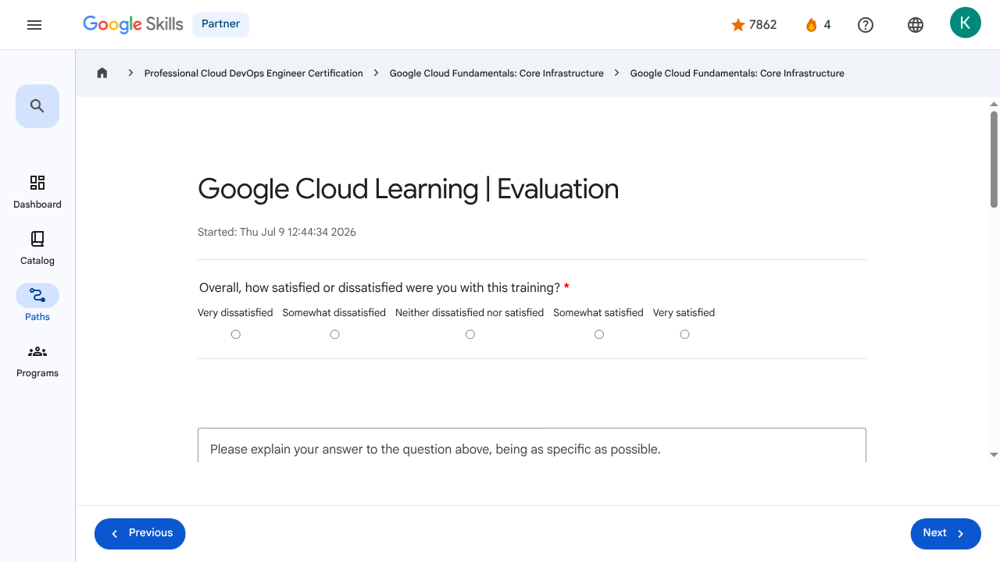

# Google Cloud Learning | Evaluation | Google Skills for Partners

> Offline lesson archive generated by Google Skills scraper.

---

## Metadata

- **Original URL:** https://partner.skills.google/paths/20/course_templates/60/course_surveys/0
- **Lesson type:** `course_surveys`
- **Path ID:** `20`
- **Container type:** `course_templates`
- **Container ID:** `60`
- **Lesson ID:** `0`
- **Generated:** 2026-07-10 05:06:28

---

## Full Page Screenshot

---

## Video

_No video found for this page._

---

## Transcript

_No transcript available._

---

## Lesson Text

Partner
4
navigate_next
Professional Cloud DevOps Engineer Certification
navigate_next
Google Cloud Fundamentals: Core Infrastructure
navigate_next
Google Cloud Fundamentals: Core Infrastructure
Google Cloud Learning | Evaluation

Started: Thu Jul 9 12:44:34 2026

Overall, how satisfied or dissatisfied were you with this training? *
Very dissatisfied
Somewhat dissatisfied
Neither dissatisfied nor satisfied
Somewhat satisfied
Very satisfied
Please rate the distribution of the lecture (slide deck, reading(s), video(s)) and interactive parts of the training (labs, hands-on activities and/or group exercises):
Too many interactive parts
Slightly too many interactive parts
Balanced between interactive parts and lectures
Slightly too much lecture
Too much lecture
Not Applicable
The interactive parts of the training (labs, hands-on activities and/or group exercises) increased my understanding of the subject matter.
Strongly disagree
Somewhat disagree
Neither agree nor disagree
Somewhat agree
Strongly agree
Not Applicable
The lecture parts (slide deck, reading(s), video(s)) of the training increased my understanding of the subject matter.
Strongly disagree
Somewhat disagree
Neither agree nor disagree
Somewhat agree
Strongly agree
Not Applicable

Submit
Previous
Next
Recertify in 3 simple steps:
Link your Google Skills and certification account profiles using the same email to get started.
Instantly see which certifications are eligible for renewal.
Complete courses and skill badges to renew your certifications automatically.

By clicking "Accept", I consent to share my name, email, and course completion data with Google Skills' certification partner, CM Connect, to receive continuing education credit for certification renewal.

---

## Images

### Image 1

### Image 2

---

## Main Resources

### youtube

- [Youtube](https://www.youtube.com/@googlecloud)

### labs

- [Resource](https://support.google.com/qwiklabs/contact/Google_Skills_Partner)

### external_links

- [Resource](https://partner.skills.google/)
- [Professional Cloud DevOps Engineer Certification](https://partner.skills.google/paths/20)
- [Google Cloud Fundamentals: Core Infrastructure](https://partner.skills.google/paths/20/course_templates/60)
- [Dashboard](https://partner.skills.google/)
- [Catalog](https://partner.skills.google/catalog)
- [Paths](https://partner.skills.google/paths)
- [Subscriptions](https://partner.skills.google/subscriptions)
- [Activities](https://partner.skills.google/profile/stay_on_track)
- [Achievements](https://partner.skills.google/profile/badges)
- [Resource](https://partner.skills.google/profile/activity)
- [Resource](https://partner.skills.google/my_account/profile)
- [Programs](https://partner.skills.google/my_account/programs)
- [Resource](https://partner.skills.google/paths/20/course_templates/60/badge)
- [Resource](https://partner.skills.google/paths/20/course_templates/95/documents/441006)
- [Resource](https://partner.skills.google/paths/20/course_templates/60/preview)

---

## Headings

- **H1**: Google Cloud Learning | Evaluation
- **H2**: Recertify in 3 simple steps:
- **H1**: A newer version of this course is available. Your progress will carry over if you choose to upgrade. However, your completion percentage may change if the new version has added or removed any learning activities. Click the preview button to see the course changes before upgrading.

---

## Code Blocks / Commands

_No code blocks found._

---

## Related Files

- [README.md](README.md)
- [lesson.md](lesson.md)
- [readable_page.html](readable_page.html)
- [page.html](page.html)
- [page_text.txt](page_text.txt)
- [transcript.txt](transcript.txt)
- [screenshot.png](screenshot.png)
- [assets/](assets/)
- [assets/](assets/)
