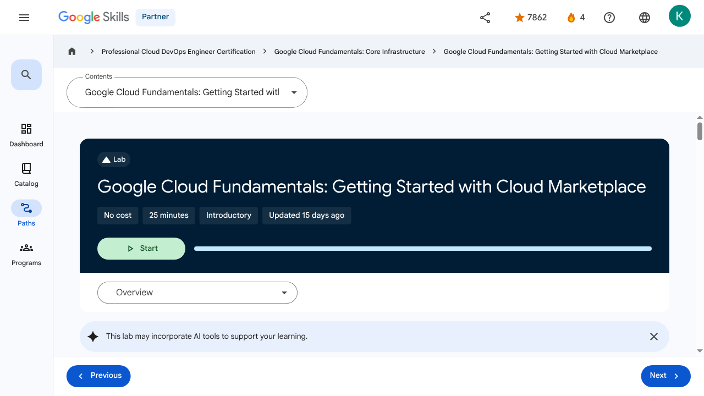

# Resources and Access in the Cloud - Google Cloud Fundamentals: Getting Started with Cloud Marketplace | Google Skills for Partners

---

## Metadata

- **URL:** https://partner.skills.google/paths/20/course_sessions/39706059/labs/630074
- **Lesson type:** `labs`
- **Path ID:** `20`
- **Container type:** `course_sessions`
- **Container ID:** `39706059`
- **Lesson ID:** `630074`
- **Generated:** 2026-07-10 04:46:46

---

## Open Human-Readable HTML

[Open readable_page.html](readable_page.html)

> README/GitHub Markdown usually blocks playable iframes. Open `readable_page.html` to see the playable YouTube frame and browser-like lesson page.

---

## Screenshot



---

## YouTube Video

_No YouTube video found._
---

## Transcript

_No transcript available for this page._
---

## Page Text

Partner
4
navigate_next
Professional Cloud DevOps Engineer Certification
navigate_next
Google Cloud Fundamentals: Core Infrastructure
navigate_next
Google Cloud Fundamentals: Getting Started with Cloud Marketplace
This lab may incorporate AI tools to support your learning.
Overview

In this lab, you use Google Cloud Marketplace to quickly and easily deploy a LAMP stack on a Compute Engine instance. The Google Click to Deploy LAMP Stack provides a complete web development environment for Linux that can be launched in one click.

Component	Role
Linux	Operating system
Apache HTTP Server	Web server
MySQL	Relational database
PHP	Web application framework
phpMyAdmin	PHP administration tool
Objectives

In this lab, you learn how to launch a solution using Cloud Marketplace.

Task 1. Sign in to the Google Cloud console

For each lab, you get a new Google Cloud project and set of resources for a fixed time at no cost.

Click the Start Lab button. If you need to pay for the lab, a pop-up opens for you to select your payment method. On the right is the Lab setup and access panel with the following:

The Open Google Cloud console button
The temporary credentials (username and password) that you must use for this lab
Other information, if needed, to step through this lab

Note that the lab timer is located near the top of the page, showing the remaining time.

Click Open Google Cloud console (or right-click and select Open Link in Incognito Window if you are running the Chrome browser).

The lab spins up resources, and then opens another tab that shows the Sign in page.

Tip: Arrange the tabs in separate windows, side-by-side.

Note: If you see the Choose an account dialog, click Use Another Account.

If necessary, copy the Username below and paste it into the Sign in dialog.

You can also find the Username in the Lab setup and access panel.

Click Next.

Copy the Password below and paste it into the Welcome dialog.

You can also find the Password in the Lab setup and access panel.

Click Next.

Important: You must use the credentials the lab provides you. Do not use your Google Cloud account credentials.
Note: Using your own Google Cloud account for this lab may incur extra charges.

Click through the subsequent pages:

Accept the terms and conditions.
Do not add recovery options or two-factor authentication (because this is a temporary account).
Do not sign up for free trials.

After a few moments, the Google Cloud console opens in this tab.

Note: To view a menu with a list of Google Cloud products and services, click the Navigation menu at the top-left, or type the service or product name in the Search field. 
Task 2. Use Cloud Marketplace to deploy a LAMP stack

In the Google Cloud console, in the Navigation menu (), click Marketplace.

In the search bar, type LAMP and then press ENTER.

In the search results, click LAMP Stack, by Google Click to Deploy.

If you choose another LAMP stack, the lab instructions may not work as expected.

On the LAMP page, click GET STARTED.

On the Agreements page, check the box for Terms and agreements, and click AGREE.

On the Successfully agreed to terms pop up, click DEPLOY.

If prompted, click on Enable for the Compute Engine API and the Infrastructure Manager API.

For Zone, select the deployment zone to  .

For Machine Type, select E2 as the Series and e2-medium as the Machine Type.

Leave the remaining settings as their defaults.

Click Deploy.

Note: Warnings may appear as the deployment is happening. You can disregard these for this lab.

The status of the deployment appears in the console window: lamp-1 is being deployed. When the deployment of the infrastructure is complete, the status changes to lamp-1 has been deployed.

After the software is installed, a summary of the details for the instance, including the site address, is displayed.

Click Check my progress to verify the objective.Use Cloud Marketplace to deploy a LAMP stack

Task 3. Verify your deployment

When the deployment is complete, click lamp-1-vm > Details.

Click the Site Url link. (If the website is not responding, wait 30 seconds and try again.) If you see a redirection notice, click on that link to view your new site. A new browser tab displays a congratulations message. This page confirms that, as part of the LAMP stack, the Apache HTTP Server is running.

Note: If you can't see the web page in the browser on your corporate laptop: If possible, exit any corporate VPN/network and try again. Enter the IP address on another device, such as a tablet or even a phone.
Congratulations!

In this lab, you deployed a LAMP stack to a Compute Engine instance.

End your lab

When you have completed your lab, click End Lab. Google Skills removes the resources you’ve used and cleans the account for you.

You will be given an opportunity to rate the lab experience. Select the applicable number of stars, type a comment, and then click Submit.

The number of stars indicates the following:

1 star = Very dissatisfied
2 stars = Dissatisfied
3 stars = Neutral
4 stars = Satisfied
5 stars = Very satisfied

You can close the dialog box if you don't want to provide feedback.

For feedback, suggestions, or corrections, please use the Support tab.

Copyright 2026 Google LLC All rights reserved. Google and the Google logo are trademarks of Google LLC. All other company and product names may be trademarks of the respective companies with which they are associated.

More resources

Read the Google Cloud documentation on Cloud Marketplace.

Previous
Next
Recertify in 3 simple steps:
Link your Google Skills and certification account profiles using the same email to get started.
Instantly see which certifications are eligible for renewal.
Complete courses and skill badges to renew your certifications automatically.

By clicking "Accept", I consent to share my name, email, and course completion data with Google Skills' certification partner, CM Connect, to receive continuing education credit for certification renewal.

Before you begin
Labs create a Google Cloud project and resources for a fixed time
Labs have a time limit and no pause feature. If you end the lab, you'll have to restart from the beginning.
On the top left of your screen, click Start lab to begin

This content is not currently available

We will notify you via email when it becomes available

Great!

We will contact you via email if it becomes available

One lab at a time

Confirm to end all existing labs and start this one

Use private browsing to run the lab
Using an Incognito or private browser window is the best way to run this lab. This prevents any conflicts between your personal account and the Student account, which may cause extra charges incurred to your personal account.
Additional Comments

Complete this quick step to start your lab.

---

## Images

### Image 1


### Image 2


### Image 3


### Image 4


### Image 5


### Image 6


### Image 7


### Image 8


### Image 9


### Image 10


### Image 11


### Image 12


### Image 13


### Image 14


---

## Main Resources

### youtube

- [Youtube](https://www.youtube.com/@googlecloud)

### videos

- [Course Introduction](https://partner.skills.google/paths/20/course_sessions/39706059/video/630060)
- [Cloud computing overview](https://partner.skills.google/paths/20/course_sessions/39706059/video/630061)
- [IaaS and PaaS](https://partner.skills.google/paths/20/course_sessions/39706059/video/630062)
- [The Google Cloud network](https://partner.skills.google/paths/20/course_sessions/39706059/video/630063)
- [Environmental impact](https://partner.skills.google/paths/20/course_sessions/39706059/video/630064)
- [Security](https://partner.skills.google/paths/20/course_sessions/39706059/video/630065)
- [Open source ecosystems](https://partner.skills.google/paths/20/course_sessions/39706059/video/630066)
- [Pricing and billing](https://partner.skills.google/paths/20/course_sessions/39706059/video/630067)
- [Google Cloud resource hierarchy](https://partner.skills.google/paths/20/course_sessions/39706059/video/630069)
- [Identity and Access Management (IAM)](https://partner.skills.google/paths/20/course_sessions/39706059/video/630070)
- [Service accounts](https://partner.skills.google/paths/20/course_sessions/39706059/video/630071)
- [Cloud Identity](https://partner.skills.google/paths/20/course_sessions/39706059/video/630072)
- [Interacting with Google Cloud](https://partner.skills.google/paths/20/course_sessions/39706059/video/630073)
- [Virtual Private Cloud networking](https://partner.skills.google/paths/20/course_sessions/39706059/video/630076)
- [Compute Engine](https://partner.skills.google/paths/20/course_sessions/39706059/video/630077)
- [Scaling virtual machines](https://partner.skills.google/paths/20/course_sessions/39706059/video/630078)
- [Important VPC compatibilities](https://partner.skills.google/paths/20/course_sessions/39706059/video/630079)
- [Cloud Load Balancing](https://partner.skills.google/paths/20/course_sessions/39706059/video/630080)
- [Cloud DNS and Cloud CDN](https://partner.skills.google/paths/20/course_sessions/39706059/video/630081)
- [Connecting networks to Google VPC](https://partner.skills.google/paths/20/course_sessions/39706059/video/630082)
- [Google Cloud storage options](https://partner.skills.google/paths/20/course_sessions/39706059/video/630085)
- [Cloud Storage](https://partner.skills.google/paths/20/course_sessions/39706059/video/630086)
- [Cloud Storage: Storage classes and data transfer](https://partner.skills.google/paths/20/course_sessions/39706059/video/630087)
- [Cloud SQL](https://partner.skills.google/paths/20/course_sessions/39706059/video/630088)
- [Spanner](https://partner.skills.google/paths/20/course_sessions/39706059/video/630089)
- [Firestore](https://partner.skills.google/paths/20/course_sessions/39706059/video/630090)
- [Bigtable](https://partner.skills.google/paths/20/course_sessions/39706059/video/630091)
- [Comparing storage options](https://partner.skills.google/paths/20/course_sessions/39706059/video/630092)
- [Introduction to containers](https://partner.skills.google/paths/20/course_sessions/39706059/video/630095)
- [Kubernetes](https://partner.skills.google/paths/20/course_sessions/39706059/video/630096)
- [Google Kubernetes Engine](https://partner.skills.google/paths/20/course_sessions/39706059/video/630097)
- [Cloud Run](https://partner.skills.google/paths/20/course_sessions/39706059/video/630099)
- [Development in the cloud](https://partner.skills.google/paths/20/course_sessions/39706059/video/630100)
- [Prompt Engineering](https://partner.skills.google/paths/20/course_sessions/39706059/video/630103)
- [Course summary](https://partner.skills.google/paths/20/course_sessions/39706059/video/630105)
- [Resource](https://partner.skills.google/paths/20/course_sessions/39706059/video/630073)

### labs

- [Resource](https://support.google.com/qwiklabs/contact/Google_Skills_Partner)
- [Google Cloud Fundamentals: Getting Started with Cloud Marketplace](https://partner.skills.google/paths/20/course_sessions/39706059/labs/630074)
- [Get Started with Virtual Private Cloud Networking and Compute Engine](https://partner.skills.google/paths/20/course_sessions/39706059/labs/630083)
- [Google Cloud Fundamentals: Getting Started with Cloud Storage and Cloud SQL](https://partner.skills.google/paths/20/course_sessions/39706059/labs/630093)
- [Hello Cloud Run](https://partner.skills.google/paths/20/course_sessions/39706059/labs/630101)

### external_links

- [Resource](https://partner.skills.google/)
- [Professional Cloud DevOps Engineer Certification](https://partner.skills.google/paths/20)
- [Google Cloud Fundamentals: Core Infrastructure](https://partner.skills.google/paths/20/course_templates/60)
- [Google Cloud documentation on Cloud Marketplace](https://cloud.google.com/marketplace/docs/)
- [Dashboard](https://partner.skills.google/)
- [Catalog](https://partner.skills.google/catalog)
- [Paths](https://partner.skills.google/paths)
- [Subscriptions](https://partner.skills.google/subscriptions)
- [Activities](https://partner.skills.google/profile/stay_on_track)
- [Achievements](https://partner.skills.google/profile/badges)
- [https://partner.skills.google/catalog_lab/1119](https://partner.skills.google/catalog_lab/1119)
- [Resource](https://x.com/intent/tweet?text=Learn%20cloud%20tech%20through%20hands-on%20training%20on%20%23GoogleSkills%21&url=https%3A%2F%2Fpartner.skills.google%2Fcatalog_lab%2F1119%3Futm_medium%3Dsocial%26utm_source%3Dx%26utm_campaign%3Dql-social-share&hashtags=)
- [Resource](https://partner.skills.google/profile/activity)
- [Resource](https://partner.skills.google/my_account/profile)
- [Programs](https://partner.skills.google/my_account/programs)
- [Overview](https://partner.skills.google/paths/20/course_templates/60)
- [Quiz](https://partner.skills.google/paths/20/course_sessions/39706059/quizzes/630068)
- [Quiz](https://partner.skills.google/paths/20/course_sessions/39706059/quizzes/630075)
- [Quiz](https://partner.skills.google/paths/20/course_sessions/39706059/quizzes/630084)
- [Quiz](https://partner.skills.google/paths/20/course_sessions/39706059/quizzes/630094)
- [Quiz](https://partner.skills.google/paths/20/course_sessions/39706059/quizzes/630098)
- [Quiz](https://partner.skills.google/paths/20/course_sessions/39706059/quizzes/630102)
- [Quiz](https://partner.skills.google/paths/20/course_sessions/39706059/quizzes/630104)
- [Course resources](https://partner.skills.google/paths/20/course_sessions/39706059/documents/630106)
- [Claim credential](https://partner.skills.google/paths/20/course_templates/60/badge)
- [Course Survey
      Recommended](https://partner.skills.google/paths/20/course_templates/60/course_surveys/0)
- [Resource](https://partner.skills.google/paths/20/course_sessions/39706059/quizzes/630075)
- [Resource](https://partner.skills.google/focuses/816163881/set_up_lab_forward_url?course_template=60&parent=course_session)
- [Resource](https://partner.skills.google/paths/20/course_templates/60/preview)

---

## Headings

- **H4**: Checkpoints
- **H1**: Google Cloud Fundamentals: Getting Started with Cloud Marketplace
- **H2**: Overview
- **H2**: Objectives
- **H2**: Task 1. Sign in to the Google Cloud console
- **H2**: Task 2. Use Cloud Marketplace to deploy a LAMP stack
- **H2**: Task 3. Verify your deployment
- **H2**: Congratulations!
- **H2**: End your lab
- **H3**: More resources
- **H2**: Recertify in 3 simple steps:
- **H1**: Before you begin
- **H1**: Use private browsing
- **H1**: Sign in to the Console
- **H1**: Score Details
- **H1**: Use private browsing to run the lab
- **H1**: How satisfied are you with this lab?*
- **H1**: Are you sure? You may not be able to restart the lab, and you'll need to start from the beginning if you do.
- **H1**: Verify you're human
- **H1**: A newer version of this course is available. Your progress will carry over if you choose to upgrade. However, your completion percentage may change if the new version has added or removed any learning activities. Click the preview button to see the course changes before upgrading.
---

## Raw Files

- [readable_page.html](readable_page.html)
- [page.html](page.html)
- [page_text.txt](page_text.txt)
- [session.json](session.json)
- [headings.json](headings.json)
- [links.json](links.json)
- [images.json](images.json)
- [resources.json](resources.json)
- [youtube_links.json](youtube_links.json)
- [transcript.json](transcript.json)
- [transcript.txt](transcript.txt)
- [plugin_extra.json](plugin_extra.json)
- [screenshot.png](screenshot.png)

## Plugin Extra Data

```json
{
  "content_kind": "lab"
}
```
