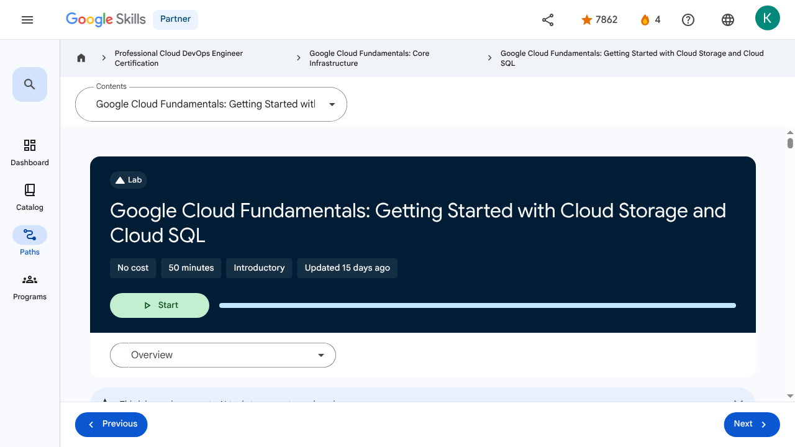

# Storage in the Cloud - Google Cloud Fundamentals: Getting Started with Cloud Storage and Cloud SQL | Google Skills for Partners

---

## Metadata

- **URL:** https://partner.skills.google/paths/20/course_sessions/39706059/labs/630093
- **Lesson type:** `labs`
- **Path ID:** `20`
- **Container type:** `course_sessions`
- **Container ID:** `39706059`
- **Lesson ID:** `630093`
- **Generated:** 2026-07-10 04:47:39

---

## Open Human-Readable HTML

[Open readable_page.html](readable_page.html)

> README/GitHub Markdown usually blocks playable iframes. Open `readable_page.html` to see the playable YouTube frame and browser-like lesson page.

---

## Screenshot



---

## YouTube Video

_No YouTube video found._
---

## Transcript

_No transcript available for this page._
---

## Page Text

Partner
4
navigate_next
Professional Cloud DevOps Engineer Certification
navigate_next
Google Cloud Fundamentals: Core Infrastructure
navigate_next
Google Cloud Fundamentals: Getting Started with Cloud Storage and Cloud SQL
This lab may incorporate AI tools to support your learning.
Overview

In this lab, you create a Cloud Storage bucket and place an image in it. You also configure an application running in Compute Engine to use a database managed by Cloud SQL. For this lab, you configure a web server with PHP, a web development environment that is the basis for popular blogging software. Outside this lab, you will use analogous techniques to configure these packages.

You also configure the web server to reference the image in the Cloud Storage bucket.

Objectives

In this lab, you learn how to perform the following tasks:

Create a Cloud Storage bucket and place an image into it.
Create a Cloud SQL instance and configure it.
Connect to the Cloud SQL instance from a web server.
Use the image in the Cloud Storage bucket on a web page.
Task 1. Sign in to the Google Cloud Console

For each lab, you get a new Google Cloud project and set of resources for a fixed time at no cost.

Click the Start Lab button. If you need to pay for the lab, a pop-up opens for you to select your payment method. On the right is the Lab setup and access panel with the following:

The Open Google Cloud console button
The temporary credentials (username and password) that you must use for this lab
Other information, if needed, to step through this lab

Note that the lab timer is located near the top of the page, showing the remaining time.

Click Open Google Cloud console (or right-click and select Open Link in Incognito Window if you are running the Chrome browser).

The lab spins up resources, and then opens another tab that shows the Sign in page.

Tip: Arrange the tabs in separate windows, side-by-side.

Note: If you see the Choose an account dialog, click Use Another Account.

If necessary, copy the Username below and paste it into the Sign in dialog.

You can also find the Username in the Lab setup and access panel.

Click Next.

Copy the Password below and paste it into the Welcome dialog.

You can also find the Password in the Lab setup and access panel.

Click Next.

Important: You must use the credentials the lab provides you. Do not use your Google Cloud account credentials.
Note: Using your own Google Cloud account for this lab may incur extra charges.

Click through the subsequent pages:

Accept the terms and conditions.
Do not add recovery options or two-factor authentication (because this is a temporary account).
Do not sign up for free trials.

After a few moments, the Google Cloud console opens in this tab.

Note: To view a menu with a list of Google Cloud products and services, click the Navigation menu at the top-left, or type the service or product name in the Search field. 
Task 2. Deploy a web server VM instance

In this task you provision a virtual machine (VM) instance using Compute Engine, configure it with a web server (Apache) and necessary scripting for initial setup using a startup script. Next, you note its network identifiers.

In the Google Cloud console, on the Navigation menu (), click Compute Engine > VM instances.

Click Create instance.

For Name, type bloghost

For Region select .

For Zone, select .

For Machine type, select e2-standard-2.

In the left pane click OS and storage, if the Image shown is not Debian GNU/Linux 12 (bookworm), click Change and select version to Debian GNU/Linux 12 (bookworm).

Click Networking.

In Firewall, click Allow HTTP traffic.

In the left pane, click Advanced.

In Automation, copy and paste the following script as the value for Startup script:

Note: Be sure to supply that script as the value of the Startup script field. If you accidentally put it into another field, it won't be executed when the VM instance starts.
Leave the remaining settings as their defaults, and click Create.
Note: Instance can take about two minutes to launch and be fully available for use.
On the VM instances page, copy the bloghost VM instance's internal and external IP addresses to a text editor for use later in this lab.

Click Check my progress to verify the objective.Deploy a web server VM instance

Task 3. Create a Cloud Storage bucket using the gcloud storage command line

In this task you use the gcloud storage command-line tool to create a globally unique Cloud Storage bucket, set its location, upload a public image to it, and make that specific object publicly readable.

All Cloud Storage bucket names must be globally unique. To ensure that your bucket name is unique, these instructions will guide you to give your bucket the same name as your Google Cloud project ID, which is also globally unique.

Cloud Storage buckets can be associated with either a region or a multi-region location: US, EU, or ASIA. In this activity, you associate your bucket with the multi-region closest to the region and zone that the lab or your instructor assigned you to.

On the Google Cloud console, on the top right toolbar, click the Activate Cloud Shell . If a dialog box appears, click Continue.

For convenience, enter your chosen location into an environment variable called LOCATION. Enter one of these commands:

Or

Or

In Cloud Shell, the DEVSHELL_PROJECT_ID environment variable contains your project ID. Enter this command to make a bucket named after your project ID:

If prompted, click Authorize to continue.

Retrieve a banner image from a publicly accessible Cloud Storage location:
Copy the banner image to your newly created Cloud Storage bucket:
Modify the Access Control List of the object you just created so that it's readable by everyone:

Click Check my progress to verify the objective.Create a Cloud Storage bucket using the gcloud storage command line

Task 4. Create the Cloud SQL instance

In this task you create and configure a managed MySQL database instance using Cloud SQL, set up a specific user account, and crucially, authorize the external IP address of your future web server for network connectivity.

In the Google Cloud console, on the Navigation menu (), click Cloud SQL.

Scroll to the bottom of the page, then click Create instance.

For Choose a database engine, select Choose MySQL.

For Choose a Cloud SQL edition, click Enterprise, and for Edition preset select Sandbox from the dropdown.

For Instance ID, type blog-db, and for Password type Passw0rd1!

For Region, select .

For Zonal availability, select Single zone.

Expand Specify zones, and in Primary zone, select .

Note: This is the same region and zone into which you launched the bloghost instance. The best performance is achieved by placing the client and the database close to each other.

In Customize your instance, expand Show configuration options.

Expand Security, and then click Allow unencrypted network traffic (not recommended).

Note: This lab does not use SSL, so ensure you set the above option.
Click Create instance.
Note: Wait for the instance to finish deploying. It will take a few minutes.
Configure User and Connections

From the SQL instances details page, under Connect to this instance, copy the Public IP address for your SQL instance to a text editor for use later in this lab.

In the left pane, click Users, and then click Add user account.

For User name, type blogdbuser

For Password, type Passw0rd1!

Click Add to add the user account in the database.

Note: Wait for the user to be created.

In the left pane, click Connections, and then click Networking tab.

Click Add a network.

Note: If you're offered the choice between a Private IP connection and a Public IP connection, choose Public IP for purposes of this lab.
Note: The Add a network button may be unavailable if the user account creation is not yet complete.

For Name, type web front end

For Network, type the external IP address of your bloghost VM instance, followed by /32

The result will look like this:

Note: Be sure to use the external IP address of your VM instance followed by /32. Do not use the VM instance's internal IP address. Do not use the sample IP address shown here.

Click Done to finish defining the authorized network.

Click Save to save the configuration change.

Note: If the message appears like Another operation is in progress, wait for few minutes until you see the green check for blog-db to save the configuration.

Click Check my progress to verify the objective.Create the Cloud SQL instance

Task 5. Configure an application in a Compute Engine instance to use Cloud SQL

In this task you securely connect the Apache web server running on your VM instance to the Cloud SQL database by modifying the PHP application code (index.php) to include the database's IP address and credentials, thereby establishing a successful database connection.

On the Navigation menu (), click Compute Engine > VM instances.

In the VM instances list, click SSH in the row for your VM instance bloghost. If prompted, click Authorize.

In your ssh session on bloghost, change your working directory to the document root of the web server:

Use the nano text editor to edit a file called index.php:
Copy and paste the content below into the file:
Note: In a later step, you will insert your Cloud SQL instance's IP address and your database password into this file. For now, leave the file unmodified.

Press Ctrl+O, and then press Enter to save your edited file.

Press Ctrl+X to exit the nano text editor.

Restart the web server:

Open a new web browser tab and paste into the address bar your bloghost VM instance's external IP address followed by /index.php. The URL will look like this:
Note: Be sure to use the external IP address of your VM instance followed by /index.php. Do not use the VM instance's internal IP address. Do not use the sample IP address shown here. If you see the message that the IP address doesn't support a secure connection, click Continue to site.

When you load the page, you will see that its content includes an error message beginning with the words:

Note: This message occurs because you have not yet configured PHP's connection to your Cloud SQL instance.
Return to your ssh session on bloghost. Use the nano text editor to edit index.php again. Ensure that you are in the /var/www/html directory.

In the nano text editor, replace CLOUDSQLIP with the Cloud SQL instance (blog-db) Public IP address that you noted above. Leave the quotation marks around the value in place.

In the nano text editor, replace DBPASSWORD with the Cloud SQL database password that you defined above, which is Passw0rd1! Leave the quotation marks around the value in place.

Press Ctrl+O, and then press Enter to save your edited file.

Press Ctrl+X to exit the nano text editor.

Restart the web server:

Return to the web browser tab in which you opened your bloghost VM instance's external IP address. When you load the page, the following message appears:
Note: In an actual blog, the database connection status would not be visible to blog visitors. Instead, the database connection would be managed solely by the administrator.
Task 6. Configure an application in a Compute Engine instance to use a Cloud Storage object

In this task you integrate the publicly accessible image stored in your Cloud Storage bucket into your web application by editing the index.php file on the Compute Engine instance to include the correct image source URL.

In the Google Cloud console, on the Navigation menu (), click Cloud Storage > Buckets.

Click the bucket that is named after your Google Cloud project.

In this bucket, there is an object called my-excellent-blog.png. Copy the URL behind the link icon that appears in that object's Public access column, or behind the words "Public link" if shown.

Note: If you see neither a link icon nor a "Public link", try refreshing the browser. If you still do not see a link icon, return to Cloud Shell and confirm that your attempt to change the object's Access Control list with the gsutil acl ch command was successful.

Return to your ssh session on your bloghost VM instance.

Enter this command to set your working directory to the document root of the web server:

Use the nano text editor to edit index.php:

Use the arrow keys to move the cursor to the line that contains the h1 element. Press Enter to open up a new, blank screen line, and then paste the URL you copied earlier into the line.

Paste this HTML markup immediately before the URL:

Place a closing single quotation mark and a closing angle bracket at the end of the URL:

The resulting line will look like this:

The effect of these steps is to place the line containing  immediately before the line containing <h1>...</h1>

Note: Do not copy the URL shown here. Instead, copy the URL shown by the Storage browser in your own Cloud Platform project.

Press Ctrl+O, and then press Enter to save your edited file.

Press Ctrl+X to exit the nano text editor.

Restart the web server:

Return to the web browser tab in which you opened your bloghost VM instance's external IP address. When you load the page, its content now includes a banner image.
Congratulations!

In this lab, you configured a Cloud SQL instance and connected an application in a Compute Engine instance to it. You also worked with a Cloud Storage bucket.

End your lab

When you have completed your lab, click End Lab. Google Skills removes the resources you’ve used and cleans the account for you.

You will be given an opportunity to rate the lab experience. Select the applicable number of stars, type a comment, and then click Submit.

The number of stars indicates the following:

1 star = Very dissatisfied
2 stars = Dissatisfied
3 stars = Neutral
4 stars = Satisfied
5 stars = Very satisfied

You can close the dialog box if you don't want to provide feedback.

For feedback, suggestions, or corrections, please use the Support tab.

Copyright 2026 Google LLC All rights reserved. Google and the Google logo are trademarks of Google LLC. All other company and product names may be trademarks of the respective companies with which they are associated.

More resources

Read the Google Cloud Platform documentation on Cloud SQL.

Read the Google Cloud Platform documentation on Cloud Storage.

Previous
Next
Recertify in 3 simple steps:
Link your Google Skills and certification account profiles using the same email to get started.
Instantly see which certifications are eligible for renewal.
Complete courses and skill badges to renew your certifications automatically.

By clicking "Accept", I consent to share my name, email, and course completion data with Google Skills' certification partner, CM Connect, to receive continuing education credit for certification renewal.

Before you begin
Labs create a Google Cloud project and resources for a fixed time
Labs have a time limit and no pause feature. If you end the lab, you'll have to restart from the beginning.
On the top left of your screen, click Start lab to begin

This content is not currently available

We will notify you via email when it becomes available

Great!

We will contact you via email if it becomes available

One lab at a time

Confirm to end all existing labs and start this one

Use private browsing to run the lab
Using an Incognito or private browser window is the best way to run this lab. This prevents any conflicts between your personal account and the Student account, which may cause extra charges incurred to your personal account.
Additional Comments

Complete this quick step to start your lab.

---

## Images

### Image 1


### Image 2


### Image 3


### Image 4


### Image 5


### Image 6


### Image 7


### Image 8


### Image 9


### Image 10


### Image 11


### Image 12


### Image 13


### Image 14


---

## Main Resources

### youtube

- [Youtube](https://www.youtube.com/@googlecloud)

### videos

- [Course Introduction](https://partner.skills.google/paths/20/course_sessions/39706059/video/630060)
- [Cloud computing overview](https://partner.skills.google/paths/20/course_sessions/39706059/video/630061)
- [IaaS and PaaS](https://partner.skills.google/paths/20/course_sessions/39706059/video/630062)
- [The Google Cloud network](https://partner.skills.google/paths/20/course_sessions/39706059/video/630063)
- [Environmental impact](https://partner.skills.google/paths/20/course_sessions/39706059/video/630064)
- [Security](https://partner.skills.google/paths/20/course_sessions/39706059/video/630065)
- [Open source ecosystems](https://partner.skills.google/paths/20/course_sessions/39706059/video/630066)
- [Pricing and billing](https://partner.skills.google/paths/20/course_sessions/39706059/video/630067)
- [Google Cloud resource hierarchy](https://partner.skills.google/paths/20/course_sessions/39706059/video/630069)
- [Identity and Access Management (IAM)](https://partner.skills.google/paths/20/course_sessions/39706059/video/630070)
- [Service accounts](https://partner.skills.google/paths/20/course_sessions/39706059/video/630071)
- [Cloud Identity](https://partner.skills.google/paths/20/course_sessions/39706059/video/630072)
- [Interacting with Google Cloud](https://partner.skills.google/paths/20/course_sessions/39706059/video/630073)
- [Virtual Private Cloud networking](https://partner.skills.google/paths/20/course_sessions/39706059/video/630076)
- [Compute Engine](https://partner.skills.google/paths/20/course_sessions/39706059/video/630077)
- [Scaling virtual machines](https://partner.skills.google/paths/20/course_sessions/39706059/video/630078)
- [Important VPC compatibilities](https://partner.skills.google/paths/20/course_sessions/39706059/video/630079)
- [Cloud Load Balancing](https://partner.skills.google/paths/20/course_sessions/39706059/video/630080)
- [Cloud DNS and Cloud CDN](https://partner.skills.google/paths/20/course_sessions/39706059/video/630081)
- [Connecting networks to Google VPC](https://partner.skills.google/paths/20/course_sessions/39706059/video/630082)
- [Google Cloud storage options](https://partner.skills.google/paths/20/course_sessions/39706059/video/630085)
- [Cloud Storage](https://partner.skills.google/paths/20/course_sessions/39706059/video/630086)
- [Cloud Storage: Storage classes and data transfer](https://partner.skills.google/paths/20/course_sessions/39706059/video/630087)
- [Cloud SQL](https://partner.skills.google/paths/20/course_sessions/39706059/video/630088)
- [Spanner](https://partner.skills.google/paths/20/course_sessions/39706059/video/630089)
- [Firestore](https://partner.skills.google/paths/20/course_sessions/39706059/video/630090)
- [Bigtable](https://partner.skills.google/paths/20/course_sessions/39706059/video/630091)
- [Comparing storage options](https://partner.skills.google/paths/20/course_sessions/39706059/video/630092)
- [Introduction to containers](https://partner.skills.google/paths/20/course_sessions/39706059/video/630095)
- [Kubernetes](https://partner.skills.google/paths/20/course_sessions/39706059/video/630096)
- [Google Kubernetes Engine](https://partner.skills.google/paths/20/course_sessions/39706059/video/630097)
- [Cloud Run](https://partner.skills.google/paths/20/course_sessions/39706059/video/630099)
- [Development in the cloud](https://partner.skills.google/paths/20/course_sessions/39706059/video/630100)
- [Prompt Engineering](https://partner.skills.google/paths/20/course_sessions/39706059/video/630103)
- [Course summary](https://partner.skills.google/paths/20/course_sessions/39706059/video/630105)
- [Resource](https://partner.skills.google/paths/20/course_sessions/39706059/video/630092)

### labs

- [Resource](https://support.google.com/qwiklabs/contact/Google_Skills_Partner)
- [Google Cloud Fundamentals: Getting Started with Cloud Marketplace](https://partner.skills.google/paths/20/course_sessions/39706059/labs/630074)
- [Get Started with Virtual Private Cloud Networking and Compute Engine](https://partner.skills.google/paths/20/course_sessions/39706059/labs/630083)
- [Google Cloud Fundamentals: Getting Started with Cloud Storage and Cloud SQL](https://partner.skills.google/paths/20/course_sessions/39706059/labs/630093)
- [Hello Cloud Run](https://partner.skills.google/paths/20/course_sessions/39706059/labs/630101)

### external_links

- [Resource](https://partner.skills.google/)
- [Professional Cloud DevOps Engineer Certification](https://partner.skills.google/paths/20)
- [Google Cloud Fundamentals: Core Infrastructure](https://partner.skills.google/paths/20/course_templates/60)
- [Google Cloud Platform documentation on Cloud SQL](https://cloud.google.com/sql/docs/)
- [Google Cloud Platform documentation on Cloud Storage](https://cloud.google.com/storage/docs/)
- [Dashboard](https://partner.skills.google/)
- [Catalog](https://partner.skills.google/catalog)
- [Paths](https://partner.skills.google/paths)
- [Subscriptions](https://partner.skills.google/subscriptions)
- [Activities](https://partner.skills.google/profile/stay_on_track)
- [Achievements](https://partner.skills.google/profile/badges)
- [https://partner.skills.google/catalog_lab/1155](https://partner.skills.google/catalog_lab/1155)
- [Resource](https://x.com/intent/tweet?text=Learn%20cloud%20tech%20through%20hands-on%20training%20on%20%23GoogleSkills%21&url=https%3A%2F%2Fpartner.skills.google%2Fcatalog_lab%2F1155%3Futm_medium%3Dsocial%26utm_source%3Dx%26utm_campaign%3Dql-social-share&hashtags=)
- [Resource](https://partner.skills.google/profile/activity)
- [Resource](https://partner.skills.google/my_account/profile)
- [Programs](https://partner.skills.google/my_account/programs)
- [Overview](https://partner.skills.google/paths/20/course_templates/60)
- [Quiz](https://partner.skills.google/paths/20/course_sessions/39706059/quizzes/630068)
- [Quiz](https://partner.skills.google/paths/20/course_sessions/39706059/quizzes/630075)
- [Quiz](https://partner.skills.google/paths/20/course_sessions/39706059/quizzes/630084)
- [Quiz](https://partner.skills.google/paths/20/course_sessions/39706059/quizzes/630094)
- [Quiz](https://partner.skills.google/paths/20/course_sessions/39706059/quizzes/630098)
- [Quiz](https://partner.skills.google/paths/20/course_sessions/39706059/quizzes/630102)
- [Quiz](https://partner.skills.google/paths/20/course_sessions/39706059/quizzes/630104)
- [Course resources](https://partner.skills.google/paths/20/course_sessions/39706059/documents/630106)
- [Claim credential](https://partner.skills.google/paths/20/course_templates/60/badge)
- [Course Survey
      Recommended](https://partner.skills.google/paths/20/course_templates/60/course_surveys/0)
- [Resource](https://partner.skills.google/paths/20/course_sessions/39706059/quizzes/630094)
- [Resource](https://partner.skills.google/focuses/816163900/set_up_lab_forward_url?course_template=60&parent=course_session)
- [Resource](https://partner.skills.google/paths/20/course_templates/60/preview)

---

## Headings

- **H4**: Checkpoints
- **H1**: Google Cloud Fundamentals: Getting Started with Cloud Storage and Cloud SQL
- **H2**: Overview
- **H2**: Objectives
- **H2**: Task 1. Sign in to the Google Cloud Console
- **H2**: Task 2. Deploy a web server VM instance
- **H2**: Task 3. Create a Cloud Storage bucket using the gcloud storage command line
- **H2**: Task 4. Create the Cloud SQL instance
- **H3**: Configure User and Connections
- **H2**: Task 5. Configure an application in a Compute Engine instance to use Cloud SQL
- **H2**: Task 6. Configure an application in a Compute Engine instance to use a Cloud Storage object
- **H2**: Congratulations!
- **H2**: End your lab
- **H2**: More resources
- **H2**: Recertify in 3 simple steps:
- **H1**: Before you begin
- **H1**: Use private browsing
- **H1**: Sign in to the Console
- **H1**: Score Details
- **H1**: Use private browsing to run the lab
- **H1**: How satisfied are you with this lab?*
- **H1**: Are you sure? You may not be able to restart the lab, and you'll need to start from the beginning if you do.
- **H1**: Verify you're human
- **H1**: A newer version of this course is available. Your progress will carry over if you choose to upgrade. However, your completion percentage may change if the new version has added or removed any learning activities. Click the preview button to see the course changes before upgrading.
---

## Raw Files

- [readable_page.html](readable_page.html)
- [page.html](page.html)
- [page_text.txt](page_text.txt)
- [session.json](session.json)
- [headings.json](headings.json)
- [links.json](links.json)
- [images.json](images.json)
- [resources.json](resources.json)
- [youtube_links.json](youtube_links.json)
- [transcript.json](transcript.json)
- [transcript.txt](transcript.txt)
- [plugin_extra.json](plugin_extra.json)
- [screenshot.png](screenshot.png)

## Plugin Extra Data

```json
{
  "content_kind": "lab"
}
```
