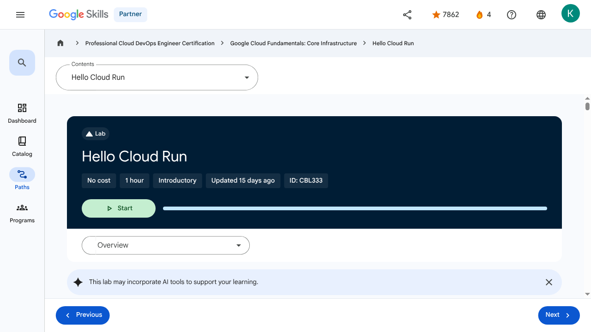

# Applications in the Cloud - Hello Cloud Run | Google Skills for Partners

---

## Metadata

- **URL:** https://partner.skills.google/paths/20/course_sessions/39706059/labs/630101
- **Lesson type:** `labs`
- **Path ID:** `20`
- **Container type:** `course_sessions`
- **Container ID:** `39706059`
- **Lesson ID:** `630101`
- **Generated:** 2026-07-10 04:48:07

---

## Open Human-Readable HTML

[Open readable_page.html](readable_page.html)

> README/GitHub Markdown usually blocks playable iframes. Open `readable_page.html` to see the playable YouTube frame and browser-like lesson page.

---

## Screenshot



---

## YouTube Video

_No YouTube video found._
---

## Transcript

_No transcript available for this page._
---

## Page Text

Partner
4
navigate_next
Professional Cloud DevOps Engineer Certification
navigate_next
Google Cloud Fundamentals: Core Infrastructure
navigate_next
Hello Cloud Run
This lab may incorporate AI tools to support your learning.
Overview

Cloud Run is a managed compute platform that enables you to run stateless containers that are invocable via HTTP requests. Cloud Run is serverless: it abstracts away all infrastructure management, so you can focus on what matters most — building great applications.

The goal of this lab is for you to build a simple containerized application image and deploy it to Cloud Run.

Objectives

In this lab, you learn to:

Enable the Cloud Run and Artifact Registry APIs.
Create a simple Node.js application that can be deployed as a serverless, stateless container.
Create an Artifact Registry repository.
Containerize your application and upload it to Artifact Registry.
Deploy a containerized application on Cloud Run.
Delete unneeded images to avoid incurring extra storage charges.
Setup and requirements

For each lab, you get a new Google Cloud project and set of resources for a fixed time at no cost.

Click the Start Lab button. If you need to pay for the lab, a pop-up opens for you to select your payment method. On the right is the Lab setup and access panel with the following:

The Open Google Cloud console button
The temporary credentials (username and password) that you must use for this lab
Other information, if needed, to step through this lab

Note that the lab timer is located near the top of the page, showing the remaining time.

Click Open Google Cloud console (or right-click and select Open Link in Incognito Window if you are running the Chrome browser).

The lab spins up resources, and then opens another tab that shows the Sign in page.

Tip: Arrange the tabs in separate windows, side-by-side.

Note: If you see the Choose an account dialog, click Use Another Account.

If necessary, copy the Username below and paste it into the Sign in dialog.

You can also find the Username in the Lab setup and access panel.

Click Next.

Copy the Password below and paste it into the Welcome dialog.

You can also find the Password in the Lab setup and access panel.

Click Next.

Important: You must use the credentials the lab provides you. Do not use your Google Cloud account credentials.
Note: Using your own Google Cloud account for this lab may incur extra charges.

Click through the subsequent pages:

Accept the terms and conditions.
Do not add recovery options or two-factor authentication (because this is a temporary account).
Do not sign up for free trials.

After a few moments, the Google Cloud console opens in this tab.

Note: To view a menu with a list of Google Cloud products and services, click the Navigation menu at the top-left, or type the service or product name in the Search field. 
Activate Google Cloud Shell

Google Cloud Shell is a virtual machine that is loaded with development tools. It offers a persistent 5GB home directory and runs on the Google Cloud.

Google Cloud Shell provides command-line access to your Google Cloud resources.

In Cloud console, on the top right toolbar, click the Open Cloud Shell button.

Click Continue.

It takes a few moments to provision and connect to the environment. When you are connected, you are already authenticated, and the project is set to your PROJECT_ID. For example:

gcloud is the command-line tool for Google Cloud. It comes pre-installed on Cloud Shell and supports tab-completion.

You can list the active account name with this command:

Output:

Example output:

You can list the project ID with this command:

Output:

Example output:

Note: Full documentation of gcloud is available in the gcloud CLI overview guide .
Reference
Basic Linux Commands

Below you will find a reference list of a few very basic Linux commands which may be included in the instructions or code blocks for this lab.

Command -->	Action	.	Command -->	Action
mkdir (make directory)	create a new folder	.	cd (change directory)	change location to another folder
ls (list )	list files and folders in the directory	.	cat (concatenate)	read contents of a file without using an editor
apt-get update	update package manager library	.	ping	signal to test reachability of a host
mv (move )	moves a file	.	cp (copy)	makes a file copy
pwd (present working directory )	returns your current location	.	sudo (super user do)	gives higher administration privileges
Task 1. Enable the Cloud Run API and configure your Shell environment

In this task, you enable the necessary APIs and set up environment variables to simplify your commands.

From Cloud Shell, enable the Cloud Run API and Artifact Registry API. This allows your project to accept requests for these services:
If you are asked to authorize the use of your credentials, do so. You should then see a successful message similar to this one:
Note: You can also enable the API using the APIs & Services section of the Google Cloud console.
Set the compute region:
Create a LOCATION environment variable:
Task 2. Write the sample application

In this task, you will build a simple express-based NodeJS application which responds to HTTP requests.

In Cloud Shell create a new directory named helloworld, then move your view into that directory:

Next you'll be creating and editing files. To edit files, use nano or the Cloud Shell Code Editor by clicking on the Open Editor button in Cloud Shell.

Create a package.json file, then add the following content to it:

Most importantly, the file above contains a start script command and a dependency on the Express web application framework.

Press CTRL+X, then Y, then Enter to save the package.json file.

Next, in the same directory, create an index.js file, and copy the following lines into it:

This code creates a basic web server that listens on the port defined by the PORT environment variable. Your app is now finished and ready to be containerized and uploaded to Artifact Registry.

Press CTRL+X, then Y, then Enter to save the index.js file
Note: You can use many other languages to get started with Cloud Run. You can find instructions for Go, Python, Java, PHP, Ruby, Shell scripts, and others from the Quickstarts guide.
Task 3. Create an Artifact Registry repository

In this task, you create a repository in Artifact Registry. This repository will act as the storage location for your container images, allowing Google Cloud services to access and pull them.

Create a new Docker repository named my-repository in your region:
Configure Docker to authenticate requests for Artifact Registry in your region:

Click Check my progress to verify the objective.Create an Artifact Registry repository

Task 4. Containerize your app and upload it to Artifact Registry

In this task, you containerize your sample application and push the image to Artifact Registry.

To containerize the sample app, create a new file named Dockerfile in the same directory as the source files. This file acts as a recipe, instructing Docker how to build your image:

Press CTRL+X, then Y, then Enter to save the Dockerfile file.

Now, build your container image using Cloud Build by running the following command from the directory containing the Dockerfile. (Note the $GOOGLE_CLOUD_PROJECT environmental variable in the command, which contains your lab's Project ID):

Cloud Build is a service that executes your builds on Google Cloud. It executes a series of build steps, where each build step is run in a Docker container to produce your application container (or other artifacts) and push it to Artifact Registry, all in one command.

Once pushed to the registry, you will see a SUCCESS message containing the image name. The image is stored in Artifact Registry and can be re-used if desired.

To run and test the application locally from Cloud Shell, start it using this standard docker command:
In the Cloud Shell window, click on Web preview and select Preview on port 8080.

This should open a browser window showing the "Hello World!" message. You could also simply use curl localhost:8080.

Click Check my progress to verify the objective.Containerize your app and upload it to Artifact Registry

Task 5. Deploy to Cloud Run

In this task, you deploy your containerized application to Cloud Run. This process spins up a service that can respond to web requests via a secure HTTPS URL.

Deploy your containerized application to Cloud Run using the following command:

The allow-unauthenticated flag in the command above makes your service publicly accessible.

If prompted to enable APIs, type Y.

Wait a few moments until the deployment is complete. On success, the command line displays the service URL:

You can now visit your deployed container by opening the service URL in any browser window.

Congratulations! You have just deployed an application packaged in a container image to Cloud Run. Cloud Run automatically and horizontally scales your container image to handle the received requests, then scales down when demand decreases. In your own environment, you only pay for the CPU, memory, and networking consumed during request handling.

For this lab you used the gcloud command-line. Cloud Run is also available via Cloud console.

In the Google Cloud console, on the Navigation menu (), click Cloud Run and you should see your helloworld service listed:

Click Check my progress to verify the objective.Deploy a containerized application on Cloud Run

Task 6. Clean up

In this task, you delete the deployed service and the container image to avoid incurring charges.

While Cloud Run does not charge when the service is not in use, you might still be charged for storing the built container image.

You can delete your helloworld image using the following command:

When prompted to continue type Y, and press Enter.

To delete the Cloud Run service, use this command :

When prompted to continue type Y, and press Enter.
End your lab

When you have completed your lab, click End Lab. Google Skills removes the resources you’ve used and cleans the account for you.

You will be given an opportunity to rate the lab experience. Select the applicable number of stars, type a comment, and then click Submit.

The number of stars indicates the following:

1 star = Very dissatisfied
2 stars = Dissatisfied
3 stars = Neutral
4 stars = Satisfied
5 stars = Very satisfied

You can close the dialog box if you don't want to provide feedback.

For feedback, suggestions, or corrections, please use the Support tab.

Congratulations!

You have completed this lab!

Next steps / learn more

For more information on building a stateless HTTP container suitable for Cloud Run from code source and pushing it to Artifact Registry, view:

Developing Cloud Run services
Building Containers

Copyright 2026 Google LLC All rights reserved. Google and the Google logo are trademarks of Google LLC. All other company and product names may be trademarks of the respective companies with which they are associated.

Previous
Next
Recertify in 3 simple steps:
Link your Google Skills and certification account profiles using the same email to get started.
Instantly see which certifications are eligible for renewal.
Complete courses and skill badges to renew your certifications automatically.

By clicking "Accept", I consent to share my name, email, and course completion data with Google Skills' certification partner, CM Connect, to receive continuing education credit for certification renewal.

Before you begin
Labs create a Google Cloud project and resources for a fixed time
Labs have a time limit and no pause feature. If you end the lab, you'll have to restart from the beginning.
On the top left of your screen, click Start lab to begin

This content is not currently available

We will notify you via email when it becomes available

Great!

We will contact you via email if it becomes available

One lab at a time

Confirm to end all existing labs and start this one

Use private browsing to run the lab
Using an Incognito or private browser window is the best way to run this lab. This prevents any conflicts between your personal account and the Student account, which may cause extra charges incurred to your personal account.
Additional Comments

Complete this quick step to start your lab.

---

## Images

### Image 1


### Image 2


### Image 3


### Image 4


### Image 5


### Image 6


### Image 7


### Image 8


### Image 9


### Image 10


### Image 11


### Image 12


### Image 13


### Image 14


### Image 15


### Image 16


### Image 17


---

## Main Resources

### youtube

- [Youtube](https://www.youtube.com/@googlecloud)

### videos

- [Course Introduction](https://partner.skills.google/paths/20/course_sessions/39706059/video/630060)
- [Cloud computing overview](https://partner.skills.google/paths/20/course_sessions/39706059/video/630061)
- [IaaS and PaaS](https://partner.skills.google/paths/20/course_sessions/39706059/video/630062)
- [The Google Cloud network](https://partner.skills.google/paths/20/course_sessions/39706059/video/630063)
- [Environmental impact](https://partner.skills.google/paths/20/course_sessions/39706059/video/630064)
- [Security](https://partner.skills.google/paths/20/course_sessions/39706059/video/630065)
- [Open source ecosystems](https://partner.skills.google/paths/20/course_sessions/39706059/video/630066)
- [Pricing and billing](https://partner.skills.google/paths/20/course_sessions/39706059/video/630067)
- [Google Cloud resource hierarchy](https://partner.skills.google/paths/20/course_sessions/39706059/video/630069)
- [Identity and Access Management (IAM)](https://partner.skills.google/paths/20/course_sessions/39706059/video/630070)
- [Service accounts](https://partner.skills.google/paths/20/course_sessions/39706059/video/630071)
- [Cloud Identity](https://partner.skills.google/paths/20/course_sessions/39706059/video/630072)
- [Interacting with Google Cloud](https://partner.skills.google/paths/20/course_sessions/39706059/video/630073)
- [Virtual Private Cloud networking](https://partner.skills.google/paths/20/course_sessions/39706059/video/630076)
- [Compute Engine](https://partner.skills.google/paths/20/course_sessions/39706059/video/630077)
- [Scaling virtual machines](https://partner.skills.google/paths/20/course_sessions/39706059/video/630078)
- [Important VPC compatibilities](https://partner.skills.google/paths/20/course_sessions/39706059/video/630079)
- [Cloud Load Balancing](https://partner.skills.google/paths/20/course_sessions/39706059/video/630080)
- [Cloud DNS and Cloud CDN](https://partner.skills.google/paths/20/course_sessions/39706059/video/630081)
- [Connecting networks to Google VPC](https://partner.skills.google/paths/20/course_sessions/39706059/video/630082)
- [Google Cloud storage options](https://partner.skills.google/paths/20/course_sessions/39706059/video/630085)
- [Cloud Storage](https://partner.skills.google/paths/20/course_sessions/39706059/video/630086)
- [Cloud Storage: Storage classes and data transfer](https://partner.skills.google/paths/20/course_sessions/39706059/video/630087)
- [Cloud SQL](https://partner.skills.google/paths/20/course_sessions/39706059/video/630088)
- [Spanner](https://partner.skills.google/paths/20/course_sessions/39706059/video/630089)
- [Firestore](https://partner.skills.google/paths/20/course_sessions/39706059/video/630090)
- [Bigtable](https://partner.skills.google/paths/20/course_sessions/39706059/video/630091)
- [Comparing storage options](https://partner.skills.google/paths/20/course_sessions/39706059/video/630092)
- [Introduction to containers](https://partner.skills.google/paths/20/course_sessions/39706059/video/630095)
- [Kubernetes](https://partner.skills.google/paths/20/course_sessions/39706059/video/630096)
- [Google Kubernetes Engine](https://partner.skills.google/paths/20/course_sessions/39706059/video/630097)
- [Cloud Run](https://partner.skills.google/paths/20/course_sessions/39706059/video/630099)
- [Development in the cloud](https://partner.skills.google/paths/20/course_sessions/39706059/video/630100)
- [Prompt Engineering](https://partner.skills.google/paths/20/course_sessions/39706059/video/630103)
- [Course summary](https://partner.skills.google/paths/20/course_sessions/39706059/video/630105)
- [Resource](https://partner.skills.google/paths/20/course_sessions/39706059/video/630100)

### labs

- [Resource](https://support.google.com/qwiklabs/contact/Google_Skills_Partner)
- [Google Cloud Fundamentals: Getting Started with Cloud Marketplace](https://partner.skills.google/paths/20/course_sessions/39706059/labs/630074)
- [Get Started with Virtual Private Cloud Networking and Compute Engine](https://partner.skills.google/paths/20/course_sessions/39706059/labs/630083)
- [Google Cloud Fundamentals: Getting Started with Cloud Storage and Cloud SQL](https://partner.skills.google/paths/20/course_sessions/39706059/labs/630093)
- [Hello Cloud Run](https://partner.skills.google/paths/20/course_sessions/39706059/labs/630101)

### external_links

- [Resource](https://partner.skills.google/)
- [Professional Cloud DevOps Engineer Certification](https://partner.skills.google/paths/20)
- [Google Cloud Fundamentals: Core Infrastructure](https://partner.skills.google/paths/20/course_templates/60)
- [Cloud Run](https://cloud.google.com/run)
- [gcloud CLI overview guide](https://cloud.google.com/sdk/gcloud)
- [Quickstarts guide](https://cloud.google.com/run/docs/quickstarts/build-and-deploy)
- [Developing Cloud Run services](https://cloud.google.com/run/docs/developing)
- [Building Containers](https://cloud.google.com/run/docs/building/containers)
- [Dashboard](https://partner.skills.google/)
- [Catalog](https://partner.skills.google/catalog)
- [Paths](https://partner.skills.google/paths)
- [Subscriptions](https://partner.skills.google/subscriptions)
- [Activities](https://partner.skills.google/profile/stay_on_track)
- [Achievements](https://partner.skills.google/profile/badges)
- [https://partner.skills.google/catalog_lab/3390](https://partner.skills.google/catalog_lab/3390)
- [Resource](https://x.com/intent/tweet?text=Learn%20cloud%20tech%20through%20hands-on%20training%20on%20%23GoogleSkills%21&url=https%3A%2F%2Fpartner.skills.google%2Fcatalog_lab%2F3390%3Futm_medium%3Dsocial%26utm_source%3Dx%26utm_campaign%3Dql-social-share&hashtags=)
- [Resource](https://partner.skills.google/profile/activity)
- [Resource](https://partner.skills.google/my_account/profile)
- [Programs](https://partner.skills.google/my_account/programs)
- [Overview](https://partner.skills.google/paths/20/course_templates/60)
- [Quiz](https://partner.skills.google/paths/20/course_sessions/39706059/quizzes/630068)
- [Quiz](https://partner.skills.google/paths/20/course_sessions/39706059/quizzes/630075)
- [Quiz](https://partner.skills.google/paths/20/course_sessions/39706059/quizzes/630084)
- [Quiz](https://partner.skills.google/paths/20/course_sessions/39706059/quizzes/630094)
- [Quiz](https://partner.skills.google/paths/20/course_sessions/39706059/quizzes/630098)
- [Quiz](https://partner.skills.google/paths/20/course_sessions/39706059/quizzes/630102)
- [Quiz](https://partner.skills.google/paths/20/course_sessions/39706059/quizzes/630104)
- [Course resources](https://partner.skills.google/paths/20/course_sessions/39706059/documents/630106)
- [Claim credential](https://partner.skills.google/paths/20/course_templates/60/badge)
- [Course Survey
      Recommended](https://partner.skills.google/paths/20/course_templates/60/course_surveys/0)
- [Resource](https://partner.skills.google/paths/20/course_sessions/39706059/quizzes/630102)
- [Resource](https://partner.skills.google/focuses/816163908/set_up_lab_forward_url?course_template=60&parent=course_session)
- [Resource](https://partner.skills.google/paths/20/course_templates/60/preview)

---

## Headings

- **H4**: Checkpoints
- **H1**: Hello Cloud Run
- **H2**: Overview
- **H3**: Objectives
- **H2**: Setup and requirements
- **H3**: Activate Google Cloud Shell
- **H3**: Reference
- **H3**: Basic Linux Commands
- **H2**: Task 1. Enable the Cloud Run API and configure your Shell environment
- **H2**: Task 2. Write the sample application
- **H2**: Task 3. Create an Artifact Registry repository
- **H2**: Task 4. Containerize your app and upload it to Artifact Registry
- **H2**: Task 5. Deploy to Cloud Run
- **H2**: Task 6. Clean up
- **H2**: End your lab
- **H2**: Congratulations!
- **H3**: Next steps / learn more
- **H2**: Recertify in 3 simple steps:
- **H1**: Before you begin
- **H1**: Use private browsing
- **H1**: Sign in to the Console
- **H1**: Score Details
- **H1**: Use private browsing to run the lab
- **H1**: How satisfied are you with this lab?*
- **H1**: Are you sure? You may not be able to restart the lab, and you'll need to start from the beginning if you do.
- **H1**: Verify you're human
- **H1**: A newer version of this course is available. Your progress will carry over if you choose to upgrade. However, your completion percentage may change if the new version has added or removed any learning activities. Click the preview button to see the course changes before upgrading.
---

## Raw Files

- [readable_page.html](readable_page.html)
- [page.html](page.html)
- [page_text.txt](page_text.txt)
- [session.json](session.json)
- [headings.json](headings.json)
- [links.json](links.json)
- [images.json](images.json)
- [resources.json](resources.json)
- [youtube_links.json](youtube_links.json)
- [transcript.json](transcript.json)
- [transcript.txt](transcript.txt)
- [plugin_extra.json](plugin_extra.json)
- [screenshot.png](screenshot.png)

## Plugin Extra Data

```json
{
  "content_kind": "lab"
}
```
