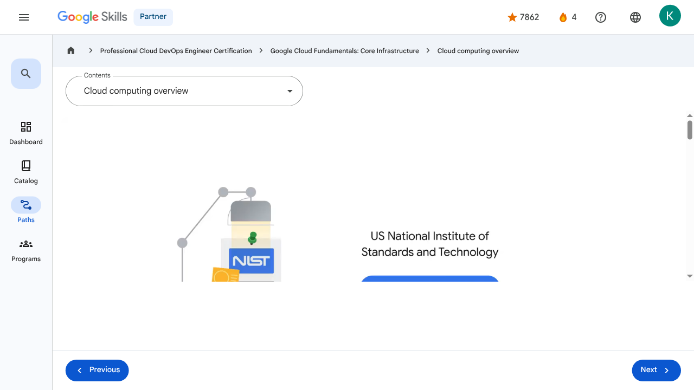
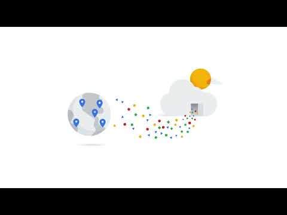

# Introducing Google Cloud - Cloud computing overview | Google Skills for Partners

> Offline lesson archive generated by Google Skills scraper.

---

## Metadata

- **Original URL:** https://partner.skills.google/paths/20/course_sessions/39706059/video/630061
- **Lesson type:** `video`
- **Path ID:** `20`
- **Container type:** `course_sessions`
- **Container ID:** `39706059`
- **Lesson ID:** `630061`
- **Generated:** 2026-07-10 04:51:17

---

## Full Page Screenshot

---

## Video

### YouTube Video `ph5hjgOAf40`

---

## Transcript

**00:00**

Let’s start at the beginning with an overview of cloud computing.

**00:04**

The cloud is a hot topic these days, but what exactly is it?

**00:09**

The US National Institute of Standards and Technology created the term cloud computing, although there is nothing US-specific about it.

**00:17**

Cloud computing is a way of using information technology (IT) that has these five equally important traits.

**00:25**

First, customers get computing resources that are on-demand and self-service.

**00:31**

Through a web interface, users get the processing power, storage, and network they require without the need for human intervention.

**00:40**

Second, customers get access to those resources over the internet, from anywhere they have a connection.

**00:46**

Third, the cloud provider has a big pool of those resources and allocates them to users out of that pool.

**00:53**

That allows the provider to buy in bulk and pass the savings on to the customers.

**00:58**

Customers don't have to know or care about the exact physical location of those resources.

**01:05**

Fourth, the resources are elastic–which means they’re flexible, so customers can be.

**01:10**

If customers need more resources they can get more, and quickly.

**01:14**

If they need less, they can scale back.

**01:18**

And finally, customers pay only for what they use, or reserve as they go.

**01:22**

If they stop using resources, they stop paying.

**01:26**

And that's it, that's the definition of cloud.

**01:30**

But why is the cloud model so compelling nowadays?

**01:33**

To understand why, we need to look at some history.

**01:37**

The trend towards cloud computing started with a first wave known as colocation.

**01:42**

Colocation gave users the financial efficiency of renting physical space, instead of investing in data center real estate.

**01:50**

Virtualized data centers of today, which are the second wave, share similarities with the private data centers and colocation facilities of decades past.

**02:00**

The components of virtualized data centers match the physical building blocks of hosted computing—servers, CPUs, disks, load balancers, and so on—but now they’re virtual devices.

**02:13**

With virtualization, enterprises still maintain the infrastructure; but it also remains a user-controlled and user-configured environment.

**02:22**

Several years ago, Google realized that its business couldn’t move fast enough within the confines of the virtualization model.

**02:30**

So Google switched to a container-based architecture— a fully automated, elastic third-wave cloud that consists of a combination of automated services and scalable data.

**02:41**

Services automatically provision and configure the infrastructure used to run applications.

**02:48**

Today, Google Cloud makes this third-wave cloud available to Google customers.

**02:54**

Google believes that, in the future, every company, regardless of size or industry, will differentiate itself from its competitors through technology.

**03:03**

Increasingly, that technology will be in the form of software.

**03:07**

Great software is based on high-quality data.

**03:12**

This means that every company is, or will eventually become, a data company.

**00:00**

Let’s start at the beginning with an overview of cloud computing. 00:04 The cloud is a hot topic these days, but what exactly is it? 00:09 The US National Institute of Standards and Technology created the term cloud computing, although there is nothing US-specific about it. 00:17 Cloud computing is a way of using information technology (IT) that has these five equally important traits. 00:25 First, customers get computing resources that are on-demand and self-service. 00:31 Through a web interface, users get the processing power, storage, and network they require without the need for human intervention. 00:40 Second, customers get access to those resources over the internet, from anywhere they have a connection. 00:46 Third, the cloud provider has a big pool of those resources and allocates them to users out of that pool. 00:53 That allows the provider to buy in bulk and pass the savings on to the customers. 00:58 Customers don't have to know or care about the exact physical location of those resources. 01:05 Fourth, the resources are elastic–which means they’re flexible, so customers can be. 01:10 If customers need more resources they can get more, and quickly. 01:14 If they need less, they can scale back. 01:18 And finally, customers pay only for what they use, or reserve as they go. 01:22 If they stop using resources, they stop paying. 01:26 And that's it, that's the definition of cloud. 01:30 But why is the cloud model so compelling nowadays? 01:33 To understand why, we need to look at some history. 01:37 The trend towards cloud computing started with a first wave known as colocation. 01:42 Colocation gave users the financial efficiency of renting physical space, instead of investing in data center real estate. 01:50 Virtualized data centers of today, which are the second wave, share similarities with the private data centers and colocation facilities of decades past. 02:00 The components of virtualized data centers match the physical building blocks of hosted computing—servers, CPUs, disks, load balancers, and so on—but now they’re virtual devices. 02:13 With virtualization, enterprises still maintain the infrastructure; but it also remains a user-controlled and user-configured environment. 02:22 Several years ago, Google realized that its business couldn’t move fast enough within the confines of the virtualization model. 02:30 So Google switched to a container-based architecture— a fully automated, elastic third-wave cloud that consists of a combination of automated services and scalable data. 02:41 Services automatically provision and configure the infrastructure used to run applications. 02:48 Today, Google Cloud makes this third-wave cloud available to Google customers. 02:54 Google believes that, in the future, every company, regardless of size or industry, will differentiate itself from its competitors through technology. 03:03 Increasingly, that technology will be in the form of software. 03:07 Great software is based on high-quality data. 03:12 This means that every company is, or will eventually become, a data company.

---

## Lesson Text

Partner
4
navigate_next
Professional Cloud DevOps Engineer Certification
navigate_next
Google Cloud Fundamentals: Core Infrastructure
navigate_next
Cloud computing overview
Previous
Next
Recertify in 3 simple steps:
Link your Google Skills and certification account profiles using the same email to get started.
Instantly see which certifications are eligible for renewal.
Complete courses and skill badges to renew your certifications automatically.

By clicking "Accept", I consent to share my name, email, and course completion data with Google Skills' certification partner, CM Connect, to receive continuing education credit for certification renewal.

---

## Images

### Image 1

### Image 2

---

## Main Resources

### youtube

- [Youtube](https://www.youtube.com/@googlecloud)

### videos

- [Course Introduction](https://partner.skills.google/paths/20/course_sessions/39706059/video/630060)
- [Cloud computing overview](https://partner.skills.google/paths/20/course_sessions/39706059/video/630061)
- [IaaS and PaaS](https://partner.skills.google/paths/20/course_sessions/39706059/video/630062)
- [The Google Cloud network](https://partner.skills.google/paths/20/course_sessions/39706059/video/630063)
- [Environmental impact](https://partner.skills.google/paths/20/course_sessions/39706059/video/630064)
- [Security](https://partner.skills.google/paths/20/course_sessions/39706059/video/630065)
- [Open source ecosystems](https://partner.skills.google/paths/20/course_sessions/39706059/video/630066)
- [Pricing and billing](https://partner.skills.google/paths/20/course_sessions/39706059/video/630067)
- [Google Cloud resource hierarchy](https://partner.skills.google/paths/20/course_sessions/39706059/video/630069)
- [Identity and Access Management (IAM)](https://partner.skills.google/paths/20/course_sessions/39706059/video/630070)
- [Service accounts](https://partner.skills.google/paths/20/course_sessions/39706059/video/630071)
- [Cloud Identity](https://partner.skills.google/paths/20/course_sessions/39706059/video/630072)
- [Interacting with Google Cloud](https://partner.skills.google/paths/20/course_sessions/39706059/video/630073)
- [Virtual Private Cloud networking](https://partner.skills.google/paths/20/course_sessions/39706059/video/630076)
- [Compute Engine](https://partner.skills.google/paths/20/course_sessions/39706059/video/630077)
- [Scaling virtual machines](https://partner.skills.google/paths/20/course_sessions/39706059/video/630078)
- [Important VPC compatibilities](https://partner.skills.google/paths/20/course_sessions/39706059/video/630079)
- [Cloud Load Balancing](https://partner.skills.google/paths/20/course_sessions/39706059/video/630080)
- [Cloud DNS and Cloud CDN](https://partner.skills.google/paths/20/course_sessions/39706059/video/630081)
- [Connecting networks to Google VPC](https://partner.skills.google/paths/20/course_sessions/39706059/video/630082)
- [Google Cloud storage options](https://partner.skills.google/paths/20/course_sessions/39706059/video/630085)
- [Cloud Storage](https://partner.skills.google/paths/20/course_sessions/39706059/video/630086)
- [Cloud Storage: Storage classes and data transfer](https://partner.skills.google/paths/20/course_sessions/39706059/video/630087)
- [Cloud SQL](https://partner.skills.google/paths/20/course_sessions/39706059/video/630088)
- [Spanner](https://partner.skills.google/paths/20/course_sessions/39706059/video/630089)
- [Firestore](https://partner.skills.google/paths/20/course_sessions/39706059/video/630090)
- [Bigtable](https://partner.skills.google/paths/20/course_sessions/39706059/video/630091)
- [Comparing storage options](https://partner.skills.google/paths/20/course_sessions/39706059/video/630092)
- [Introduction to containers](https://partner.skills.google/paths/20/course_sessions/39706059/video/630095)
- [Kubernetes](https://partner.skills.google/paths/20/course_sessions/39706059/video/630096)
- [Google Kubernetes Engine](https://partner.skills.google/paths/20/course_sessions/39706059/video/630097)
- [Cloud Run](https://partner.skills.google/paths/20/course_sessions/39706059/video/630099)
- [Development in the cloud](https://partner.skills.google/paths/20/course_sessions/39706059/video/630100)
- [Prompt Engineering](https://partner.skills.google/paths/20/course_sessions/39706059/video/630103)
- [Course summary](https://partner.skills.google/paths/20/course_sessions/39706059/video/630105)
- [Resource](https://partner.skills.google/paths/20/course_sessions/39706059/video/630060)
- [Resource](https://partner.skills.google/paths/20/course_sessions/39706059/video/630062)

### labs

- [Resource](https://support.google.com/qwiklabs/contact/Google_Skills_Partner)
- [Google Cloud Fundamentals: Getting Started with Cloud Marketplace](https://partner.skills.google/paths/20/course_sessions/39706059/labs/630074)
- [Get Started with Virtual Private Cloud Networking and Compute Engine](https://partner.skills.google/paths/20/course_sessions/39706059/labs/630083)
- [Google Cloud Fundamentals: Getting Started with Cloud Storage and Cloud SQL](https://partner.skills.google/paths/20/course_sessions/39706059/labs/630093)
- [Hello Cloud Run](https://partner.skills.google/paths/20/course_sessions/39706059/labs/630101)

### external_links

- [Resource](https://partner.skills.google/)
- [Professional Cloud DevOps Engineer Certification](https://partner.skills.google/paths/20)
- [Google Cloud Fundamentals: Core Infrastructure](https://partner.skills.google/paths/20/course_templates/60)
- [Dashboard](https://partner.skills.google/)
- [Catalog](https://partner.skills.google/catalog)
- [Paths](https://partner.skills.google/paths)
- [Subscriptions](https://partner.skills.google/subscriptions)
- [Activities](https://partner.skills.google/profile/stay_on_track)
- [Achievements](https://partner.skills.google/profile/badges)
- [Resource](https://partner.skills.google/profile/activity)
- [Resource](https://partner.skills.google/my_account/profile)
- [Programs](https://partner.skills.google/my_account/programs)
- [Overview](https://partner.skills.google/paths/20/course_templates/60)
- [Quiz](https://partner.skills.google/paths/20/course_sessions/39706059/quizzes/630068)
- [Quiz](https://partner.skills.google/paths/20/course_sessions/39706059/quizzes/630075)
- [Quiz](https://partner.skills.google/paths/20/course_sessions/39706059/quizzes/630084)
- [Quiz](https://partner.skills.google/paths/20/course_sessions/39706059/quizzes/630094)
- [Quiz](https://partner.skills.google/paths/20/course_sessions/39706059/quizzes/630098)
- [Quiz](https://partner.skills.google/paths/20/course_sessions/39706059/quizzes/630102)
- [Quiz](https://partner.skills.google/paths/20/course_sessions/39706059/quizzes/630104)
- [Course resources](https://partner.skills.google/paths/20/course_sessions/39706059/documents/630106)
- [Claim credential](https://partner.skills.google/paths/20/course_templates/60/badge)
- [Course Survey
      Recommended](https://partner.skills.google/paths/20/course_templates/60/course_surveys/0)
- [Resource](https://partner.skills.google/paths/20/course_templates/60/preview)

---

## Headings

- **H3**: Transcript
- **H2**: Recertify in 3 simple steps:
- **H1**: A newer version of this course is available. Your progress will carry over if you choose to upgrade. However, your completion percentage may change if the new version has added or removed any learning activities. Click the preview button to see the course changes before upgrading.

---

## Code Blocks / Commands

_No code blocks found._

---

## Related Files

- [README.md](README.md)
- [lesson.md](lesson.md)
- [readable_page.html](readable_page.html)
- [page.html](page.html)
- [page_text.txt](page_text.txt)
- [transcript.txt](transcript.txt)
- [screenshot.png](screenshot.png)
- [assets/](assets/)
- [assets/](assets/)
