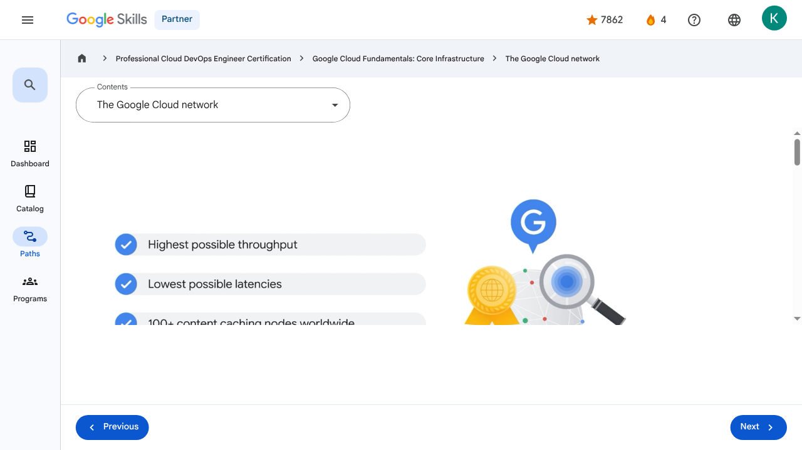
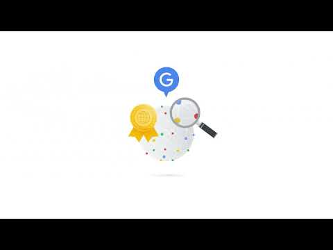

# Introducing Google Cloud - The Google Cloud network | Google Skills for Partners

> Offline lesson archive generated by Google Skills scraper.

---

## Metadata

- **Original URL:** https://partner.skills.google/paths/20/course_sessions/39706059/video/630063
- **Lesson type:** `video`
- **Path ID:** `20`
- **Container type:** `course_sessions`
- **Container ID:** `39706059`
- **Lesson ID:** `630063`
- **Generated:** 2026-07-10 04:52:04

---

## Full Page Screenshot

---

## Video

### YouTube Video `SDGJqKIE5yY`

---

## Transcript

**00:01**

Google Cloud runs on Google’s own global network.

**00:05**

It’s the largest network of its kind, and Google has invested billions of dollars over many years to build it.

**00:12**

This network is designed to give customers the highest possible throughput and lowest possible latencies for their applications by leveraging more than 100 content caching nodes worldwide.

**00:23**

These are locations where high demand content is cached for quicker access, allowing applications to respond to user requests from the location that will provide the quickest response time.

**00:34**

Google Cloud’s locations underpin all of the important work we do for our customers.

**00:40**

From redundant cloud regions to high- bandwidth connectivity via subsea cables, every aspect of our infrastructure

**00:45**

is designed to deliver your services to your users, no matter where they are around the world.

**00:52**

Google Cloud’s infrastructure is based in seven major geographic locations: North America, South America, Europe, Africa, the Middle East, Asia, and Australia.

**01:05**

Having multiple service locations is important because choosing where to locate applications affects qualities like availability, durability, and latency,

**01:15**

the latter of which measures the time a packet of information takes to travel from its source to its destination.

**01:22**

Each of these locations is divided into several different regions and zones.

**01:28**

Regions represent independent geographic areas and are composed of zones.

**01:34**

For example, London, or europe-west2, is a region that currently comprises three different zones.

**01:42**

A zone is an area where Google Cloud resources are deployed.

**01:47**

For example, if you launch a virtual machine using Compute Engine it will run in the zone that you specify to ensure resource redundancy.

**01:56**

You can run also resources in different regions.

**02:00**

This is useful for bringing applications closer to users around the world, and also for protection in case there are issues with an entire region, such as a natural disaster.

**02:10**

Some of Google Cloud’s services support placing resources in what we call a multi-region.

**02:16**

For example, Spanner multi-region configurations allow you to replicate the database's data not just in multiple zones, but in multiple zones across multiple regions, as defined by the instance configuration.

**02:31**

These additional replicas enable you to read data with low latency from multiple locations close to or within the regions in the configuration, like The Netherlands, and Belgium.

**02:43**

The number of zones and regions Google Cloud supports is increasing all the time.

**02:49**

You can find the most up-to-date numbers at cloud.google.com/about/locations.

**00:01**

Google Cloud runs on Google’s own global network. 00:05 It’s the largest network of its kind, and Google has invested billions of dollars over many years to build it. 00:12 This network is designed to give customers the highest possible throughput and lowest possible latencies for their applications by leveraging more than 100 content caching nodes worldwide. 00:23 These are locations where high demand content is cached for quicker access, allowing applications to respond to user requests from the location that will provide the quickest response time. 00:34 Google Cloud’s locations underpin all of the important work we do for our customers. 00:40 From redundant cloud regions to high- bandwidth connectivity via subsea cables, every aspect of our infrastructure 00:45 is designed to deliver your services to your users, no matter where they are around the world. 00:52 Google Cloud’s infrastructure is based in seven major geographic locations: North America, South America, Europe, Africa, the Middle East, Asia, and Australia. 01:05 Having multiple service locations is important because choosing where to locate applications affects qualities like availability, durability, and latency, 01:15 the latter of which measures the time a packet of information takes to travel from its source to its destination. 01:22 Each of these locations is divided into several different regions and zones. 01:28 Regions represent independent geographic areas and are composed of zones. 01:34 For example, London, or europe-west2, is a region that currently comprises three different zones. 01:42 A zone is an area where Google Cloud resources are deployed. 01:47 For example, if you launch a virtual machine using Compute Engine it will run in the zone that you specify to ensure resource redundancy. 01:56 You can run also resources in different regions. 02:00 This is useful for bringing applications closer to users around the world, and also for protection in case there are issues with an entire region, such as a natural disaster. 02:10 Some of Google Cloud’s services support placing resources in what we call a multi-region. 02:16 For example, Spanner multi-region configurations allow you to replicate the database's data not just in multiple zones, but in multiple zones across multiple regions, as defined by the instance configuration. 02:31 These additional replicas enable you to read data with low latency from multiple locations close to or within the regions in the configuration, like The Netherlands, and Belgium. 02:43 The number of zones and regions Google Cloud supports is increasing all the time. 02:49 You can find the most up-to-date numbers at cloud.google.com/about/locations.

---

## Lesson Text

Partner
4
navigate_next
Professional Cloud DevOps Engineer Certification
navigate_next
Google Cloud Fundamentals: Core Infrastructure
navigate_next
The Google Cloud network
Previous
Next
Recertify in 3 simple steps:
Link your Google Skills and certification account profiles using the same email to get started.
Instantly see which certifications are eligible for renewal.
Complete courses and skill badges to renew your certifications automatically.

By clicking "Accept", I consent to share my name, email, and course completion data with Google Skills' certification partner, CM Connect, to receive continuing education credit for certification renewal.

---

## Images

### Image 1

### Image 2

---

## Main Resources

### youtube

- [Youtube](https://www.youtube.com/@googlecloud)

### videos

- [Course Introduction](https://partner.skills.google/paths/20/course_sessions/39706059/video/630060)
- [Cloud computing overview](https://partner.skills.google/paths/20/course_sessions/39706059/video/630061)
- [IaaS and PaaS](https://partner.skills.google/paths/20/course_sessions/39706059/video/630062)
- [The Google Cloud network](https://partner.skills.google/paths/20/course_sessions/39706059/video/630063)
- [Environmental impact](https://partner.skills.google/paths/20/course_sessions/39706059/video/630064)
- [Security](https://partner.skills.google/paths/20/course_sessions/39706059/video/630065)
- [Open source ecosystems](https://partner.skills.google/paths/20/course_sessions/39706059/video/630066)
- [Pricing and billing](https://partner.skills.google/paths/20/course_sessions/39706059/video/630067)
- [Google Cloud resource hierarchy](https://partner.skills.google/paths/20/course_sessions/39706059/video/630069)
- [Identity and Access Management (IAM)](https://partner.skills.google/paths/20/course_sessions/39706059/video/630070)
- [Service accounts](https://partner.skills.google/paths/20/course_sessions/39706059/video/630071)
- [Cloud Identity](https://partner.skills.google/paths/20/course_sessions/39706059/video/630072)
- [Interacting with Google Cloud](https://partner.skills.google/paths/20/course_sessions/39706059/video/630073)
- [Virtual Private Cloud networking](https://partner.skills.google/paths/20/course_sessions/39706059/video/630076)
- [Compute Engine](https://partner.skills.google/paths/20/course_sessions/39706059/video/630077)
- [Scaling virtual machines](https://partner.skills.google/paths/20/course_sessions/39706059/video/630078)
- [Important VPC compatibilities](https://partner.skills.google/paths/20/course_sessions/39706059/video/630079)
- [Cloud Load Balancing](https://partner.skills.google/paths/20/course_sessions/39706059/video/630080)
- [Cloud DNS and Cloud CDN](https://partner.skills.google/paths/20/course_sessions/39706059/video/630081)
- [Connecting networks to Google VPC](https://partner.skills.google/paths/20/course_sessions/39706059/video/630082)
- [Google Cloud storage options](https://partner.skills.google/paths/20/course_sessions/39706059/video/630085)
- [Cloud Storage](https://partner.skills.google/paths/20/course_sessions/39706059/video/630086)
- [Cloud Storage: Storage classes and data transfer](https://partner.skills.google/paths/20/course_sessions/39706059/video/630087)
- [Cloud SQL](https://partner.skills.google/paths/20/course_sessions/39706059/video/630088)
- [Spanner](https://partner.skills.google/paths/20/course_sessions/39706059/video/630089)
- [Firestore](https://partner.skills.google/paths/20/course_sessions/39706059/video/630090)
- [Bigtable](https://partner.skills.google/paths/20/course_sessions/39706059/video/630091)
- [Comparing storage options](https://partner.skills.google/paths/20/course_sessions/39706059/video/630092)
- [Introduction to containers](https://partner.skills.google/paths/20/course_sessions/39706059/video/630095)
- [Kubernetes](https://partner.skills.google/paths/20/course_sessions/39706059/video/630096)
- [Google Kubernetes Engine](https://partner.skills.google/paths/20/course_sessions/39706059/video/630097)
- [Cloud Run](https://partner.skills.google/paths/20/course_sessions/39706059/video/630099)
- [Development in the cloud](https://partner.skills.google/paths/20/course_sessions/39706059/video/630100)
- [Prompt Engineering](https://partner.skills.google/paths/20/course_sessions/39706059/video/630103)
- [Course summary](https://partner.skills.google/paths/20/course_sessions/39706059/video/630105)
- [Resource](https://partner.skills.google/paths/20/course_sessions/39706059/video/630062)
- [Resource](https://partner.skills.google/paths/20/course_sessions/39706059/video/630064)

### labs

- [Resource](https://support.google.com/qwiklabs/contact/Google_Skills_Partner)
- [Google Cloud Fundamentals: Getting Started with Cloud Marketplace](https://partner.skills.google/paths/20/course_sessions/39706059/labs/630074)
- [Get Started with Virtual Private Cloud Networking and Compute Engine](https://partner.skills.google/paths/20/course_sessions/39706059/labs/630083)
- [Google Cloud Fundamentals: Getting Started with Cloud Storage and Cloud SQL](https://partner.skills.google/paths/20/course_sessions/39706059/labs/630093)
- [Hello Cloud Run](https://partner.skills.google/paths/20/course_sessions/39706059/labs/630101)

### external_links

- [Resource](https://partner.skills.google/)
- [Professional Cloud DevOps Engineer Certification](https://partner.skills.google/paths/20)
- [Google Cloud Fundamentals: Core Infrastructure](https://partner.skills.google/paths/20/course_templates/60)
- [Dashboard](https://partner.skills.google/)
- [Catalog](https://partner.skills.google/catalog)
- [Paths](https://partner.skills.google/paths)
- [Subscriptions](https://partner.skills.google/subscriptions)
- [Activities](https://partner.skills.google/profile/stay_on_track)
- [Achievements](https://partner.skills.google/profile/badges)
- [Resource](https://partner.skills.google/profile/activity)
- [Resource](https://partner.skills.google/my_account/profile)
- [Programs](https://partner.skills.google/my_account/programs)
- [Overview](https://partner.skills.google/paths/20/course_templates/60)
- [Quiz](https://partner.skills.google/paths/20/course_sessions/39706059/quizzes/630068)
- [Quiz](https://partner.skills.google/paths/20/course_sessions/39706059/quizzes/630075)
- [Quiz](https://partner.skills.google/paths/20/course_sessions/39706059/quizzes/630084)
- [Quiz](https://partner.skills.google/paths/20/course_sessions/39706059/quizzes/630094)
- [Quiz](https://partner.skills.google/paths/20/course_sessions/39706059/quizzes/630098)
- [Quiz](https://partner.skills.google/paths/20/course_sessions/39706059/quizzes/630102)
- [Quiz](https://partner.skills.google/paths/20/course_sessions/39706059/quizzes/630104)
- [Course resources](https://partner.skills.google/paths/20/course_sessions/39706059/documents/630106)
- [Claim credential](https://partner.skills.google/paths/20/course_templates/60/badge)
- [Course Survey
      Recommended](https://partner.skills.google/paths/20/course_templates/60/course_surveys/0)
- [Resource](https://partner.skills.google/paths/20/course_templates/60/preview)

---

## Headings

- **H3**: Transcript
- **H2**: Recertify in 3 simple steps:
- **H1**: A newer version of this course is available. Your progress will carry over if you choose to upgrade. However, your completion percentage may change if the new version has added or removed any learning activities. Click the preview button to see the course changes before upgrading.

---

## Code Blocks / Commands

_No code blocks found._

---

## Related Files

- [README.md](README.md)
- [lesson.md](lesson.md)
- [readable_page.html](readable_page.html)
- [page.html](page.html)
- [page_text.txt](page_text.txt)
- [transcript.txt](transcript.txt)
- [screenshot.png](screenshot.png)
- [assets/](assets/)
- [assets/](assets/)
