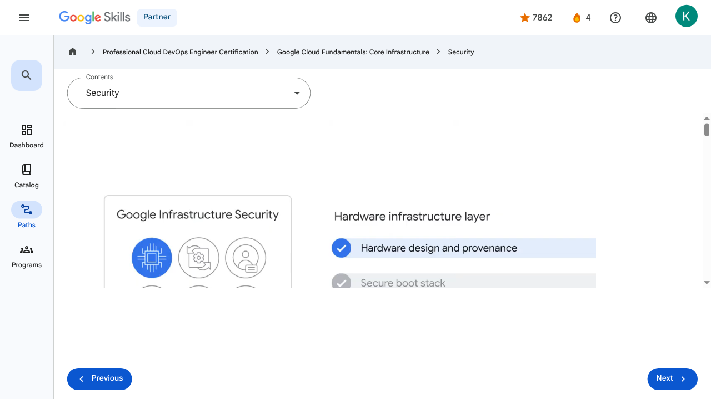
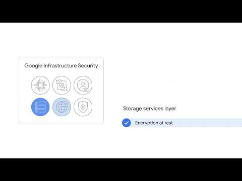

# Introducing Google Cloud - Security | Google Skills for Partners

> Offline lesson archive generated by Google Skills scraper.

---

## Metadata

- **Original URL:** https://partner.skills.google/paths/20/course_sessions/39706059/video/630065
- **Lesson type:** `video`
- **Path ID:** `20`
- **Container type:** `course_sessions`
- **Container ID:** `39706059`
- **Lesson ID:** `630065`
- **Generated:** 2026-07-10 04:52:47

---

## Full Page Screenshot

---

## Video

### YouTube Video `BggWZl8qTzk`

---

## Transcript

**00:00**

Nine of Google’s services have more than one billion users each, and so you can be assured that security is always on the minds of Google's employees.

**00:08**

Design for security is prevalent throughout the infrastructure that Google Cloud and Google services run on.

**00:15**

Let's talk about a few ways Google works to keep customers' data safe.

**00:20**

The security infrastructure can be explained in progressive layers, starting from the physical security of our data centers, continuing on to how the

**00:27**

hardware and software that underlie the infrastructure are secured, and finally, describing the technical constraints and processes in place to support operational security.

**00:39**

We begin with the Hardware infrastructure layer which comprises three key security features: The first is hardware design and provenance.

**00:49**

Both the server boards and the networking equipment in Google data centers are custom-designed by Google.

**00:56**

Google also designs custom chips, including a hardware security chip that's currently being deployed on both servers and peripherals.

**01:05**

The next feature is a secure boot stack.

**01:09**

Google server machines use a variety of technologies to ensure that they are booting the correct

**01:14**

software stack, such as cryptographic signatures over the BIOS, bootloader, kernel, and base operating system image.

**01:23**

This layer's final feature is premises security.

**01:27**

Google designs and builds its own data centers, which incorporate multiple layers of physical security protections.

**01:34**

Access to these data centers is limited to only a very small number of Google employees.

**01:40**

Google additionally hosts some servers in third-party data centers, where we ensure that there are

**01:44**

Google-controlled physical security measures on top of the security layers provided by the data center operator.

**01:51**

Next is the Service deployment layer, where the key feature is encryption of inter-service communication.

**01:57**

Google’s infrastructure provides cryptographic privacy and integrity for remote procedure call (“RPC”) data on the network.

**02:05**

Google’s services communicate with each other using RPC calls.

**02:08**

The infrastructure automatically encrypts all infrastructure RPC traffic that goes between data centers.

**02:17**

Google has started to deploy hardware cryptographic accelerators that will allow it to extend this default encryption to all infrastructure RPC traffic inside Google data centers.

**02:28**

Then we have the User identity layer.

**02:31**

Google’s central identity service, which usually manifests to end users as the Google login page, goes beyond asking for a simple username and password.

**02:41**

The service also intelligently challenges users for additional information based on risk factors such as

**02:45**

whether they have logged in from the same device or a similar location in the past.

**02:51**

Users can also employ secondary factors when signing in, including devices based on the Universal 2nd Factor (U2F) open standard.

**03:01**

On the Storage services layer we find the encryption at rest security feature.

**03:07**

Most applications at Google access physical storage (in other words, “file storage”) indirectly via storage

**03:12**

services, and encryption using centrally managed keys is applied at the layer of these storage services.

**03:21**

Google also enables hardware encryption support in hard drives and SSDs.

**03:25**

The next layer up is the Internet communication layer, and this comprises two key security features.

**03:33**

Google services that are being made available on the internet, register themselves with an infrastructure service called the Google Front End, which ensures that all TLS connections

**03:42**

are ended using a public-private key pair and an X.509 certificate from a Certified Authority (CA), as well as following best practices such as supporting perfect forward secrecy.

**03:54**

The GFE additionally applies protections against Denial of Service attacks.

**04:00**

Also provided is Denial of Service (“DoS”) protection.

**04:04**

The sheer scale of its infrastructure enables Google to simply absorb many DoS attacks.

**04:09**

Google also has multi-tier, multi-layer DoS protections that further reduce the risk of any DoS impact on a service running behind a GFE.

**04:20**

The final layer is Google's Operational security layer which provides four key features.

**04:27**

First is intrusion detection.

**04:29**

Rules and machine intelligence give Google’s operational security teams warnings of possible incidents.

**04:36**

Google conducts Red Team exercises to measure and improve the effectiveness of its detection and response mechanisms.

**04:44**

Next is reducing insider risk.

**04:46**

Google aggressively limits and actively monitors the activities of employees who have been granted administrative access to the infrastructure.

**04:54**

Then there’s employee U2F use.

**04:57**

To guard against phishing attacks against Google employees, employee accounts require use of U2F-compatible Security Keys.

**05:05**

Finally, there are stringent software development practices.

**05:10**

Google employs central source control and requires two-party review of new code.

**05:16**

Google also provides its developers libraries that prevent them from introducing certain classes of security bugs.

**05:22**

Additionally, Google runs a Vulnerability Rewards Program where we pay anyone who is able to discover and inform us of bugs in our infrastructure or applications.

**05:31**

You can learn more about Google’s technical-infrastructure security at cloud.google.com/security/security-design.

**00:00**

Nine of Google’s services have more than one billion users each, and so you can be assured that security is always on the minds of Google's employees. 00:08 Design for security is prevalent throughout the infrastructure that Google Cloud and Google services run on. 00:15 Let's talk about a few ways Google works to keep customers' data safe. 00:20 The security infrastructure can be explained in progressive layers, starting from the physical security of our data centers, continuing on to how the 00:27 hardware and software that underlie the infrastructure are secured, and finally, describing the technical constraints and processes in place to support operational security. 00:39 We begin with the Hardware infrastructure layer which comprises three key security features: The first is hardware design and provenance. 00:49 Both the server boards and the networking equipment in Google data centers are custom-designed by Google. 00:56 Google also designs custom chips, including a hardware security chip that's currently being deployed on both servers and peripherals. 01:05 The next feature is a secure boot stack. 01:09 Google server machines use a variety of technologies to ensure that they are booting the correct 01:14 software stack, such as cryptographic signatures over the BIOS, bootloader, kernel, and base operating system image. 01:23 This layer's final feature is premises security. 01:27 Google designs and builds its own data centers, which incorporate multiple layers of physical security protections. 01:34 Access to these data centers is limited to only a very small number of Google employees. 01:40 Google additionally hosts some servers in third-party data centers, where we ensure that there are 01:44 Google-controlled physical security measures on top of the security layers provided by the data center operator. 01:51 Next is the Service deployment layer, where the key feature is encryption of inter-service communication. 01:57 Google’s infrastructure provides cryptographic privacy and integrity for remote procedure call (“RPC”) data on the network. 02:05 Google’s services communicate with each other using RPC calls. 02:08 The infrastructure automatically encrypts all infrastructure RPC traffic that goes between data centers. 02:17 Google has started to deploy hardware cryptographic accelerators that will allow it to extend this default encryption to all infrastructure RPC traffic inside Google data centers. 02:28 Then we have the User identity layer. 02:31 Google’s central identity service, which usually manifests to end users as the Google login page, goes beyond asking for a simple username and password. 02:41 The service also intelligently challenges users for additional information based on risk factors such as 02:45 whether they have logged in from the same device or a similar location in the past. 02:51 Users can also employ secondary factors when signing in, including devices based on the Universal 2nd Factor (U2F) open standard. 03:01 On the Storage services layer we find the encryption at rest security feature. 03:07 Most applications at Google access physical storage (in other words, “file storage”) indirectly via storage 03:12 services, and encryption using centrally managed keys is applied at the layer of these storage services. 03:21 Google also enables hardware encryption support in hard drives and SSDs. 03:25 The next layer up is the Internet communication layer, and this comprises two key security features. 03:33 Google services that are being made available on the internet, register themselves with an infrastructure service called the Google Front End, which ensures that all TLS connections 03:42 are ended using a public-private key pair and an X.509 certificate from a Certified Authority (CA), as well as following best practices such as supporting perfect forward secrecy. 03:54 The GFE additionally applies protections against Denial of Service attacks. 04:00 Also provided is Denial of Service (“DoS”) protection. 04:04 The sheer scale of its infrastructure enables Google to simply absorb many DoS attacks. 04:09 Google also has multi-tier, multi-layer DoS protections that further reduce the risk of any DoS impact on a service running behind a GFE. 04:20 The final layer is Google's Operational security layer which provides four key features. 04:27 First is intrusion detection. 04:29 Rules and machine intelligence give Google’s operational security teams warnings of possible incidents. 04:36 Google conducts Red Team exercises to measure and improve the effectiveness of its detection and response mechanisms. 04:44 Next is reducing insider risk. 04:46 Google aggressively limits and actively monitors the activities of employees who have been granted administrative access to the infrastructure. 04:54 Then there’s employee U2F use. 04:57 To guard against phishing attacks against Google employees, employee accounts require use of U2F-compatible Security Keys. 05:05 Finally, there are stringent software development practices. 05:10 Google employs central source control and requires two-party review of new code. 05:16 Google also provides its developers libraries that prevent them from introducing certain classes of security bugs. 05:22 Additionally, Google runs a Vulnerability Rewards Program where we pay anyone who is able to discover and inform us of bugs in our infrastructure or applications. 05:31 You can learn more about Google’s technical-infrastructure security at cloud.google.com/security/security-design.

---

## Lesson Text

Partner
4
navigate_next
Professional Cloud DevOps Engineer Certification
navigate_next
Google Cloud Fundamentals: Core Infrastructure
navigate_next
Security
Previous
Next
Recertify in 3 simple steps:
Link your Google Skills and certification account profiles using the same email to get started.
Instantly see which certifications are eligible for renewal.
Complete courses and skill badges to renew your certifications automatically.

By clicking "Accept", I consent to share my name, email, and course completion data with Google Skills' certification partner, CM Connect, to receive continuing education credit for certification renewal.

---

## Images

### Image 1

### Image 2

---

## Main Resources

### youtube

- [Youtube](https://www.youtube.com/@googlecloud)

### videos

- [Course Introduction](https://partner.skills.google/paths/20/course_sessions/39706059/video/630060)
- [Cloud computing overview](https://partner.skills.google/paths/20/course_sessions/39706059/video/630061)
- [IaaS and PaaS](https://partner.skills.google/paths/20/course_sessions/39706059/video/630062)
- [The Google Cloud network](https://partner.skills.google/paths/20/course_sessions/39706059/video/630063)
- [Environmental impact](https://partner.skills.google/paths/20/course_sessions/39706059/video/630064)
- [Security](https://partner.skills.google/paths/20/course_sessions/39706059/video/630065)
- [Open source ecosystems](https://partner.skills.google/paths/20/course_sessions/39706059/video/630066)
- [Pricing and billing](https://partner.skills.google/paths/20/course_sessions/39706059/video/630067)
- [Google Cloud resource hierarchy](https://partner.skills.google/paths/20/course_sessions/39706059/video/630069)
- [Identity and Access Management (IAM)](https://partner.skills.google/paths/20/course_sessions/39706059/video/630070)
- [Service accounts](https://partner.skills.google/paths/20/course_sessions/39706059/video/630071)
- [Cloud Identity](https://partner.skills.google/paths/20/course_sessions/39706059/video/630072)
- [Interacting with Google Cloud](https://partner.skills.google/paths/20/course_sessions/39706059/video/630073)
- [Virtual Private Cloud networking](https://partner.skills.google/paths/20/course_sessions/39706059/video/630076)
- [Compute Engine](https://partner.skills.google/paths/20/course_sessions/39706059/video/630077)
- [Scaling virtual machines](https://partner.skills.google/paths/20/course_sessions/39706059/video/630078)
- [Important VPC compatibilities](https://partner.skills.google/paths/20/course_sessions/39706059/video/630079)
- [Cloud Load Balancing](https://partner.skills.google/paths/20/course_sessions/39706059/video/630080)
- [Cloud DNS and Cloud CDN](https://partner.skills.google/paths/20/course_sessions/39706059/video/630081)
- [Connecting networks to Google VPC](https://partner.skills.google/paths/20/course_sessions/39706059/video/630082)
- [Google Cloud storage options](https://partner.skills.google/paths/20/course_sessions/39706059/video/630085)
- [Cloud Storage](https://partner.skills.google/paths/20/course_sessions/39706059/video/630086)
- [Cloud Storage: Storage classes and data transfer](https://partner.skills.google/paths/20/course_sessions/39706059/video/630087)
- [Cloud SQL](https://partner.skills.google/paths/20/course_sessions/39706059/video/630088)
- [Spanner](https://partner.skills.google/paths/20/course_sessions/39706059/video/630089)
- [Firestore](https://partner.skills.google/paths/20/course_sessions/39706059/video/630090)
- [Bigtable](https://partner.skills.google/paths/20/course_sessions/39706059/video/630091)
- [Comparing storage options](https://partner.skills.google/paths/20/course_sessions/39706059/video/630092)
- [Introduction to containers](https://partner.skills.google/paths/20/course_sessions/39706059/video/630095)
- [Kubernetes](https://partner.skills.google/paths/20/course_sessions/39706059/video/630096)
- [Google Kubernetes Engine](https://partner.skills.google/paths/20/course_sessions/39706059/video/630097)
- [Cloud Run](https://partner.skills.google/paths/20/course_sessions/39706059/video/630099)
- [Development in the cloud](https://partner.skills.google/paths/20/course_sessions/39706059/video/630100)
- [Prompt Engineering](https://partner.skills.google/paths/20/course_sessions/39706059/video/630103)
- [Course summary](https://partner.skills.google/paths/20/course_sessions/39706059/video/630105)
- [Resource](https://partner.skills.google/paths/20/course_sessions/39706059/video/630064)
- [Resource](https://partner.skills.google/paths/20/course_sessions/39706059/video/630066)

### labs

- [Resource](https://support.google.com/qwiklabs/contact/Google_Skills_Partner)
- [Google Cloud Fundamentals: Getting Started with Cloud Marketplace](https://partner.skills.google/paths/20/course_sessions/39706059/labs/630074)
- [Get Started with Virtual Private Cloud Networking and Compute Engine](https://partner.skills.google/paths/20/course_sessions/39706059/labs/630083)
- [Google Cloud Fundamentals: Getting Started with Cloud Storage and Cloud SQL](https://partner.skills.google/paths/20/course_sessions/39706059/labs/630093)
- [Hello Cloud Run](https://partner.skills.google/paths/20/course_sessions/39706059/labs/630101)

### external_links

- [Resource](https://partner.skills.google/)
- [Professional Cloud DevOps Engineer Certification](https://partner.skills.google/paths/20)
- [Google Cloud Fundamentals: Core Infrastructure](https://partner.skills.google/paths/20/course_templates/60)
- [Dashboard](https://partner.skills.google/)
- [Catalog](https://partner.skills.google/catalog)
- [Paths](https://partner.skills.google/paths)
- [Subscriptions](https://partner.skills.google/subscriptions)
- [Activities](https://partner.skills.google/profile/stay_on_track)
- [Achievements](https://partner.skills.google/profile/badges)
- [Resource](https://partner.skills.google/profile/activity)
- [Resource](https://partner.skills.google/my_account/profile)
- [Programs](https://partner.skills.google/my_account/programs)
- [Overview](https://partner.skills.google/paths/20/course_templates/60)
- [Quiz](https://partner.skills.google/paths/20/course_sessions/39706059/quizzes/630068)
- [Quiz](https://partner.skills.google/paths/20/course_sessions/39706059/quizzes/630075)
- [Quiz](https://partner.skills.google/paths/20/course_sessions/39706059/quizzes/630084)
- [Quiz](https://partner.skills.google/paths/20/course_sessions/39706059/quizzes/630094)
- [Quiz](https://partner.skills.google/paths/20/course_sessions/39706059/quizzes/630098)
- [Quiz](https://partner.skills.google/paths/20/course_sessions/39706059/quizzes/630102)
- [Quiz](https://partner.skills.google/paths/20/course_sessions/39706059/quizzes/630104)
- [Course resources](https://partner.skills.google/paths/20/course_sessions/39706059/documents/630106)
- [Claim credential](https://partner.skills.google/paths/20/course_templates/60/badge)
- [Course Survey
      Recommended](https://partner.skills.google/paths/20/course_templates/60/course_surveys/0)
- [Resource](https://partner.skills.google/paths/20/course_templates/60/preview)

---

## Headings

- **H3**: Transcript
- **H2**: Recertify in 3 simple steps:
- **H1**: A newer version of this course is available. Your progress will carry over if you choose to upgrade. However, your completion percentage may change if the new version has added or removed any learning activities. Click the preview button to see the course changes before upgrading.

---

## Code Blocks / Commands

_No code blocks found._

---

## Related Files

- [README.md](README.md)
- [lesson.md](lesson.md)
- [readable_page.html](readable_page.html)
- [page.html](page.html)
- [page_text.txt](page_text.txt)
- [transcript.txt](transcript.txt)
- [screenshot.png](screenshot.png)
- [assets/](assets/)
- [assets/](assets/)
