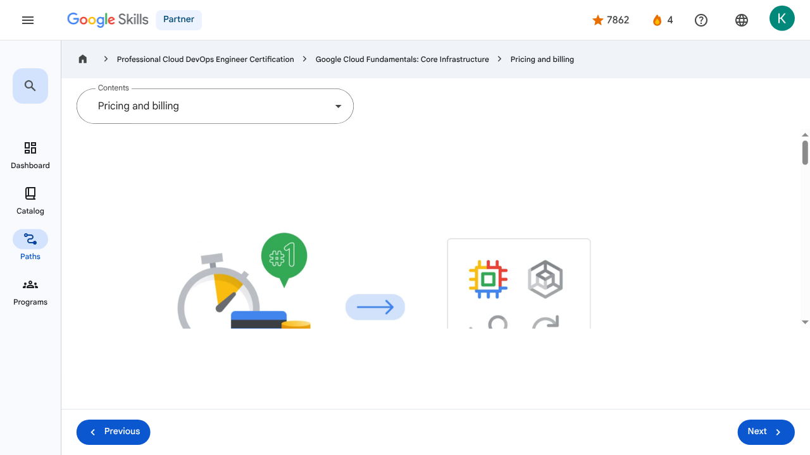
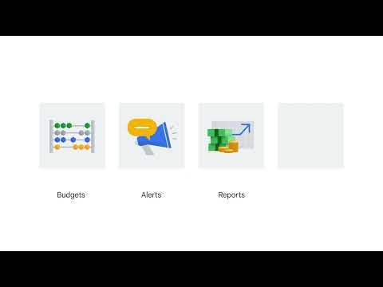

# Introducing Google Cloud - Pricing and billing | Google Skills for Partners

> Offline lesson archive generated by Google Skills scraper.

---

## Metadata

- **Original URL:** https://partner.skills.google/paths/20/course_sessions/39706059/video/630067
- **Lesson type:** `video`
- **Path ID:** `20`
- **Container type:** `course_sessions`
- **Container ID:** `39706059`
- **Lesson ID:** `630067`
- **Generated:** 2026-07-10 04:53:34

---

## Full Page Screenshot

---

## Video

### YouTube Video `OTD61ZfnO28`

---

## Transcript

**00:00**

To round off this section of the course, let’s take a brief look at Google Cloud’s pricing structure.

**00:05**

Google was the first major cloud provider to deliver per-second billing for its infrastructure-as-a-service compute offering, Compute Engine.

**00:14**

In addition, per-second billing is now also offered for users of Google Kubernetes Engine our container infrastructure as a service, Managed Service for Apache Spark,

**00:25**

which is the equivalent of the bigdata system Hadoop, but operating as a service, and App Engine flexible environment VMs, a platform as a service.

**00:35**

Compute Engine offers automatically applied sustained-use discounts, which are automatic discounts that you get for running a virtual machine instance for a significant portion of the billing month.

**00:46**

Specifically, when you run an instance for more than 25% of a month, Compute Engine automatically gives you a discount for every incremental minute you use for that instance.

**00:57**

Custom virtual machine types allow Compute Engine virtual machines to be fine-tuned with optimal amounts of

**01:04**

vCPU and memory for their applications so that you can tailor your pricing for your workloads.

**01:11**

Our online pricing calculator can help estimate your costs.

**01:15**

Visit cloud.google.com/products/calculator to try it out.

**01:22**

Now, you’re probably thinking, “How can I make sure I don’t accidentally run up a big Google Cloud bill?”

**01:28**

You can define budgets at the billing account level or at the project level.

**01:33**

A budget can be a fixed limit, or it can be tied to another metric; for example, a percentage of the previous month’s spend.

**01:42**

To be notified when costs approach your budget limit, you can create an alert.

**01:47**

For example, with a budget limit of $20,000 and an alert set at 90%, you’ll receive a notification alert when your expenses reach $18,000.

**01:58**

Alerts are generally set at 50%, 90% and 100%, but can also be customized.

**02:06**

Reports is a visual tool in the Google Cloud console that allows you to monitor expenditure based on a project or services.

**02:15**

Finally, Google Cloud also implements quotas, which are designed to prevent the over-consumption of resources because of

**02:21**

an error or a malicious attack, protecting both account owners and the Google Cloud community as a whole.

**02:29**

There are two types of quotas: rate quotas and allocation quotas.

**02:34**

Both are applied at the project level.

**02:37**

Rate quotas reset after a specific time.

**02:39**

For example, by default, the GKE service implements a quota of 3,000 calls to its API from each Google Cloud project every 100 seconds.

**02:50**

After that 100 seconds, the limit is reset.

**02:54**

Allocation quotas govern the number of resources you can have in your projects.

**02:59**

For example, by default, each Google Cloud project has a quota allowing it no more than 15 Virtual Private Cloud networks.

**03:08**

Although projects all start with the same quotas, you can change some of them by requesting an increase from Google Cloud Support.

**00:00**

To round off this section of the course, let’s take a brief look at Google Cloud’s pricing structure. 00:05 Google was the first major cloud provider to deliver per-second billing for its infrastructure-as-a-service compute offering, Compute Engine. 00:14 In addition, per-second billing is now also offered for users of Google Kubernetes Engine our container infrastructure as a service, Managed Service for Apache Spark, 00:25 which is the equivalent of the bigdata system Hadoop, but operating as a service, and App Engine flexible environment VMs, a platform as a service. 00:35 Compute Engine offers automatically applied sustained-use discounts, which are automatic discounts that you get for running a virtual machine instance for a significant portion of the billing month. 00:46 Specifically, when you run an instance for more than 25% of a month, Compute Engine automatically gives you a discount for every incremental minute you use for that instance. 00:57 Custom virtual machine types allow Compute Engine virtual machines to be fine-tuned with optimal amounts of 01:04 vCPU and memory for their applications so that you can tailor your pricing for your workloads. 01:11 Our online pricing calculator can help estimate your costs. 01:15 Visit cloud.google.com/products/calculator to try it out. 01:22 Now, you’re probably thinking, “How can I make sure I don’t accidentally run up a big Google Cloud bill?” 01:28 You can define budgets at the billing account level or at the project level. 01:33 A budget can be a fixed limit, or it can be tied to another metric; for example, a percentage of the previous month’s spend. 01:42 To be notified when costs approach your budget limit, you can create an alert. 01:47 For example, with a budget limit of $20,000 and an alert set at 90%, you’ll receive a notification alert when your expenses reach $18,000. 01:58 Alerts are generally set at 50%, 90% and 100%, but can also be customized. 02:06 Reports is a visual tool in the Google Cloud console that allows you to monitor expenditure based on a project or services. 02:15 Finally, Google Cloud also implements quotas, which are designed to prevent the over-consumption of resources because of 02:21 an error or a malicious attack, protecting both account owners and the Google Cloud community as a whole. 02:29 There are two types of quotas: rate quotas and allocation quotas. 02:34 Both are applied at the project level. 02:37 Rate quotas reset after a specific time. 02:39 For example, by default, the GKE service implements a quota of 3,000 calls to its API from each Google Cloud project every 100 seconds. 02:50 After that 100 seconds, the limit is reset. 02:54 Allocation quotas govern the number of resources you can have in your projects. 02:59 For example, by default, each Google Cloud project has a quota allowing it no more than 15 Virtual Private Cloud networks. 03:08 Although projects all start with the same quotas, you can change some of them by requesting an increase from Google Cloud Support.

---

## Lesson Text

Partner
4
navigate_next
Professional Cloud DevOps Engineer Certification
navigate_next
Google Cloud Fundamentals: Core Infrastructure
navigate_next
Pricing and billing
Previous
Next
Recertify in 3 simple steps:
Link your Google Skills and certification account profiles using the same email to get started.
Instantly see which certifications are eligible for renewal.
Complete courses and skill badges to renew your certifications automatically.

By clicking "Accept", I consent to share my name, email, and course completion data with Google Skills' certification partner, CM Connect, to receive continuing education credit for certification renewal.

---

## Images

### Image 1

### Image 2

---

## Main Resources

### youtube

- [Youtube](https://www.youtube.com/@googlecloud)

### videos

- [Course Introduction](https://partner.skills.google/paths/20/course_sessions/39706059/video/630060)
- [Cloud computing overview](https://partner.skills.google/paths/20/course_sessions/39706059/video/630061)
- [IaaS and PaaS](https://partner.skills.google/paths/20/course_sessions/39706059/video/630062)
- [The Google Cloud network](https://partner.skills.google/paths/20/course_sessions/39706059/video/630063)
- [Environmental impact](https://partner.skills.google/paths/20/course_sessions/39706059/video/630064)
- [Security](https://partner.skills.google/paths/20/course_sessions/39706059/video/630065)
- [Open source ecosystems](https://partner.skills.google/paths/20/course_sessions/39706059/video/630066)
- [Pricing and billing](https://partner.skills.google/paths/20/course_sessions/39706059/video/630067)
- [Google Cloud resource hierarchy](https://partner.skills.google/paths/20/course_sessions/39706059/video/630069)
- [Identity and Access Management (IAM)](https://partner.skills.google/paths/20/course_sessions/39706059/video/630070)
- [Service accounts](https://partner.skills.google/paths/20/course_sessions/39706059/video/630071)
- [Cloud Identity](https://partner.skills.google/paths/20/course_sessions/39706059/video/630072)
- [Interacting with Google Cloud](https://partner.skills.google/paths/20/course_sessions/39706059/video/630073)
- [Virtual Private Cloud networking](https://partner.skills.google/paths/20/course_sessions/39706059/video/630076)
- [Compute Engine](https://partner.skills.google/paths/20/course_sessions/39706059/video/630077)
- [Scaling virtual machines](https://partner.skills.google/paths/20/course_sessions/39706059/video/630078)
- [Important VPC compatibilities](https://partner.skills.google/paths/20/course_sessions/39706059/video/630079)
- [Cloud Load Balancing](https://partner.skills.google/paths/20/course_sessions/39706059/video/630080)
- [Cloud DNS and Cloud CDN](https://partner.skills.google/paths/20/course_sessions/39706059/video/630081)
- [Connecting networks to Google VPC](https://partner.skills.google/paths/20/course_sessions/39706059/video/630082)
- [Google Cloud storage options](https://partner.skills.google/paths/20/course_sessions/39706059/video/630085)
- [Cloud Storage](https://partner.skills.google/paths/20/course_sessions/39706059/video/630086)
- [Cloud Storage: Storage classes and data transfer](https://partner.skills.google/paths/20/course_sessions/39706059/video/630087)
- [Cloud SQL](https://partner.skills.google/paths/20/course_sessions/39706059/video/630088)
- [Spanner](https://partner.skills.google/paths/20/course_sessions/39706059/video/630089)
- [Firestore](https://partner.skills.google/paths/20/course_sessions/39706059/video/630090)
- [Bigtable](https://partner.skills.google/paths/20/course_sessions/39706059/video/630091)
- [Comparing storage options](https://partner.skills.google/paths/20/course_sessions/39706059/video/630092)
- [Introduction to containers](https://partner.skills.google/paths/20/course_sessions/39706059/video/630095)
- [Kubernetes](https://partner.skills.google/paths/20/course_sessions/39706059/video/630096)
- [Google Kubernetes Engine](https://partner.skills.google/paths/20/course_sessions/39706059/video/630097)
- [Cloud Run](https://partner.skills.google/paths/20/course_sessions/39706059/video/630099)
- [Development in the cloud](https://partner.skills.google/paths/20/course_sessions/39706059/video/630100)
- [Prompt Engineering](https://partner.skills.google/paths/20/course_sessions/39706059/video/630103)
- [Course summary](https://partner.skills.google/paths/20/course_sessions/39706059/video/630105)
- [Resource](https://partner.skills.google/paths/20/course_sessions/39706059/video/630066)

### labs

- [Resource](https://support.google.com/qwiklabs/contact/Google_Skills_Partner)
- [Google Cloud Fundamentals: Getting Started with Cloud Marketplace](https://partner.skills.google/paths/20/course_sessions/39706059/labs/630074)
- [Get Started with Virtual Private Cloud Networking and Compute Engine](https://partner.skills.google/paths/20/course_sessions/39706059/labs/630083)
- [Google Cloud Fundamentals: Getting Started with Cloud Storage and Cloud SQL](https://partner.skills.google/paths/20/course_sessions/39706059/labs/630093)
- [Hello Cloud Run](https://partner.skills.google/paths/20/course_sessions/39706059/labs/630101)

### external_links

- [Resource](https://partner.skills.google/)
- [Professional Cloud DevOps Engineer Certification](https://partner.skills.google/paths/20)
- [Google Cloud Fundamentals: Core Infrastructure](https://partner.skills.google/paths/20/course_templates/60)
- [Dashboard](https://partner.skills.google/)
- [Catalog](https://partner.skills.google/catalog)
- [Paths](https://partner.skills.google/paths)
- [Subscriptions](https://partner.skills.google/subscriptions)
- [Activities](https://partner.skills.google/profile/stay_on_track)
- [Achievements](https://partner.skills.google/profile/badges)
- [Resource](https://partner.skills.google/profile/activity)
- [Resource](https://partner.skills.google/my_account/profile)
- [Programs](https://partner.skills.google/my_account/programs)
- [Overview](https://partner.skills.google/paths/20/course_templates/60)
- [Quiz](https://partner.skills.google/paths/20/course_sessions/39706059/quizzes/630068)
- [Quiz](https://partner.skills.google/paths/20/course_sessions/39706059/quizzes/630075)
- [Quiz](https://partner.skills.google/paths/20/course_sessions/39706059/quizzes/630084)
- [Quiz](https://partner.skills.google/paths/20/course_sessions/39706059/quizzes/630094)
- [Quiz](https://partner.skills.google/paths/20/course_sessions/39706059/quizzes/630098)
- [Quiz](https://partner.skills.google/paths/20/course_sessions/39706059/quizzes/630102)
- [Quiz](https://partner.skills.google/paths/20/course_sessions/39706059/quizzes/630104)
- [Course resources](https://partner.skills.google/paths/20/course_sessions/39706059/documents/630106)
- [Claim credential](https://partner.skills.google/paths/20/course_templates/60/badge)
- [Course Survey
      Recommended](https://partner.skills.google/paths/20/course_templates/60/course_surveys/0)
- [Resource](https://partner.skills.google/paths/20/course_sessions/39706059/quizzes/630068)
- [Resource](https://partner.skills.google/paths/20/course_templates/60/preview)

---

## Headings

- **H3**: Transcript
- **H2**: Recertify in 3 simple steps:
- **H1**: A newer version of this course is available. Your progress will carry over if you choose to upgrade. However, your completion percentage may change if the new version has added or removed any learning activities. Click the preview button to see the course changes before upgrading.

---

## Code Blocks / Commands

_No code blocks found._

---

## Related Files

- [README.md](README.md)
- [lesson.md](lesson.md)
- [readable_page.html](readable_page.html)
- [page.html](page.html)
- [page_text.txt](page_text.txt)
- [transcript.txt](transcript.txt)
- [screenshot.png](screenshot.png)
- [assets/](assets/)
- [assets/](assets/)
