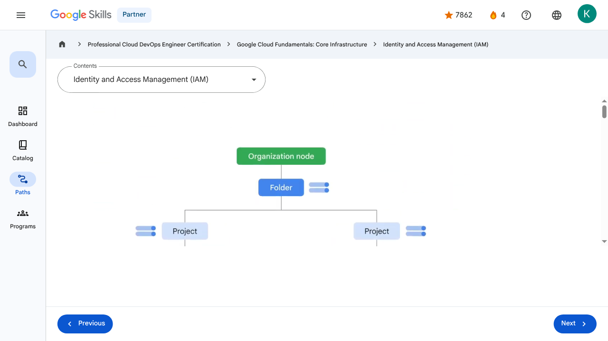

# Resources and Access in the Cloud - Identity and Access Management (IAM) | Google Skills for Partners

---

## Metadata

- **URL:** https://partner.skills.google/paths/20/course_sessions/39706059/video/630070
- **Lesson type:** `video`
- **Path ID:** `20`
- **Container type:** `course_sessions`
- **Container ID:** `39706059`
- **Lesson ID:** `630070`
- **Generated:** 2026-07-10 04:54:19

---

## Open Human-Readable HTML

[Open readable_page.html](readable_page.html)

> README/GitHub Markdown usually blocks playable iframes. Open `readable_page.html` to see the playable YouTube frame and browser-like lesson page.

---

## Screenshot



---

## YouTube Video

**Video ID:** `Di1T4RyO9yg`

[](https://www.youtube.com/watch?v=Di1T4RyO9yg)

[Open YouTube Video](https://www.youtube.com/watch?v=Di1T4RyO9yg)

---

## Transcript

### 00:00

When an organization node contains lots of folders, projects, and resources, a workforce might need to restrict who has access to what.

### 00:09

To help with this task, administrators can use Identity and Access Management, or IAM.

### 00:14

With IAM, administrators can apply policies that define who can do what and on which resources.

### 00:21

The “who” part of an IAM policy can be a Google account, a Google group, a service account, or a Cloud Identity domain.

### 00:29

A “who” is also called a “principal.”

### 00:32

Each principal has its own identifier, usually an email address.

### 00:36

The “can do what” part of an IAM policy is defined by a role.

### 00:41

An IAM role is a collection of permissions.

### 00:44

When you grant a role to a principal, you grant all the permissions that the role contains.

### 00:50

For example, to manage virtual machine instances in a project, you must be able to create, delete, start, stop and change virtual machines.

### 01:00

So these permissions are grouped into a role to make them easier to understand and easier to manage.

### 01:07

When a principal is given a role on a specific element of the resource hierarchy, the

### 01:11

resulting policy applies to both the chosen element and all the elements below it in the hierarchy.

### 01:18

You can define deny rules that prevent certain principals from using certain permissions, regardless of the roles they're granted.

### 01:25

This is because IAM always checks relevant deny policies before checking relevant allow policies.

### 01:32

Deny policies, like allow policies, are inherited through the resource hierarchy.

### 01:37

There are three kinds of roles in IAM: basic, predefined, and custom.

### 01:44

The first role type is basic.

### 01:47

Basic roles are quite broad in scope.

### 01:50

When applied to a Google Cloud project, they affect all resources in that project.

### 01:55

Basic roles include owner, editor, viewer, and billing administrator.

### 02:00

Let’s look at these basic roles in a bit more detail.

### 02:05

Project viewers can access resources but can’t make changes.

### 02:09

Project editors can access and make changes to a resource.

### 02:12

And project owners can also access and make changes to a resource.

### 02:17

In addition, project owners can manage the associated roles and permissions and set up billing.

### 02:24

Often companies want someone to control the billing for a project but not be able to change the resources in the project.

### 02:31

This is possible through a billing administrator role.

### 02:34

A word of caution: If several people are working together on a project that contains sensitive data, basic roles are probably too broad.

### 02:43

Fortunately, IAM provides other ways to assign permissions that are more specifically tailored to meet the needs of typical job roles.

### 02:51

This brings us to the second type of role, predefined roles.

### 02:56

Specific Google Cloud services offer sets of predefined roles, and they even define where those roles can be applied.

### 03:03

Let’s look at Compute Engine, for example, a Google Cloud product that offers virtual machines as a service.

### 03:11

With Compute Engine, you can apply specific predefined roles—such as “instanceAdmin”—to Compute Engine resources in a given project, a given folder, or an entire organization.

### 03:23

This then allows whoever has these roles to perform a specific set of predefined actions.

### 03:29

But what if you need to assign a role that has even more specific permissions?

### 03:32

That’s when you’d use a custom role.

### 03:35

Many companies use a “least-privilege” model in which each person in your organization is given the minimal amount of privilege needed to do their job.

### 03:44

So, for example, maybe you want to define an “instanceOperator” role to allow some users to stop and start Compute Engine virtual machines, but not reconfigure them.

### 03:54

Custom roles will allow you to define those exact permissions.

### 03:58

Before you start creating custom roles, please note two important details.

### 04:02

First, you’ll need to manage the permissions that define the custom role you’ve created.

### 04:08

Because of this, some organizations decide they’d rather use the predefined roles.

### 04:12

And second, custom roles can only be applied to either the project level or organization level.

### 04:18

They can’t be applied to the folder level.

### 00:00

When an organization node contains lots of folders, projects, and resources, a workforce might need to restrict who has access to what. 00:09 To help with this task, administrators can use Identity and Access Management, or IAM. 00:14 With IAM, administrators can apply policies that define who can do what and on which resources. 00:21 The “who” part of an IAM policy can be a Google account, a Google group, a service account, or a Cloud Identity domain. 00:29 A “who” is also called a “principal.” 00:32 Each principal has its own identifier, usually an email address. 00:36 The “can do what” part of an IAM policy is defined by a role. 00:41 An IAM role is a collection of permissions. 00:44 When you grant a role to a principal, you grant all the permissions that the role contains. 00:50 For example, to manage virtual machine instances in a project, you must be able to create, delete, start, stop and change virtual machines. 01:00 So these permissions are grouped into a role to make them easier to understand and easier to manage. 01:07 When a principal is given a role on a specific element of the resource hierarchy, the 01:11 resulting policy applies to both the chosen element and all the elements below it in the hierarchy. 01:18 You can define deny rules that prevent certain principals from using certain permissions, regardless of the roles they're granted. 01:25 This is because IAM always checks relevant deny policies before checking relevant allow policies. 01:32 Deny policies, like allow policies, are inherited through the resource hierarchy. 01:37 There are three kinds of roles in IAM: basic, predefined, and custom. 01:44 The first role type is basic. 01:47 Basic roles are quite broad in scope. 01:50 When applied to a Google Cloud project, they affect all resources in that project. 01:55 Basic roles include owner, editor, viewer, and billing administrator. 02:00 Let’s look at these basic roles in a bit more detail. 02:05 Project viewers can access resources but can’t make changes. 02:09 Project editors can access and make changes to a resource. 02:12 And project owners can also access and make changes to a resource. 02:17 In addition, project owners can manage the associated roles and permissions and set up billing. 02:24 Often companies want someone to control the billing for a project but not be able to change the resources in the project. 02:31 This is possible through a billing administrator role. 02:34 A word of caution: If several people are working together on a project that contains sensitive data, basic roles are probably too broad. 02:43 Fortunately, IAM provides other ways to assign permissions that are more specifically tailored to meet the needs of typical job roles. 02:51 This brings us to the second type of role, predefined roles. 02:56 Specific Google Cloud services offer sets of predefined roles, and they even define where those roles can be applied. 03:03 Let’s look at Compute Engine, for example, a Google Cloud product that offers virtual machines as a service. 03:11 With Compute Engine, you can apply specific predefined roles—such as “instanceAdmin”—to Compute Engine resources in a given project, a given folder, or an entire organization. 03:23 This then allows whoever has these roles to perform a specific set of predefined actions. 03:29 But what if you need to assign a role that has even more specific permissions? 03:32 That’s when you’d use a custom role. 03:35 Many companies use a “least-privilege” model in which each person in your organization is given the minimal amount of privilege needed to do their job. 03:44 So, for example, maybe you want to define an “instanceOperator” role to allow some users to stop and start Compute Engine virtual machines, but not reconfigure them. 03:54 Custom roles will allow you to define those exact permissions. 03:58 Before you start creating custom roles, please note two important details. 04:02 First, you’ll need to manage the permissions that define the custom role you’ve created. 04:08 Because of this, some organizations decide they’d rather use the predefined roles. 04:12 And second, custom roles can only be applied to either the project level or organization level. 04:18 They can’t be applied to the folder level.

---

## Page Text

Partner
4
navigate_next
Professional Cloud DevOps Engineer Certification
navigate_next
Google Cloud Fundamentals: Core Infrastructure
navigate_next
Identity and Access Management (IAM)
Previous
Next
Recertify in 3 simple steps:
Link your Google Skills and certification account profiles using the same email to get started.
Instantly see which certifications are eligible for renewal.
Complete courses and skill badges to renew your certifications automatically.

By clicking "Accept", I consent to share my name, email, and course completion data with Google Skills' certification partner, CM Connect, to receive continuing education credit for certification renewal.

---

## Images

### Image 1


### Image 2


---

## Main Resources

### youtube

- [Youtube](https://www.youtube.com/@googlecloud)

### videos

- [Course Introduction](https://partner.skills.google/paths/20/course_sessions/39706059/video/630060)
- [Cloud computing overview](https://partner.skills.google/paths/20/course_sessions/39706059/video/630061)
- [IaaS and PaaS](https://partner.skills.google/paths/20/course_sessions/39706059/video/630062)
- [The Google Cloud network](https://partner.skills.google/paths/20/course_sessions/39706059/video/630063)
- [Environmental impact](https://partner.skills.google/paths/20/course_sessions/39706059/video/630064)
- [Security](https://partner.skills.google/paths/20/course_sessions/39706059/video/630065)
- [Open source ecosystems](https://partner.skills.google/paths/20/course_sessions/39706059/video/630066)
- [Pricing and billing](https://partner.skills.google/paths/20/course_sessions/39706059/video/630067)
- [Google Cloud resource hierarchy](https://partner.skills.google/paths/20/course_sessions/39706059/video/630069)
- [Identity and Access Management (IAM)](https://partner.skills.google/paths/20/course_sessions/39706059/video/630070)
- [Service accounts](https://partner.skills.google/paths/20/course_sessions/39706059/video/630071)
- [Cloud Identity](https://partner.skills.google/paths/20/course_sessions/39706059/video/630072)
- [Interacting with Google Cloud](https://partner.skills.google/paths/20/course_sessions/39706059/video/630073)
- [Virtual Private Cloud networking](https://partner.skills.google/paths/20/course_sessions/39706059/video/630076)
- [Compute Engine](https://partner.skills.google/paths/20/course_sessions/39706059/video/630077)
- [Scaling virtual machines](https://partner.skills.google/paths/20/course_sessions/39706059/video/630078)
- [Important VPC compatibilities](https://partner.skills.google/paths/20/course_sessions/39706059/video/630079)
- [Cloud Load Balancing](https://partner.skills.google/paths/20/course_sessions/39706059/video/630080)
- [Cloud DNS and Cloud CDN](https://partner.skills.google/paths/20/course_sessions/39706059/video/630081)
- [Connecting networks to Google VPC](https://partner.skills.google/paths/20/course_sessions/39706059/video/630082)
- [Google Cloud storage options](https://partner.skills.google/paths/20/course_sessions/39706059/video/630085)
- [Cloud Storage](https://partner.skills.google/paths/20/course_sessions/39706059/video/630086)
- [Cloud Storage: Storage classes and data transfer](https://partner.skills.google/paths/20/course_sessions/39706059/video/630087)
- [Cloud SQL](https://partner.skills.google/paths/20/course_sessions/39706059/video/630088)
- [Spanner](https://partner.skills.google/paths/20/course_sessions/39706059/video/630089)
- [Firestore](https://partner.skills.google/paths/20/course_sessions/39706059/video/630090)
- [Bigtable](https://partner.skills.google/paths/20/course_sessions/39706059/video/630091)
- [Comparing storage options](https://partner.skills.google/paths/20/course_sessions/39706059/video/630092)
- [Introduction to containers](https://partner.skills.google/paths/20/course_sessions/39706059/video/630095)
- [Kubernetes](https://partner.skills.google/paths/20/course_sessions/39706059/video/630096)
- [Google Kubernetes Engine](https://partner.skills.google/paths/20/course_sessions/39706059/video/630097)
- [Cloud Run](https://partner.skills.google/paths/20/course_sessions/39706059/video/630099)
- [Development in the cloud](https://partner.skills.google/paths/20/course_sessions/39706059/video/630100)
- [Prompt Engineering](https://partner.skills.google/paths/20/course_sessions/39706059/video/630103)
- [Course summary](https://partner.skills.google/paths/20/course_sessions/39706059/video/630105)
- [Resource](https://partner.skills.google/paths/20/course_sessions/39706059/video/630069)
- [Resource](https://partner.skills.google/paths/20/course_sessions/39706059/video/630071)

### labs

- [Resource](https://support.google.com/qwiklabs/contact/Google_Skills_Partner)
- [Google Cloud Fundamentals: Getting Started with Cloud Marketplace](https://partner.skills.google/paths/20/course_sessions/39706059/labs/630074)
- [Get Started with Virtual Private Cloud Networking and Compute Engine](https://partner.skills.google/paths/20/course_sessions/39706059/labs/630083)
- [Google Cloud Fundamentals: Getting Started with Cloud Storage and Cloud SQL](https://partner.skills.google/paths/20/course_sessions/39706059/labs/630093)
- [Hello Cloud Run](https://partner.skills.google/paths/20/course_sessions/39706059/labs/630101)

### external_links

- [Resource](https://partner.skills.google/)
- [Professional Cloud DevOps Engineer Certification](https://partner.skills.google/paths/20)
- [Google Cloud Fundamentals: Core Infrastructure](https://partner.skills.google/paths/20/course_templates/60)
- [Dashboard](https://partner.skills.google/)
- [Catalog](https://partner.skills.google/catalog)
- [Paths](https://partner.skills.google/paths)
- [Subscriptions](https://partner.skills.google/subscriptions)
- [Activities](https://partner.skills.google/profile/stay_on_track)
- [Achievements](https://partner.skills.google/profile/badges)
- [Resource](https://partner.skills.google/profile/activity)
- [Resource](https://partner.skills.google/my_account/profile)
- [Programs](https://partner.skills.google/my_account/programs)
- [Overview](https://partner.skills.google/paths/20/course_templates/60)
- [Quiz](https://partner.skills.google/paths/20/course_sessions/39706059/quizzes/630068)
- [Quiz](https://partner.skills.google/paths/20/course_sessions/39706059/quizzes/630075)
- [Quiz](https://partner.skills.google/paths/20/course_sessions/39706059/quizzes/630084)
- [Quiz](https://partner.skills.google/paths/20/course_sessions/39706059/quizzes/630094)
- [Quiz](https://partner.skills.google/paths/20/course_sessions/39706059/quizzes/630098)
- [Quiz](https://partner.skills.google/paths/20/course_sessions/39706059/quizzes/630102)
- [Quiz](https://partner.skills.google/paths/20/course_sessions/39706059/quizzes/630104)
- [Course resources](https://partner.skills.google/paths/20/course_sessions/39706059/documents/630106)
- [Claim credential](https://partner.skills.google/paths/20/course_templates/60/badge)
- [Course Survey
      Recommended](https://partner.skills.google/paths/20/course_templates/60/course_surveys/0)
- [Resource](https://partner.skills.google/paths/20/course_templates/60/preview)

---

## Headings

- **H3**: Transcript
- **H2**: Recertify in 3 simple steps:
- **H1**: A newer version of this course is available. Your progress will carry over if you choose to upgrade. However, your completion percentage may change if the new version has added or removed any learning activities. Click the preview button to see the course changes before upgrading.
---

## Raw Files

- [readable_page.html](readable_page.html)
- [page.html](page.html)
- [page_text.txt](page_text.txt)
- [session.json](session.json)
- [headings.json](headings.json)
- [links.json](links.json)
- [images.json](images.json)
- [resources.json](resources.json)
- [youtube_links.json](youtube_links.json)
- [transcript.json](transcript.json)
- [transcript.txt](transcript.txt)
- [plugin_extra.json](plugin_extra.json)
- [screenshot.png](screenshot.png)

## Plugin Extra Data

```json
{
  "content_kind": "video"
}
```
