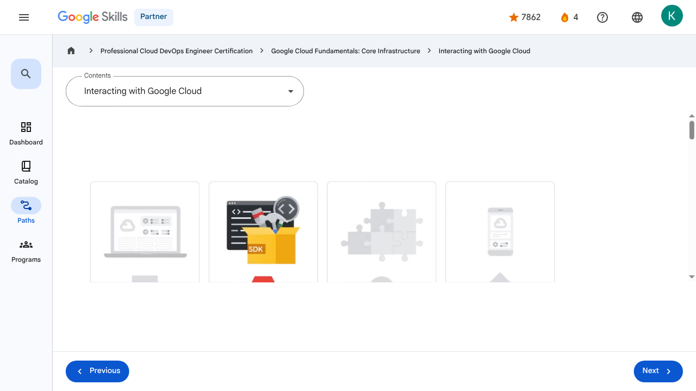

# Resources and Access in the Cloud - Interacting with Google Cloud | Google Skills for Partners

---

## Metadata

- **URL:** https://partner.skills.google/paths/20/course_sessions/39706059/video/630073
- **Lesson type:** `video`
- **Path ID:** `20`
- **Container type:** `course_sessions`
- **Container ID:** `39706059`
- **Lesson ID:** `630073`
- **Generated:** 2026-07-10 04:55:24

---

## Open Human-Readable HTML

[Open readable_page.html](readable_page.html)

> README/GitHub Markdown usually blocks playable iframes. Open `readable_page.html` to see the playable YouTube frame and browser-like lesson page.

---

## Screenshot



---

## YouTube Video

**Video ID:** `cgwwXMvkaOg`

[](https://www.youtube.com/watch?v=cgwwXMvkaOg)

[Open YouTube Video](https://www.youtube.com/watch?v=cgwwXMvkaOg)

---

## Transcript

### 00:00

There are four ways to access and interact with Google Cloud.

### 00:04

The Google Cloud console, the Google Cloud SDK and Cloud Shell, the APIs, and the Google Cloud app.

### 00:13

Let’s explore each of those now.

### 00:16

First is the Google Cloud console, which is Google Cloud’s graphical user interface, or GUI, that helps you deploy, scale, and diagnose production issues in a simple web-based interface.

### 00:29

With the Google Cloud console, you can easily find your resources, check their health, have

### 00:34

full management control over them, and set budgets to control how much you spend on them.

### 00:40

The Google Cloud console also provides a search facility to quickly find resources and connect to instances via SSH in the browser.

### 00:49

Second is through the Google Cloud SDK and Cloud Shell.

### 00:53

The Google Cloud SDK is a set of tools that you can use to manage resources and applications hosted on Google Cloud.

### 00:59

These include the Google Cloud CLI, which provides the main command-line interface for Google Cloud products and services, and bq, a command-line tool for BigQuery.

### 01:11

When installed, all of the tools within the Google Cloud SDK are located under the bin directory.

### 01:18

Cloud Shell provides command-line access to cloud resources directly from a browser.

### 01:23

Cloud Shell is a Debian-based virtual machine with a persistent 5 gigabyte home directory, which makes it easy to manage Google Cloud projects and resources.

### 01:33

With Cloud Shell, the Google Cloud SDK gcloud command and other utilities are always installed, available, up to date, and fully authenticated.

### 01:44

The third way to access Google Cloud is through application programming interfaces, or APIs.

### 01:50

The services that make up Google Cloud offer APIs so that code you write can control them.

### 01:56

The Google Cloud console includes a tool called the Google APIs Explorer that shows which APIs are available, and in which versions.

### 02:05

You can try these APIs interactively, even those that require user authentication.

### 02:10

So, suppose you’ve explored an API, and you’re ready to build an application that uses it.

### 02:15

Do you have to start coding from scratch?

### 02:17

No.

### 02:18

Google provides Cloud Client libraries and Google API Client libraries in many popular languages to take

### 02:23

a lot of the drudgery out of the task of calling Google Cloud from your code.

### 02:29

Languages currently represented in these libraries are Java, Python, PHP, C#, Go, Node.js, Ruby, and C++.

### 02:44

And finally, the fourth way to access and interact with Google Cloud is with the Google Cloud app, which can

### 02:50

be used to start, stop, and use SSH to connect to Compute Engine instances and see logs from each instance.

### 02:59

It also lets you stop and start Cloud SQL instances.

### 03:03

Additionally, you can administer applications deployed on App Engine by viewing errors, rolling back deployments, and changing traffic splitting.

### 03:13

The Google Cloud app provides up-to-date billing information for your projects and billing alerts for projects that are going over budget.

### 03:20

You can set up customizable graphs showing key metrics such as CPU usage, network usage, requests per second, and server errors.

### 03:30

The app also offers alerts and incident management.

### 03:35

You can download the Google Cloud app at cloud.google.com/app.

### 00:00

There are four ways to access and interact with Google Cloud. 00:04 The Google Cloud console, the Google Cloud SDK and Cloud Shell, the APIs, and the Google Cloud app. 00:13 Let’s explore each of those now. 00:16 First is the Google Cloud console, which is Google Cloud’s graphical user interface, or GUI, that helps you deploy, scale, and diagnose production issues in a simple web-based interface. 00:29 With the Google Cloud console, you can easily find your resources, check their health, have 00:34 full management control over them, and set budgets to control how much you spend on them. 00:40 The Google Cloud console also provides a search facility to quickly find resources and connect to instances via SSH in the browser. 00:49 Second is through the Google Cloud SDK and Cloud Shell. 00:53 The Google Cloud SDK is a set of tools that you can use to manage resources and applications hosted on Google Cloud. 00:59 These include the Google Cloud CLI, which provides the main command-line interface for Google Cloud products and services, and bq, a command-line tool for BigQuery. 01:11 When installed, all of the tools within the Google Cloud SDK are located under the bin directory. 01:18 Cloud Shell provides command-line access to cloud resources directly from a browser. 01:23 Cloud Shell is a Debian-based virtual machine with a persistent 5 gigabyte home directory, which makes it easy to manage Google Cloud projects and resources. 01:33 With Cloud Shell, the Google Cloud SDK gcloud command and other utilities are always installed, available, up to date, and fully authenticated. 01:44 The third way to access Google Cloud is through application programming interfaces, or APIs. 01:50 The services that make up Google Cloud offer APIs so that code you write can control them. 01:56 The Google Cloud console includes a tool called the Google APIs Explorer that shows which APIs are available, and in which versions. 02:05 You can try these APIs interactively, even those that require user authentication. 02:10 So, suppose you’ve explored an API, and you’re ready to build an application that uses it. 02:15 Do you have to start coding from scratch? 02:17 No. 02:18 Google provides Cloud Client libraries and Google API Client libraries in many popular languages to take 02:23 a lot of the drudgery out of the task of calling Google Cloud from your code. 02:29 Languages currently represented in these libraries are Java, Python, PHP, C#, Go, Node.js, Ruby, and C++. 02:44 And finally, the fourth way to access and interact with Google Cloud is with the Google Cloud app, which can 02:50 be used to start, stop, and use SSH to connect to Compute Engine instances and see logs from each instance. 02:59 It also lets you stop and start Cloud SQL instances. 03:03 Additionally, you can administer applications deployed on App Engine by viewing errors, rolling back deployments, and changing traffic splitting. 03:13 The Google Cloud app provides up-to-date billing information for your projects and billing alerts for projects that are going over budget. 03:20 You can set up customizable graphs showing key metrics such as CPU usage, network usage, requests per second, and server errors. 03:30 The app also offers alerts and incident management. 03:35 You can download the Google Cloud app at cloud.google.com/app.

---

## Page Text

Partner
4
navigate_next
Professional Cloud DevOps Engineer Certification
navigate_next
Google Cloud Fundamentals: Core Infrastructure
navigate_next
Interacting with Google Cloud
Previous
Next
Recertify in 3 simple steps:
Link your Google Skills and certification account profiles using the same email to get started.
Instantly see which certifications are eligible for renewal.
Complete courses and skill badges to renew your certifications automatically.

By clicking "Accept", I consent to share my name, email, and course completion data with Google Skills' certification partner, CM Connect, to receive continuing education credit for certification renewal.

---

## Images

### Image 1


### Image 2


---

## Main Resources

### youtube

- [Youtube](https://www.youtube.com/@googlecloud)

### videos

- [Course Introduction](https://partner.skills.google/paths/20/course_sessions/39706059/video/630060)
- [Cloud computing overview](https://partner.skills.google/paths/20/course_sessions/39706059/video/630061)
- [IaaS and PaaS](https://partner.skills.google/paths/20/course_sessions/39706059/video/630062)
- [The Google Cloud network](https://partner.skills.google/paths/20/course_sessions/39706059/video/630063)
- [Environmental impact](https://partner.skills.google/paths/20/course_sessions/39706059/video/630064)
- [Security](https://partner.skills.google/paths/20/course_sessions/39706059/video/630065)
- [Open source ecosystems](https://partner.skills.google/paths/20/course_sessions/39706059/video/630066)
- [Pricing and billing](https://partner.skills.google/paths/20/course_sessions/39706059/video/630067)
- [Google Cloud resource hierarchy](https://partner.skills.google/paths/20/course_sessions/39706059/video/630069)
- [Identity and Access Management (IAM)](https://partner.skills.google/paths/20/course_sessions/39706059/video/630070)
- [Service accounts](https://partner.skills.google/paths/20/course_sessions/39706059/video/630071)
- [Cloud Identity](https://partner.skills.google/paths/20/course_sessions/39706059/video/630072)
- [Interacting with Google Cloud](https://partner.skills.google/paths/20/course_sessions/39706059/video/630073)
- [Virtual Private Cloud networking](https://partner.skills.google/paths/20/course_sessions/39706059/video/630076)
- [Compute Engine](https://partner.skills.google/paths/20/course_sessions/39706059/video/630077)
- [Scaling virtual machines](https://partner.skills.google/paths/20/course_sessions/39706059/video/630078)
- [Important VPC compatibilities](https://partner.skills.google/paths/20/course_sessions/39706059/video/630079)
- [Cloud Load Balancing](https://partner.skills.google/paths/20/course_sessions/39706059/video/630080)
- [Cloud DNS and Cloud CDN](https://partner.skills.google/paths/20/course_sessions/39706059/video/630081)
- [Connecting networks to Google VPC](https://partner.skills.google/paths/20/course_sessions/39706059/video/630082)
- [Google Cloud storage options](https://partner.skills.google/paths/20/course_sessions/39706059/video/630085)
- [Cloud Storage](https://partner.skills.google/paths/20/course_sessions/39706059/video/630086)
- [Cloud Storage: Storage classes and data transfer](https://partner.skills.google/paths/20/course_sessions/39706059/video/630087)
- [Cloud SQL](https://partner.skills.google/paths/20/course_sessions/39706059/video/630088)
- [Spanner](https://partner.skills.google/paths/20/course_sessions/39706059/video/630089)
- [Firestore](https://partner.skills.google/paths/20/course_sessions/39706059/video/630090)
- [Bigtable](https://partner.skills.google/paths/20/course_sessions/39706059/video/630091)
- [Comparing storage options](https://partner.skills.google/paths/20/course_sessions/39706059/video/630092)
- [Introduction to containers](https://partner.skills.google/paths/20/course_sessions/39706059/video/630095)
- [Kubernetes](https://partner.skills.google/paths/20/course_sessions/39706059/video/630096)
- [Google Kubernetes Engine](https://partner.skills.google/paths/20/course_sessions/39706059/video/630097)
- [Cloud Run](https://partner.skills.google/paths/20/course_sessions/39706059/video/630099)
- [Development in the cloud](https://partner.skills.google/paths/20/course_sessions/39706059/video/630100)
- [Prompt Engineering](https://partner.skills.google/paths/20/course_sessions/39706059/video/630103)
- [Course summary](https://partner.skills.google/paths/20/course_sessions/39706059/video/630105)
- [Resource](https://partner.skills.google/paths/20/course_sessions/39706059/video/630072)

### labs

- [Resource](https://support.google.com/qwiklabs/contact/Google_Skills_Partner)
- [Google Cloud Fundamentals: Getting Started with Cloud Marketplace](https://partner.skills.google/paths/20/course_sessions/39706059/labs/630074)
- [Get Started with Virtual Private Cloud Networking and Compute Engine](https://partner.skills.google/paths/20/course_sessions/39706059/labs/630083)
- [Google Cloud Fundamentals: Getting Started with Cloud Storage and Cloud SQL](https://partner.skills.google/paths/20/course_sessions/39706059/labs/630093)
- [Hello Cloud Run](https://partner.skills.google/paths/20/course_sessions/39706059/labs/630101)
- [Resource](https://partner.skills.google/paths/20/course_sessions/39706059/labs/630074)

### external_links

- [Resource](https://partner.skills.google/)
- [Professional Cloud DevOps Engineer Certification](https://partner.skills.google/paths/20)
- [Google Cloud Fundamentals: Core Infrastructure](https://partner.skills.google/paths/20/course_templates/60)
- [Dashboard](https://partner.skills.google/)
- [Catalog](https://partner.skills.google/catalog)
- [Paths](https://partner.skills.google/paths)
- [Subscriptions](https://partner.skills.google/subscriptions)
- [Activities](https://partner.skills.google/profile/stay_on_track)
- [Achievements](https://partner.skills.google/profile/badges)
- [Resource](https://partner.skills.google/profile/activity)
- [Resource](https://partner.skills.google/my_account/profile)
- [Programs](https://partner.skills.google/my_account/programs)
- [Overview](https://partner.skills.google/paths/20/course_templates/60)
- [Quiz](https://partner.skills.google/paths/20/course_sessions/39706059/quizzes/630068)
- [Quiz](https://partner.skills.google/paths/20/course_sessions/39706059/quizzes/630075)
- [Quiz](https://partner.skills.google/paths/20/course_sessions/39706059/quizzes/630084)
- [Quiz](https://partner.skills.google/paths/20/course_sessions/39706059/quizzes/630094)
- [Quiz](https://partner.skills.google/paths/20/course_sessions/39706059/quizzes/630098)
- [Quiz](https://partner.skills.google/paths/20/course_sessions/39706059/quizzes/630102)
- [Quiz](https://partner.skills.google/paths/20/course_sessions/39706059/quizzes/630104)
- [Course resources](https://partner.skills.google/paths/20/course_sessions/39706059/documents/630106)
- [Claim credential](https://partner.skills.google/paths/20/course_templates/60/badge)
- [Course Survey
      Recommended](https://partner.skills.google/paths/20/course_templates/60/course_surveys/0)
- [Resource](https://partner.skills.google/paths/20/course_templates/60/preview)

---

## Headings

- **H3**: Transcript
- **H2**: Recertify in 3 simple steps:
- **H1**: A newer version of this course is available. Your progress will carry over if you choose to upgrade. However, your completion percentage may change if the new version has added or removed any learning activities. Click the preview button to see the course changes before upgrading.
---

## Raw Files

- [readable_page.html](readable_page.html)
- [page.html](page.html)
- [page_text.txt](page_text.txt)
- [session.json](session.json)
- [headings.json](headings.json)
- [links.json](links.json)
- [images.json](images.json)
- [resources.json](resources.json)
- [youtube_links.json](youtube_links.json)
- [transcript.json](transcript.json)
- [transcript.txt](transcript.txt)
- [plugin_extra.json](plugin_extra.json)
- [screenshot.png](screenshot.png)

## Plugin Extra Data

```json
{
  "content_kind": "video"
}
```
