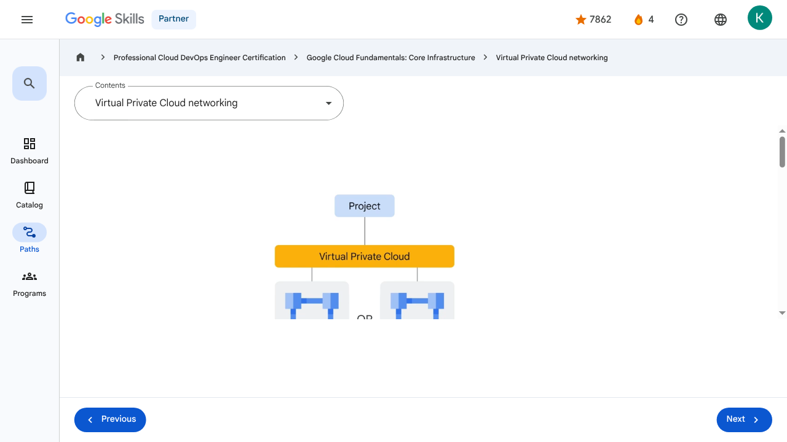

# Virtual Machines and Networks in the Cloud - Virtual Private Cloud networking | Google Skills for Partners

---

## Metadata

- **URL:** https://partner.skills.google/paths/20/course_sessions/39706059/video/630076
- **Lesson type:** `video`
- **Path ID:** `20`
- **Container type:** `course_sessions`
- **Container ID:** `39706059`
- **Lesson ID:** `630076`
- **Generated:** 2026-07-10 04:55:45

---

## Open Human-Readable HTML

[Open readable_page.html](readable_page.html)

> README/GitHub Markdown usually blocks playable iframes. Open `readable_page.html` to see the playable YouTube frame and browser-like lesson page.

---

## Screenshot



---

## YouTube Video

**Video ID:** `SFRCZvJN650`

[](https://www.youtube.com/watch?v=SFRCZvJN650)

[Open YouTube Video](https://www.youtube.com/watch?v=SFRCZvJN650)

---

## Transcript

### 00:00

In this section of the course, we’re going to explore how Google Compute Engine works with a focus on virtual networking.

### 00:07

Many users start with Google Cloud by defining their own virtual private cloud inside their first Google Cloud project or by starting with the default virtual private cloud.

### 00:17

So, what is a virtual private cloud?

### 00:21

A virtual private cloud, or VPC, is a secure, individual, private cloud-computing model hosted within a public cloud – like Google Cloud!

### 00:32

On a VPC, customers can run code, store data, host websites, and do anything else they could

### 00:38

do in an ordinary private cloud, but this private cloud is hosted remotely by a public cloud provider.

### 00:46

This means that VPCs combine the scalability and convenience of public cloud computing with the data isolation of private cloud computing.

### 00:58

VPC networks connect Google Cloud resources to each other and to the internet.

### 01:02

This includes segmenting networks, using firewall rules to restrict access to instances, and creating static routes to forward traffic to specific destinations.

### 01:13

Here's something that tends to surprise a lot of new Google Cloud users: Google VPC networks are global.

### 01:21

They can also have subnets, which is a segmented piece of the larger network, in any Google Cloud region worldwide.

### 01:29

Subnets can span the zones that make up a region.

### 01:32

This architecture makes it easy to define network layouts with global scope.

### 01:37

Resources can even be in different zones on the same subnet.

### 01:42

The size of a subnet can be increased by expanding the range of IP addresses allocated to it, and doing so won’t affect virtual machines that are already configured.

### 01:51

For example, let’s take a VPC network named vpc1 that has two subnets defined in the asia-east1 and us-east1 regions.

### 02:04

If the VPC has three Compute Engine VMs attached to it, it means they’re neighbors on the same subnet even though they’re in different zones.

### 02:12

This capability can be used to build solutions that are resilient to disruptions yet retain a simple network layout.

### 00:00

In this section of the course, we’re going to explore how Google Compute Engine works with a focus on virtual networking. 00:07 Many users start with Google Cloud by defining their own virtual private cloud inside their first Google Cloud project or by starting with the default virtual private cloud. 00:17 So, what is a virtual private cloud? 00:21 A virtual private cloud, or VPC, is a secure, individual, private cloud-computing model hosted within a public cloud – like Google Cloud! 00:32 On a VPC, customers can run code, store data, host websites, and do anything else they could 00:38 do in an ordinary private cloud, but this private cloud is hosted remotely by a public cloud provider. 00:46 This means that VPCs combine the scalability and convenience of public cloud computing with the data isolation of private cloud computing. 00:58 VPC networks connect Google Cloud resources to each other and to the internet. 01:02 This includes segmenting networks, using firewall rules to restrict access to instances, and creating static routes to forward traffic to specific destinations. 01:13 Here's something that tends to surprise a lot of new Google Cloud users: Google VPC networks are global. 01:21 They can also have subnets, which is a segmented piece of the larger network, in any Google Cloud region worldwide. 01:29 Subnets can span the zones that make up a region. 01:32 This architecture makes it easy to define network layouts with global scope. 01:37 Resources can even be in different zones on the same subnet. 01:42 The size of a subnet can be increased by expanding the range of IP addresses allocated to it, and doing so won’t affect virtual machines that are already configured. 01:51 For example, let’s take a VPC network named vpc1 that has two subnets defined in the asia-east1 and us-east1 regions. 02:04 If the VPC has three Compute Engine VMs attached to it, it means they’re neighbors on the same subnet even though they’re in different zones. 02:12 This capability can be used to build solutions that are resilient to disruptions yet retain a simple network layout.

---

## Page Text

Partner
4
navigate_next
Professional Cloud DevOps Engineer Certification
navigate_next
Google Cloud Fundamentals: Core Infrastructure
navigate_next
Virtual Private Cloud networking
Previous
Next
Recertify in 3 simple steps:
Link your Google Skills and certification account profiles using the same email to get started.
Instantly see which certifications are eligible for renewal.
Complete courses and skill badges to renew your certifications automatically.

By clicking "Accept", I consent to share my name, email, and course completion data with Google Skills' certification partner, CM Connect, to receive continuing education credit for certification renewal.

---

## Images

### Image 1


### Image 2


---

## Main Resources

### youtube

- [Youtube](https://www.youtube.com/@googlecloud)

### videos

- [Course Introduction](https://partner.skills.google/paths/20/course_sessions/39706059/video/630060)
- [Cloud computing overview](https://partner.skills.google/paths/20/course_sessions/39706059/video/630061)
- [IaaS and PaaS](https://partner.skills.google/paths/20/course_sessions/39706059/video/630062)
- [The Google Cloud network](https://partner.skills.google/paths/20/course_sessions/39706059/video/630063)
- [Environmental impact](https://partner.skills.google/paths/20/course_sessions/39706059/video/630064)
- [Security](https://partner.skills.google/paths/20/course_sessions/39706059/video/630065)
- [Open source ecosystems](https://partner.skills.google/paths/20/course_sessions/39706059/video/630066)
- [Pricing and billing](https://partner.skills.google/paths/20/course_sessions/39706059/video/630067)
- [Google Cloud resource hierarchy](https://partner.skills.google/paths/20/course_sessions/39706059/video/630069)
- [Identity and Access Management (IAM)](https://partner.skills.google/paths/20/course_sessions/39706059/video/630070)
- [Service accounts](https://partner.skills.google/paths/20/course_sessions/39706059/video/630071)
- [Cloud Identity](https://partner.skills.google/paths/20/course_sessions/39706059/video/630072)
- [Interacting with Google Cloud](https://partner.skills.google/paths/20/course_sessions/39706059/video/630073)
- [Virtual Private Cloud networking](https://partner.skills.google/paths/20/course_sessions/39706059/video/630076)
- [Compute Engine](https://partner.skills.google/paths/20/course_sessions/39706059/video/630077)
- [Scaling virtual machines](https://partner.skills.google/paths/20/course_sessions/39706059/video/630078)
- [Important VPC compatibilities](https://partner.skills.google/paths/20/course_sessions/39706059/video/630079)
- [Cloud Load Balancing](https://partner.skills.google/paths/20/course_sessions/39706059/video/630080)
- [Cloud DNS and Cloud CDN](https://partner.skills.google/paths/20/course_sessions/39706059/video/630081)
- [Connecting networks to Google VPC](https://partner.skills.google/paths/20/course_sessions/39706059/video/630082)
- [Google Cloud storage options](https://partner.skills.google/paths/20/course_sessions/39706059/video/630085)
- [Cloud Storage](https://partner.skills.google/paths/20/course_sessions/39706059/video/630086)
- [Cloud Storage: Storage classes and data transfer](https://partner.skills.google/paths/20/course_sessions/39706059/video/630087)
- [Cloud SQL](https://partner.skills.google/paths/20/course_sessions/39706059/video/630088)
- [Spanner](https://partner.skills.google/paths/20/course_sessions/39706059/video/630089)
- [Firestore](https://partner.skills.google/paths/20/course_sessions/39706059/video/630090)
- [Bigtable](https://partner.skills.google/paths/20/course_sessions/39706059/video/630091)
- [Comparing storage options](https://partner.skills.google/paths/20/course_sessions/39706059/video/630092)
- [Introduction to containers](https://partner.skills.google/paths/20/course_sessions/39706059/video/630095)
- [Kubernetes](https://partner.skills.google/paths/20/course_sessions/39706059/video/630096)
- [Google Kubernetes Engine](https://partner.skills.google/paths/20/course_sessions/39706059/video/630097)
- [Cloud Run](https://partner.skills.google/paths/20/course_sessions/39706059/video/630099)
- [Development in the cloud](https://partner.skills.google/paths/20/course_sessions/39706059/video/630100)
- [Prompt Engineering](https://partner.skills.google/paths/20/course_sessions/39706059/video/630103)
- [Course summary](https://partner.skills.google/paths/20/course_sessions/39706059/video/630105)
- [Resource](https://partner.skills.google/paths/20/course_sessions/39706059/video/630077)

### labs

- [Resource](https://support.google.com/qwiklabs/contact/Google_Skills_Partner)
- [Google Cloud Fundamentals: Getting Started with Cloud Marketplace](https://partner.skills.google/paths/20/course_sessions/39706059/labs/630074)
- [Get Started with Virtual Private Cloud Networking and Compute Engine](https://partner.skills.google/paths/20/course_sessions/39706059/labs/630083)
- [Google Cloud Fundamentals: Getting Started with Cloud Storage and Cloud SQL](https://partner.skills.google/paths/20/course_sessions/39706059/labs/630093)
- [Hello Cloud Run](https://partner.skills.google/paths/20/course_sessions/39706059/labs/630101)

### external_links

- [Resource](https://partner.skills.google/)
- [Professional Cloud DevOps Engineer Certification](https://partner.skills.google/paths/20)
- [Google Cloud Fundamentals: Core Infrastructure](https://partner.skills.google/paths/20/course_templates/60)
- [Dashboard](https://partner.skills.google/)
- [Catalog](https://partner.skills.google/catalog)
- [Paths](https://partner.skills.google/paths)
- [Subscriptions](https://partner.skills.google/subscriptions)
- [Activities](https://partner.skills.google/profile/stay_on_track)
- [Achievements](https://partner.skills.google/profile/badges)
- [Resource](https://partner.skills.google/profile/activity)
- [Resource](https://partner.skills.google/my_account/profile)
- [Programs](https://partner.skills.google/my_account/programs)
- [Overview](https://partner.skills.google/paths/20/course_templates/60)
- [Quiz](https://partner.skills.google/paths/20/course_sessions/39706059/quizzes/630068)
- [Quiz](https://partner.skills.google/paths/20/course_sessions/39706059/quizzes/630075)
- [Quiz](https://partner.skills.google/paths/20/course_sessions/39706059/quizzes/630084)
- [Quiz](https://partner.skills.google/paths/20/course_sessions/39706059/quizzes/630094)
- [Quiz](https://partner.skills.google/paths/20/course_sessions/39706059/quizzes/630098)
- [Quiz](https://partner.skills.google/paths/20/course_sessions/39706059/quizzes/630102)
- [Quiz](https://partner.skills.google/paths/20/course_sessions/39706059/quizzes/630104)
- [Course resources](https://partner.skills.google/paths/20/course_sessions/39706059/documents/630106)
- [Claim credential](https://partner.skills.google/paths/20/course_templates/60/badge)
- [Course Survey
      Recommended](https://partner.skills.google/paths/20/course_templates/60/course_surveys/0)
- [Resource](https://partner.skills.google/paths/20/course_sessions/39706059/quizzes/630075)
- [Resource](https://partner.skills.google/paths/20/course_templates/60/preview)

---

## Headings

- **H3**: Transcript
- **H2**: Recertify in 3 simple steps:
- **H1**: A newer version of this course is available. Your progress will carry over if you choose to upgrade. However, your completion percentage may change if the new version has added or removed any learning activities. Click the preview button to see the course changes before upgrading.
---

## Raw Files

- [readable_page.html](readable_page.html)
- [page.html](page.html)
- [page_text.txt](page_text.txt)
- [session.json](session.json)
- [headings.json](headings.json)
- [links.json](links.json)
- [images.json](images.json)
- [resources.json](resources.json)
- [youtube_links.json](youtube_links.json)
- [transcript.json](transcript.json)
- [transcript.txt](transcript.txt)
- [plugin_extra.json](plugin_extra.json)
- [screenshot.png](screenshot.png)

## Plugin Extra Data

```json
{
  "content_kind": "video"
}
```
