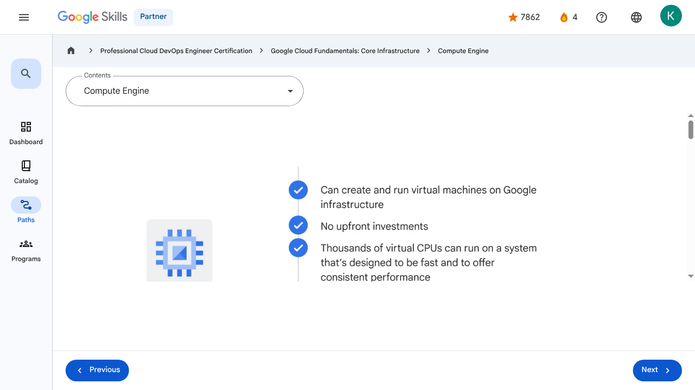

# Virtual Machines and Networks in the Cloud - Compute Engine | Google Skills for Partners

---

## Metadata

- **URL:** https://partner.skills.google/paths/20/course_sessions/39706059/video/630077
- **Lesson type:** `video`
- **Path ID:** `20`
- **Container type:** `course_sessions`
- **Container ID:** `39706059`
- **Lesson ID:** `630077`
- **Generated:** 2026-07-10 04:56:06

---

## Open Human-Readable HTML

[Open readable_page.html](readable_page.html)

> README/GitHub Markdown usually blocks playable iframes. Open `readable_page.html` to see the playable YouTube frame and browser-like lesson page.

---

## Screenshot



---

## YouTube Video

**Video ID:** `90pyGSKyPDQ`

[](https://www.youtube.com/watch?v=90pyGSKyPDQ)

[Open YouTube Video](https://www.youtube.com/watch?v=90pyGSKyPDQ)

---

## Transcript

### 00:00

Earlier in the course, we explored infrastructure as a service, or IaaS.

### 00:05

Now let’s explore Google Cloud’s IaaS solution: Compute Engine.

### 00:10

With Compute Engine, users can create and run virtual machines on Google infrastructure.

### 00:16

There are no upfront investments, and thousands of virtual CPUs can run on a system that’s designed to be fast and to offer consistent performance.

### 00:26

Each virtual machine contains the power and functionality of a full-fledged operating system.

### 00:31

This means a virtual machine can be configured much like a physical server: by specifying the amount

### 00:36

of CPU power and memory needed, the amount and type of storage needed, and the operating system.

### 00:44

A virtual machine instance can be created via the Google Cloud console, which is a web-based

### 00:49

tool to manage Google Cloud projects and resources, the Google Cloud CLI, or the Compute Engine API.

### 00:57

The instance can run Linux and Windows Server images provided by Google or any customized versions of these images.

### 01:05

You can also build and run images of other operating systems and flexibly reconfigure virtual machines.

### 01:13

A quick way to get started with Google Cloud is through the Cloud Marketplace, which offers solutions from both Google and third-party vendors.

### 01:21

With these solutions, there’s no need to manually configure the software, virtual machine instances, storage, or network settings, although many of them can be modified before launch if that’s required.

### 01:32

Most software packages in Cloud Marketplace are available at no additional charge beyond the normal usage fees for Google Cloud resources.

### 01:40

Some Cloud Marketplace images charge usage fees, particularly those published by third parties with commercially licensed software, but they all show estimates of their monthly charges before they’re launched.

### 01:53

At this point, you might be wondering about Compute Engine’s pricing and billing structure.

### 01:58

For the use of virtual machines, Compute Engine bills by the second with a one-minute minimum, and sustained-use discounts start to apply automatically to virtual machines the longer they run.

### 02:10

So, for each VM that runs for more than 25% of a month, Compute Engine automatically applies a discount for every additional minute.

### 02:18

Compute Engine also offers committed-use discounts.

### 02:21

This means that for stable and predictable workloads, a specific amount of vCPUs and memory can be purchased for up to

### 02:28

a 57% discount off of normal prices in return for committing to a usage term of one year or three years.

### 02:37

Then there are Spot VMs.

### 02:39

These are perfect for workloads that don't require immediate human oversight— like a batch job analyzing a large dataset.

### 02:46

By opting for Spot VMs, you can save up to 90% compared to standard pricing.

### 02:51

Unlike the older 'Preemptible' model, Spot VMs have no maximum runtime; they can run as long as the capacity is available.

### 03:00

The primary trade-off is that Google Cloud reserves the right to terminate the instance if those resources are needed elsewhere.

### 03:07

While the savings are significant, you must ensure your workload is designed to be stopped and restarted without losing progress.

### 03:15

In terms of storage, Compute Engine doesn’t require a particular option or machine type to get high throughput between processing and persistent disks.

### 03:23

That’s the default, and it comes to you at no extra cost.

### 03:27

And finally, you’ll only pay for what you need with custom machine types.

### 03:33

Compute Engine lets you choose the machine properties of your instances, like the number of virtual CPUs and the

### 03:37

amount of memory, by using a set of predefined machine types or by creating your own custom machine types.

### 00:00

Earlier in the course, we explored infrastructure as a service, or IaaS. 00:05 Now let’s explore Google Cloud’s IaaS solution: Compute Engine. 00:10 With Compute Engine, users can create and run virtual machines on Google infrastructure. 00:16 There are no upfront investments, and thousands of virtual CPUs can run on a system that’s designed to be fast and to offer consistent performance. 00:26 Each virtual machine contains the power and functionality of a full-fledged operating system. 00:31 This means a virtual machine can be configured much like a physical server: by specifying the amount 00:36 of CPU power and memory needed, the amount and type of storage needed, and the operating system. 00:44 A virtual machine instance can be created via the Google Cloud console, which is a web-based 00:49 tool to manage Google Cloud projects and resources, the Google Cloud CLI, or the Compute Engine API. 00:57 The instance can run Linux and Windows Server images provided by Google or any customized versions of these images. 01:05 You can also build and run images of other operating systems and flexibly reconfigure virtual machines. 01:13 A quick way to get started with Google Cloud is through the Cloud Marketplace, which offers solutions from both Google and third-party vendors. 01:21 With these solutions, there’s no need to manually configure the software, virtual machine instances, storage, or network settings, although many of them can be modified before launch if that’s required. 01:32 Most software packages in Cloud Marketplace are available at no additional charge beyond the normal usage fees for Google Cloud resources. 01:40 Some Cloud Marketplace images charge usage fees, particularly those published by third parties with commercially licensed software, but they all show estimates of their monthly charges before they’re launched. 01:53 At this point, you might be wondering about Compute Engine’s pricing and billing structure. 01:58 For the use of virtual machines, Compute Engine bills by the second with a one-minute minimum, and sustained-use discounts start to apply automatically to virtual machines the longer they run. 02:10 So, for each VM that runs for more than 25% of a month, Compute Engine automatically applies a discount for every additional minute. 02:18 Compute Engine also offers committed-use discounts. 02:21 This means that for stable and predictable workloads, a specific amount of vCPUs and memory can be purchased for up to 02:28 a 57% discount off of normal prices in return for committing to a usage term of one year or three years. 02:37 Then there are Spot VMs. 02:39 These are perfect for workloads that don't require immediate human oversight— like a batch job analyzing a large dataset. 02:46 By opting for Spot VMs, you can save up to 90% compared to standard pricing. 02:51 Unlike the older 'Preemptible' model, Spot VMs have no maximum runtime; they can run as long as the capacity is available. 03:00 The primary trade-off is that Google Cloud reserves the right to terminate the instance if those resources are needed elsewhere. 03:07 While the savings are significant, you must ensure your workload is designed to be stopped and restarted without losing progress. 03:15 In terms of storage, Compute Engine doesn’t require a particular option or machine type to get high throughput between processing and persistent disks. 03:23 That’s the default, and it comes to you at no extra cost. 03:27 And finally, you’ll only pay for what you need with custom machine types. 03:33 Compute Engine lets you choose the machine properties of your instances, like the number of virtual CPUs and the 03:37 amount of memory, by using a set of predefined machine types or by creating your own custom machine types.

---

## Page Text

Partner
4
navigate_next
Professional Cloud DevOps Engineer Certification
navigate_next
Google Cloud Fundamentals: Core Infrastructure
navigate_next
Compute Engine
Previous
Next
Recertify in 3 simple steps:
Link your Google Skills and certification account profiles using the same email to get started.
Instantly see which certifications are eligible for renewal.
Complete courses and skill badges to renew your certifications automatically.

By clicking "Accept", I consent to share my name, email, and course completion data with Google Skills' certification partner, CM Connect, to receive continuing education credit for certification renewal.

---

## Images

### Image 1


### Image 2


---

## Main Resources

### youtube

- [Youtube](https://www.youtube.com/@googlecloud)

### videos

- [Course Introduction](https://partner.skills.google/paths/20/course_sessions/39706059/video/630060)
- [Cloud computing overview](https://partner.skills.google/paths/20/course_sessions/39706059/video/630061)
- [IaaS and PaaS](https://partner.skills.google/paths/20/course_sessions/39706059/video/630062)
- [The Google Cloud network](https://partner.skills.google/paths/20/course_sessions/39706059/video/630063)
- [Environmental impact](https://partner.skills.google/paths/20/course_sessions/39706059/video/630064)
- [Security](https://partner.skills.google/paths/20/course_sessions/39706059/video/630065)
- [Open source ecosystems](https://partner.skills.google/paths/20/course_sessions/39706059/video/630066)
- [Pricing and billing](https://partner.skills.google/paths/20/course_sessions/39706059/video/630067)
- [Google Cloud resource hierarchy](https://partner.skills.google/paths/20/course_sessions/39706059/video/630069)
- [Identity and Access Management (IAM)](https://partner.skills.google/paths/20/course_sessions/39706059/video/630070)
- [Service accounts](https://partner.skills.google/paths/20/course_sessions/39706059/video/630071)
- [Cloud Identity](https://partner.skills.google/paths/20/course_sessions/39706059/video/630072)
- [Interacting with Google Cloud](https://partner.skills.google/paths/20/course_sessions/39706059/video/630073)
- [Virtual Private Cloud networking](https://partner.skills.google/paths/20/course_sessions/39706059/video/630076)
- [Compute Engine](https://partner.skills.google/paths/20/course_sessions/39706059/video/630077)
- [Scaling virtual machines](https://partner.skills.google/paths/20/course_sessions/39706059/video/630078)
- [Important VPC compatibilities](https://partner.skills.google/paths/20/course_sessions/39706059/video/630079)
- [Cloud Load Balancing](https://partner.skills.google/paths/20/course_sessions/39706059/video/630080)
- [Cloud DNS and Cloud CDN](https://partner.skills.google/paths/20/course_sessions/39706059/video/630081)
- [Connecting networks to Google VPC](https://partner.skills.google/paths/20/course_sessions/39706059/video/630082)
- [Google Cloud storage options](https://partner.skills.google/paths/20/course_sessions/39706059/video/630085)
- [Cloud Storage](https://partner.skills.google/paths/20/course_sessions/39706059/video/630086)
- [Cloud Storage: Storage classes and data transfer](https://partner.skills.google/paths/20/course_sessions/39706059/video/630087)
- [Cloud SQL](https://partner.skills.google/paths/20/course_sessions/39706059/video/630088)
- [Spanner](https://partner.skills.google/paths/20/course_sessions/39706059/video/630089)
- [Firestore](https://partner.skills.google/paths/20/course_sessions/39706059/video/630090)
- [Bigtable](https://partner.skills.google/paths/20/course_sessions/39706059/video/630091)
- [Comparing storage options](https://partner.skills.google/paths/20/course_sessions/39706059/video/630092)
- [Introduction to containers](https://partner.skills.google/paths/20/course_sessions/39706059/video/630095)
- [Kubernetes](https://partner.skills.google/paths/20/course_sessions/39706059/video/630096)
- [Google Kubernetes Engine](https://partner.skills.google/paths/20/course_sessions/39706059/video/630097)
- [Cloud Run](https://partner.skills.google/paths/20/course_sessions/39706059/video/630099)
- [Development in the cloud](https://partner.skills.google/paths/20/course_sessions/39706059/video/630100)
- [Prompt Engineering](https://partner.skills.google/paths/20/course_sessions/39706059/video/630103)
- [Course summary](https://partner.skills.google/paths/20/course_sessions/39706059/video/630105)
- [Resource](https://partner.skills.google/paths/20/course_sessions/39706059/video/630076)
- [Resource](https://partner.skills.google/paths/20/course_sessions/39706059/video/630078)

### labs

- [Resource](https://support.google.com/qwiklabs/contact/Google_Skills_Partner)
- [Google Cloud Fundamentals: Getting Started with Cloud Marketplace](https://partner.skills.google/paths/20/course_sessions/39706059/labs/630074)
- [Get Started with Virtual Private Cloud Networking and Compute Engine](https://partner.skills.google/paths/20/course_sessions/39706059/labs/630083)
- [Google Cloud Fundamentals: Getting Started with Cloud Storage and Cloud SQL](https://partner.skills.google/paths/20/course_sessions/39706059/labs/630093)
- [Hello Cloud Run](https://partner.skills.google/paths/20/course_sessions/39706059/labs/630101)

### external_links

- [Resource](https://partner.skills.google/)
- [Professional Cloud DevOps Engineer Certification](https://partner.skills.google/paths/20)
- [Google Cloud Fundamentals: Core Infrastructure](https://partner.skills.google/paths/20/course_templates/60)
- [Dashboard](https://partner.skills.google/)
- [Catalog](https://partner.skills.google/catalog)
- [Paths](https://partner.skills.google/paths)
- [Subscriptions](https://partner.skills.google/subscriptions)
- [Activities](https://partner.skills.google/profile/stay_on_track)
- [Achievements](https://partner.skills.google/profile/badges)
- [Resource](https://partner.skills.google/profile/activity)
- [Resource](https://partner.skills.google/my_account/profile)
- [Programs](https://partner.skills.google/my_account/programs)
- [Overview](https://partner.skills.google/paths/20/course_templates/60)
- [Quiz](https://partner.skills.google/paths/20/course_sessions/39706059/quizzes/630068)
- [Quiz](https://partner.skills.google/paths/20/course_sessions/39706059/quizzes/630075)
- [Quiz](https://partner.skills.google/paths/20/course_sessions/39706059/quizzes/630084)
- [Quiz](https://partner.skills.google/paths/20/course_sessions/39706059/quizzes/630094)
- [Quiz](https://partner.skills.google/paths/20/course_sessions/39706059/quizzes/630098)
- [Quiz](https://partner.skills.google/paths/20/course_sessions/39706059/quizzes/630102)
- [Quiz](https://partner.skills.google/paths/20/course_sessions/39706059/quizzes/630104)
- [Course resources](https://partner.skills.google/paths/20/course_sessions/39706059/documents/630106)
- [Claim credential](https://partner.skills.google/paths/20/course_templates/60/badge)
- [Course Survey
      Recommended](https://partner.skills.google/paths/20/course_templates/60/course_surveys/0)
- [Resource](https://partner.skills.google/paths/20/course_templates/60/preview)

---

## Headings

- **H3**: Transcript
- **H2**: Recertify in 3 simple steps:
- **H1**: A newer version of this course is available. Your progress will carry over if you choose to upgrade. However, your completion percentage may change if the new version has added or removed any learning activities. Click the preview button to see the course changes before upgrading.
---

## Raw Files

- [readable_page.html](readable_page.html)
- [page.html](page.html)
- [page_text.txt](page_text.txt)
- [session.json](session.json)
- [headings.json](headings.json)
- [links.json](links.json)
- [images.json](images.json)
- [resources.json](resources.json)
- [youtube_links.json](youtube_links.json)
- [transcript.json](transcript.json)
- [transcript.txt](transcript.txt)
- [plugin_extra.json](plugin_extra.json)
- [screenshot.png](screenshot.png)

## Plugin Extra Data

```json
{
  "content_kind": "video"
}
```
