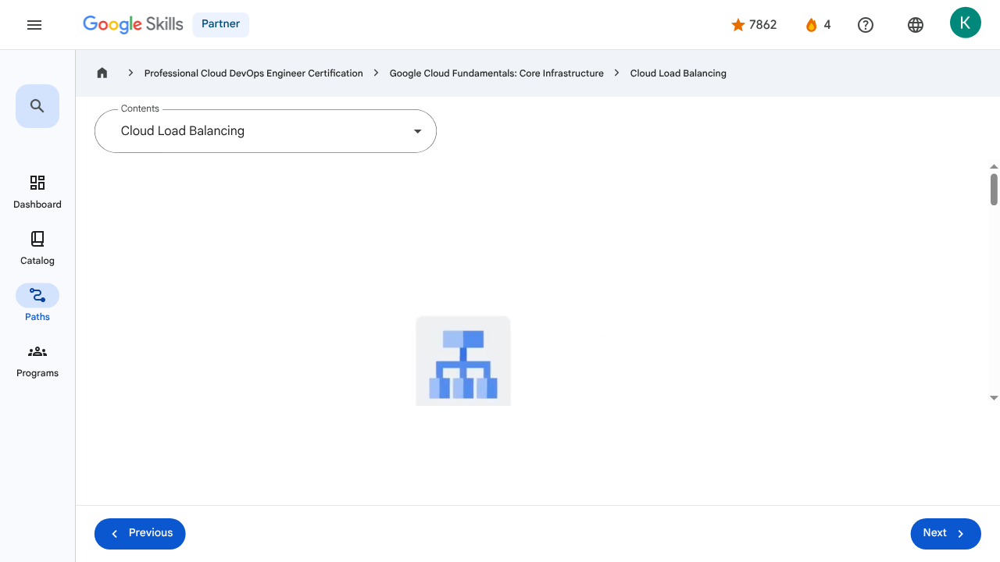

# Virtual Machines and Networks in the Cloud - Cloud Load Balancing | Google Skills for Partners

---

## Metadata

- **URL:** https://partner.skills.google/paths/20/course_sessions/39706059/video/630080
- **Lesson type:** `video`
- **Path ID:** `20`
- **Container type:** `course_sessions`
- **Container ID:** `39706059`
- **Lesson ID:** `630080`
- **Generated:** 2026-07-10 04:57:13

---

## Open Human-Readable HTML

[Open readable_page.html](readable_page.html)

> README/GitHub Markdown usually blocks playable iframes. Open `readable_page.html` to see the playable YouTube frame and browser-like lesson page.

---

## Screenshot



---

## YouTube Video

**Video ID:** `HWJQ3LNagXc`

[](https://www.youtube.com/watch?v=HWJQ3LNagXc)

[Open YouTube Video](https://www.youtube.com/watch?v=HWJQ3LNagXc)

---

## Transcript

### 00:00

Previously, we explored how virtual machines can autoscale to respond to changing loads.

### 00:06

But how do your customers get to your application when it might be provided by four VMs one moment, and by 40 VMs at another?

### 00:15

That’s done through Cloud Load Balancing.

### 00:17

The job of a load balancer is to distribute user traffic across multiple instances of an application.

### 00:23

By spreading the load, load balancing reduces the risk that applications experience performance issues.

### 00:29

Cloud Load Balancing is a fully distributed, software-defined, managed service for all your traffic.

### 00:35

And because the load balancers don’t run in VMs that you have to manage, you don’t have to worry about scaling or managing them.

### 00:42

You can put Cloud Load Balancing in front of all of your traffic: HTTP or HTTPS, other TCP and SSL traffic, and UDP traffic too.

### 00:52

Cloud Load Balancing provides cross-region load balancing, including automatic multi-region failover, which gently moves traffic in fractions if backends become unhealthy.

### 01:02

Cloud Load Balancing reacts quickly to changes in users, traffic, network, backend health, and other related conditions.

### 01:10

And what if you anticipate a huge spike in demand?

### 01:13

Say, your online game is already a hit; do you need to file a support ticket to warn Google of the incoming load?

### 01:19

No.

### 01:20

No so-called “pre-warming” is required.

### 01:24

Google Cloud offers a range of load balancing solutions that can be classified based on the OSI model layer they operate at and their specific functionalities.

### 01:34

Application Load Balancers operate at the application layer and are designed to handle HTTP and HTTPS traffic,

### 01:40

making them ideal for web applications and services that require advanced features like content-based routing and SSL/TLS termination.

### 01:49

Application Load Balancers operate as reverse proxies, distributing incoming traffic across multiple backend instances based on rules you define.

### 01:59

They are highly flexible and can be configured for both internet-facing (external) and internal applications.

### 02:07

Network Load Balancers operate at the transport layer and efficiently handle TCP, UDP, and other IP protocols.

### 02:15

They can be further classified into two types: Proxy Network Load Balancers also function as reverse proxies, terminating client connections and establishing new ones to backend services.

### 02:27

They offer advanced traffic management capabilities and support backends located both on-premises and in various cloud environments.

### 02:34

Unlike proxy Network Load Balancers, passthrough Network Load Balancers do not modify or terminate connections.

### 02:42

Instead, they directly forward traffic to the backend while preserving the original source IP address.

### 02:47

This type is well-suited for applications that require direct server return or need to handle a wider range of IP protocols.

### 00:00

Previously, we explored how virtual machines can autoscale to respond to changing loads. 00:06 But how do your customers get to your application when it might be provided by four VMs one moment, and by 40 VMs at another? 00:15 That’s done through Cloud Load Balancing. 00:17 The job of a load balancer is to distribute user traffic across multiple instances of an application. 00:23 By spreading the load, load balancing reduces the risk that applications experience performance issues. 00:29 Cloud Load Balancing is a fully distributed, software-defined, managed service for all your traffic. 00:35 And because the load balancers don’t run in VMs that you have to manage, you don’t have to worry about scaling or managing them. 00:42 You can put Cloud Load Balancing in front of all of your traffic: HTTP or HTTPS, other TCP and SSL traffic, and UDP traffic too. 00:52 Cloud Load Balancing provides cross-region load balancing, including automatic multi-region failover, which gently moves traffic in fractions if backends become unhealthy. 01:02 Cloud Load Balancing reacts quickly to changes in users, traffic, network, backend health, and other related conditions. 01:10 And what if you anticipate a huge spike in demand? 01:13 Say, your online game is already a hit; do you need to file a support ticket to warn Google of the incoming load? 01:19 No. 01:20 No so-called “pre-warming” is required. 01:24 Google Cloud offers a range of load balancing solutions that can be classified based on the OSI model layer they operate at and their specific functionalities. 01:34 Application Load Balancers operate at the application layer and are designed to handle HTTP and HTTPS traffic, 01:40 making them ideal for web applications and services that require advanced features like content-based routing and SSL/TLS termination. 01:49 Application Load Balancers operate as reverse proxies, distributing incoming traffic across multiple backend instances based on rules you define. 01:59 They are highly flexible and can be configured for both internet-facing (external) and internal applications. 02:07 Network Load Balancers operate at the transport layer and efficiently handle TCP, UDP, and other IP protocols. 02:15 They can be further classified into two types: Proxy Network Load Balancers also function as reverse proxies, terminating client connections and establishing new ones to backend services. 02:27 They offer advanced traffic management capabilities and support backends located both on-premises and in various cloud environments. 02:34 Unlike proxy Network Load Balancers, passthrough Network Load Balancers do not modify or terminate connections. 02:42 Instead, they directly forward traffic to the backend while preserving the original source IP address. 02:47 This type is well-suited for applications that require direct server return or need to handle a wider range of IP protocols.

---

## Page Text

Partner
4
navigate_next
Professional Cloud DevOps Engineer Certification
navigate_next
Google Cloud Fundamentals: Core Infrastructure
navigate_next
Cloud Load Balancing
Previous
Next
Recertify in 3 simple steps:
Link your Google Skills and certification account profiles using the same email to get started.
Instantly see which certifications are eligible for renewal.
Complete courses and skill badges to renew your certifications automatically.

By clicking "Accept", I consent to share my name, email, and course completion data with Google Skills' certification partner, CM Connect, to receive continuing education credit for certification renewal.

---

## Images

### Image 1


### Image 2


---

## Main Resources

### youtube

- [Youtube](https://www.youtube.com/@googlecloud)

### videos

- [Course Introduction](https://partner.skills.google/paths/20/course_sessions/39706059/video/630060)
- [Cloud computing overview](https://partner.skills.google/paths/20/course_sessions/39706059/video/630061)
- [IaaS and PaaS](https://partner.skills.google/paths/20/course_sessions/39706059/video/630062)
- [The Google Cloud network](https://partner.skills.google/paths/20/course_sessions/39706059/video/630063)
- [Environmental impact](https://partner.skills.google/paths/20/course_sessions/39706059/video/630064)
- [Security](https://partner.skills.google/paths/20/course_sessions/39706059/video/630065)
- [Open source ecosystems](https://partner.skills.google/paths/20/course_sessions/39706059/video/630066)
- [Pricing and billing](https://partner.skills.google/paths/20/course_sessions/39706059/video/630067)
- [Google Cloud resource hierarchy](https://partner.skills.google/paths/20/course_sessions/39706059/video/630069)
- [Identity and Access Management (IAM)](https://partner.skills.google/paths/20/course_sessions/39706059/video/630070)
- [Service accounts](https://partner.skills.google/paths/20/course_sessions/39706059/video/630071)
- [Cloud Identity](https://partner.skills.google/paths/20/course_sessions/39706059/video/630072)
- [Interacting with Google Cloud](https://partner.skills.google/paths/20/course_sessions/39706059/video/630073)
- [Virtual Private Cloud networking](https://partner.skills.google/paths/20/course_sessions/39706059/video/630076)
- [Compute Engine](https://partner.skills.google/paths/20/course_sessions/39706059/video/630077)
- [Scaling virtual machines](https://partner.skills.google/paths/20/course_sessions/39706059/video/630078)
- [Important VPC compatibilities](https://partner.skills.google/paths/20/course_sessions/39706059/video/630079)
- [Cloud Load Balancing](https://partner.skills.google/paths/20/course_sessions/39706059/video/630080)
- [Cloud DNS and Cloud CDN](https://partner.skills.google/paths/20/course_sessions/39706059/video/630081)
- [Connecting networks to Google VPC](https://partner.skills.google/paths/20/course_sessions/39706059/video/630082)
- [Google Cloud storage options](https://partner.skills.google/paths/20/course_sessions/39706059/video/630085)
- [Cloud Storage](https://partner.skills.google/paths/20/course_sessions/39706059/video/630086)
- [Cloud Storage: Storage classes and data transfer](https://partner.skills.google/paths/20/course_sessions/39706059/video/630087)
- [Cloud SQL](https://partner.skills.google/paths/20/course_sessions/39706059/video/630088)
- [Spanner](https://partner.skills.google/paths/20/course_sessions/39706059/video/630089)
- [Firestore](https://partner.skills.google/paths/20/course_sessions/39706059/video/630090)
- [Bigtable](https://partner.skills.google/paths/20/course_sessions/39706059/video/630091)
- [Comparing storage options](https://partner.skills.google/paths/20/course_sessions/39706059/video/630092)
- [Introduction to containers](https://partner.skills.google/paths/20/course_sessions/39706059/video/630095)
- [Kubernetes](https://partner.skills.google/paths/20/course_sessions/39706059/video/630096)
- [Google Kubernetes Engine](https://partner.skills.google/paths/20/course_sessions/39706059/video/630097)
- [Cloud Run](https://partner.skills.google/paths/20/course_sessions/39706059/video/630099)
- [Development in the cloud](https://partner.skills.google/paths/20/course_sessions/39706059/video/630100)
- [Prompt Engineering](https://partner.skills.google/paths/20/course_sessions/39706059/video/630103)
- [Course summary](https://partner.skills.google/paths/20/course_sessions/39706059/video/630105)
- [Resource](https://partner.skills.google/paths/20/course_sessions/39706059/video/630079)
- [Resource](https://partner.skills.google/paths/20/course_sessions/39706059/video/630081)

### labs

- [Resource](https://support.google.com/qwiklabs/contact/Google_Skills_Partner)
- [Google Cloud Fundamentals: Getting Started with Cloud Marketplace](https://partner.skills.google/paths/20/course_sessions/39706059/labs/630074)
- [Get Started with Virtual Private Cloud Networking and Compute Engine](https://partner.skills.google/paths/20/course_sessions/39706059/labs/630083)
- [Google Cloud Fundamentals: Getting Started with Cloud Storage and Cloud SQL](https://partner.skills.google/paths/20/course_sessions/39706059/labs/630093)
- [Hello Cloud Run](https://partner.skills.google/paths/20/course_sessions/39706059/labs/630101)

### external_links

- [Resource](https://partner.skills.google/)
- [Professional Cloud DevOps Engineer Certification](https://partner.skills.google/paths/20)
- [Google Cloud Fundamentals: Core Infrastructure](https://partner.skills.google/paths/20/course_templates/60)
- [Dashboard](https://partner.skills.google/)
- [Catalog](https://partner.skills.google/catalog)
- [Paths](https://partner.skills.google/paths)
- [Subscriptions](https://partner.skills.google/subscriptions)
- [Activities](https://partner.skills.google/profile/stay_on_track)
- [Achievements](https://partner.skills.google/profile/badges)
- [Resource](https://partner.skills.google/profile/activity)
- [Resource](https://partner.skills.google/my_account/profile)
- [Programs](https://partner.skills.google/my_account/programs)
- [Overview](https://partner.skills.google/paths/20/course_templates/60)
- [Quiz](https://partner.skills.google/paths/20/course_sessions/39706059/quizzes/630068)
- [Quiz](https://partner.skills.google/paths/20/course_sessions/39706059/quizzes/630075)
- [Quiz](https://partner.skills.google/paths/20/course_sessions/39706059/quizzes/630084)
- [Quiz](https://partner.skills.google/paths/20/course_sessions/39706059/quizzes/630094)
- [Quiz](https://partner.skills.google/paths/20/course_sessions/39706059/quizzes/630098)
- [Quiz](https://partner.skills.google/paths/20/course_sessions/39706059/quizzes/630102)
- [Quiz](https://partner.skills.google/paths/20/course_sessions/39706059/quizzes/630104)
- [Course resources](https://partner.skills.google/paths/20/course_sessions/39706059/documents/630106)
- [Claim credential](https://partner.skills.google/paths/20/course_templates/60/badge)
- [Course Survey
      Recommended](https://partner.skills.google/paths/20/course_templates/60/course_surveys/0)
- [Resource](https://partner.skills.google/paths/20/course_templates/60/preview)

---

## Headings

- **H3**: Transcript
- **H2**: Recertify in 3 simple steps:
- **H1**: A newer version of this course is available. Your progress will carry over if you choose to upgrade. However, your completion percentage may change if the new version has added or removed any learning activities. Click the preview button to see the course changes before upgrading.
---

## Raw Files

- [readable_page.html](readable_page.html)
- [page.html](page.html)
- [page_text.txt](page_text.txt)
- [session.json](session.json)
- [headings.json](headings.json)
- [links.json](links.json)
- [images.json](images.json)
- [resources.json](resources.json)
- [youtube_links.json](youtube_links.json)
- [transcript.json](transcript.json)
- [transcript.txt](transcript.txt)
- [plugin_extra.json](plugin_extra.json)
- [screenshot.png](screenshot.png)

## Plugin Extra Data

```json
{
  "content_kind": "video"
}
```
