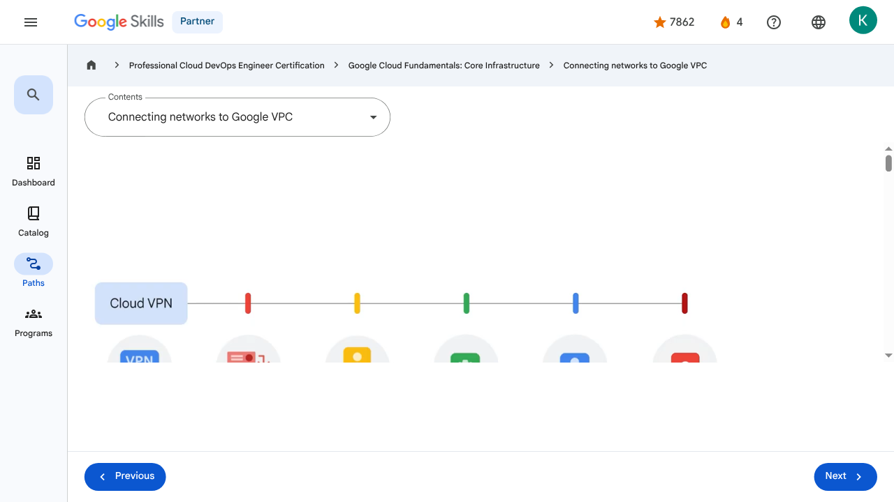

# Virtual Machines and Networks in the Cloud - Connecting networks to Google VPC | Google Skills for Partners

---

## Metadata

- **URL:** https://partner.skills.google/paths/20/course_sessions/39706059/video/630082
- **Lesson type:** `video`
- **Path ID:** `20`
- **Container type:** `course_sessions`
- **Container ID:** `39706059`
- **Lesson ID:** `630082`
- **Generated:** 2026-07-10 04:57:56

---

## Open Human-Readable HTML

[Open readable_page.html](readable_page.html)

> README/GitHub Markdown usually blocks playable iframes. Open `readable_page.html` to see the playable YouTube frame and browser-like lesson page.

---

## Screenshot



---

## YouTube Video

**Video ID:** `g24UStCvpQg`

[](https://www.youtube.com/watch?v=g24UStCvpQg)

[Open YouTube Video](https://www.youtube.com/watch?v=g24UStCvpQg)

---

## Transcript

### 00:00

Many Google Cloud customers want to connect their Google Virtual Private Cloud networks to other networks in their system, such as on-premises networks or networks in other clouds.

### 00:10

There are several effective ways to accomplish this.

### 00:14

One option is to start with a Virtual Private Network connection over the internet and use Cloud VPN to create a “tunnel” connection.

### 00:22

To make the connection dynamic, a Google Cloud feature called Cloud Router can be used.

### 00:28

Cloud Router lets other networks and Google VPC, exchange route information over the VPN using the Border Gateway Protocol.

### 00:36

Using this method, if you add a new subnet to your Google VPC, your on-premises network will automatically get routes to it.

### 00:45

But using the internet to connect networks isn't always the best option for everyone, either because of security concerns or because of bandwidth reliability.

### 00:55

So, a second option is to consider “peering” with Google using Direct Peering.

### 01:01

Peering means putting a router in the same public data center as a Google point of presence and using it to exchange traffic between networks.

### 01:10

Google has points of presence around the world.

### 01:14

Customers who aren’t already in a point of presence can work with a partner in the Carrier Peering program to get connected.

### 01:22

Carrier Peering gives you direct access from your on-premises network through a service provider's network to Google

### 01:27

Workspace and to Google Cloud products that can be exposed through one or more public IP addresses.

### 01:34

One downside of peering though, is that it isn’t covered by a Google Service Level Agreement.

### 01:41

If getting the highest uptimes for interconnection is important, using Dedicated Interconnect would be a good solution.

### 01:48

This option allows for one or more direct, private connections to Google.

### 01:53

If these connections have topologies that meet Google’s specifications, they can also be covered by an SLA of up to 99.99%.

### 02:02

Also, these connections can be backed up by a VPN for even greater reliability.

### 02:09

Another option we’ll explore is Partner Interconnect, which provides connectivity between an on-premises network and a VPC network through a supported service provider.

### 02:20

A Partner Interconnect connection is useful if a data center is in a physical location that can't reach

### 02:26

a Dedicated Interconnect colocation facility, or if the data needs don’t warrant an entire 10 Gigabytes per second connection.

### 02:36

Depending on availability needs, Partner Interconnect can be configured to support mission-critical services or applications that can tolerate some downtime.

### 02:46

As with Dedicated Interconnect, if these connections have topologies that meet Google’s specifications, they can be covered by an SLA of up to 99.99%,

### 02:56

but note that Google isn’t responsible for any aspects of Partner Interconnect provided by the third-party service provider, nor any issues outside of Google's network.

### 03:05

And the final option is Cross-Cloud Interconnect.

### 03:10

Cross-Cloud Interconnect helps you establish high-bandwidth dedicated connectivity between Google Cloud and another cloud service provider.

### 03:18

Google provisions a dedicated physical connection between the Google network and that of another cloud service provider.

### 03:25

You can use this connection to peer your Google Virtual Private Cloud network with your network that's hosted by a supported cloud service provider.

### 03:34

Cross-Cloud Interconnect supports your adoption of an integrated multicloud strategy.

### 03:39

In addition to supporting various cloud service providers, Cross-Cloud Interconnect offers reduced complexity, site-to-site data transfer, and encryption.

### 03:49

Cross-Cloud Interconnect connections are available in two sizes: 10 gigabits per second, or 100 gigabits per second.

### 03:57

Choosing a network option depends on your applications and business requirements.

### 04:02

You can assess those requirements by answering three simple questions.

### 04:06

Do any of your on-premises servers or user computers with private addressing need to connect to Google Cloud resources with private addressing?

### 04:14

Do the bandwidth and performance of your current connection to Google services currently meet your business requirements?

### 04:20

And do you already have, or are you willing to install and manage, access and routing equipment in one of Google’s point of presence locations?

### 04:28

If you need private-to-private connectivity and your internet connection meets your business requirements, then building a Cloud VPN is your best bet.

### 04:37

If you don’t need private access and your Internet connection is meeting your business requirements, then you can simply use public IP addresses to connect to Google services.

### 04:47

If you don’t need private address connectivity and your current connection to Google Cloud isn’t performing well, then peering may be your best connectivity option.

### 04:55

Direct Peering is a good option if you already have a footprint in one of Google’s

### 04:59

points of presence, or you’re willing to lease co-location space and install and support routing equipment.

### 05:07

If installing equipment isn’t an option, or you would prefer to work with a service provider

### 05:10

partner as an intermediary to peer with Google, then Carrier Peering is the way to go.

### 05:17

If you need private, high-performance connectivity to Google Cloud, but installing equipment isn’t an option, or you would

### 05:23

prefer to work with a service provider partner as an intermediary, then Partner Interconnect would be the recommended option.

### 05:31

Last but not least, there’s Dedicated Interconnect, which provides you with a private circuit direct to Google.

### 05:38

This is a good option if you already have a footprint or are willing to lease co-lo space and install and support routing equipment, in a Google point of presence.

### 00:00

Many Google Cloud customers want to connect their Google Virtual Private Cloud networks to other networks in their system, such as on-premises networks or networks in other clouds. 00:10 There are several effective ways to accomplish this. 00:14 One option is to start with a Virtual Private Network connection over the internet and use Cloud VPN to create a “tunnel” connection. 00:22 To make the connection dynamic, a Google Cloud feature called Cloud Router can be used. 00:28 Cloud Router lets other networks and Google VPC, exchange route information over the VPN using the Border Gateway Protocol. 00:36 Using this method, if you add a new subnet to your Google VPC, your on-premises network will automatically get routes to it. 00:45 But using the internet to connect networks isn't always the best option for everyone, either because of security concerns or because of bandwidth reliability. 00:55 So, a second option is to consider “peering” with Google using Direct Peering. 01:01 Peering means putting a router in the same public data center as a Google point of presence and using it to exchange traffic between networks. 01:10 Google has points of presence around the world. 01:14 Customers who aren’t already in a point of presence can work with a partner in the Carrier Peering program to get connected. 01:22 Carrier Peering gives you direct access from your on-premises network through a service provider's network to Google 01:27 Workspace and to Google Cloud products that can be exposed through one or more public IP addresses. 01:34 One downside of peering though, is that it isn’t covered by a Google Service Level Agreement. 01:41 If getting the highest uptimes for interconnection is important, using Dedicated Interconnect would be a good solution. 01:48 This option allows for one or more direct, private connections to Google. 01:53 If these connections have topologies that meet Google’s specifications, they can also be covered by an SLA of up to 99.99%. 02:02 Also, these connections can be backed up by a VPN for even greater reliability. 02:09 Another option we’ll explore is Partner Interconnect, which provides connectivity between an on-premises network and a VPC network through a supported service provider. 02:20 A Partner Interconnect connection is useful if a data center is in a physical location that can't reach 02:26 a Dedicated Interconnect colocation facility, or if the data needs don’t warrant an entire 10 Gigabytes per second connection. 02:36 Depending on availability needs, Partner Interconnect can be configured to support mission-critical services or applications that can tolerate some downtime. 02:46 As with Dedicated Interconnect, if these connections have topologies that meet Google’s specifications, they can be covered by an SLA of up to 99.99%, 02:56 but note that Google isn’t responsible for any aspects of Partner Interconnect provided by the third-party service provider, nor any issues outside of Google's network. 03:05 And the final option is Cross-Cloud Interconnect. 03:10 Cross-Cloud Interconnect helps you establish high-bandwidth dedicated connectivity between Google Cloud and another cloud service provider. 03:18 Google provisions a dedicated physical connection between the Google network and that of another cloud service provider. 03:25 You can use this connection to peer your Google Virtual Private Cloud network with your network that's hosted by a supported cloud service provider. 03:34 Cross-Cloud Interconnect supports your adoption of an integrated multicloud strategy. 03:39 In addition to supporting various cloud service providers, Cross-Cloud Interconnect offers reduced complexity, site-to-site data transfer, and encryption. 03:49 Cross-Cloud Interconnect connections are available in two sizes: 10 gigabits per second, or 100 gigabits per second. 03:57 Choosing a network option depends on your applications and business requirements. 04:02 You can assess those requirements by answering three simple questions. 04:06 Do any of your on-premises servers or user computers with private addressing need to connect to Google Cloud resources with private addressing? 04:14 Do the bandwidth and performance of your current connection to Google services currently meet your business requirements? 04:20 And do you already have, or are you willing to install and manage, access and routing equipment in one of Google’s point of presence locations? 04:28 If you need private-to-private connectivity and your internet connection meets your business requirements, then building a Cloud VPN is your best bet. 04:37 If you don’t need private access and your Internet connection is meeting your business requirements, then you can simply use public IP addresses to connect to Google services. 04:47 If you don’t need private address connectivity and your current connection to Google Cloud isn’t performing well, then peering may be your best connectivity option. 04:55 Direct Peering is a good option if you already have a footprint in one of Google’s 04:59 points of presence, or you’re willing to lease co-location space and install and support routing equipment. 05:07 If installing equipment isn’t an option, or you would prefer to work with a service provider 05:10 partner as an intermediary to peer with Google, then Carrier Peering is the way to go. 05:17 If you need private, high-performance connectivity to Google Cloud, but installing equipment isn’t an option, or you would 05:23 prefer to work with a service provider partner as an intermediary, then Partner Interconnect would be the recommended option. 05:31 Last but not least, there’s Dedicated Interconnect, which provides you with a private circuit direct to Google. 05:38 This is a good option if you already have a footprint or are willing to lease co-lo space and install and support routing equipment, in a Google point of presence.

---

## Page Text

Partner
4
navigate_next
Professional Cloud DevOps Engineer Certification
navigate_next
Google Cloud Fundamentals: Core Infrastructure
navigate_next
Connecting networks to Google VPC
Previous
Next
Recertify in 3 simple steps:
Link your Google Skills and certification account profiles using the same email to get started.
Instantly see which certifications are eligible for renewal.
Complete courses and skill badges to renew your certifications automatically.

By clicking "Accept", I consent to share my name, email, and course completion data with Google Skills' certification partner, CM Connect, to receive continuing education credit for certification renewal.

---

## Images

### Image 1


### Image 2


---

## Main Resources

### youtube

- [Youtube](https://www.youtube.com/@googlecloud)

### videos

- [Course Introduction](https://partner.skills.google/paths/20/course_sessions/39706059/video/630060)
- [Cloud computing overview](https://partner.skills.google/paths/20/course_sessions/39706059/video/630061)
- [IaaS and PaaS](https://partner.skills.google/paths/20/course_sessions/39706059/video/630062)
- [The Google Cloud network](https://partner.skills.google/paths/20/course_sessions/39706059/video/630063)
- [Environmental impact](https://partner.skills.google/paths/20/course_sessions/39706059/video/630064)
- [Security](https://partner.skills.google/paths/20/course_sessions/39706059/video/630065)
- [Open source ecosystems](https://partner.skills.google/paths/20/course_sessions/39706059/video/630066)
- [Pricing and billing](https://partner.skills.google/paths/20/course_sessions/39706059/video/630067)
- [Google Cloud resource hierarchy](https://partner.skills.google/paths/20/course_sessions/39706059/video/630069)
- [Identity and Access Management (IAM)](https://partner.skills.google/paths/20/course_sessions/39706059/video/630070)
- [Service accounts](https://partner.skills.google/paths/20/course_sessions/39706059/video/630071)
- [Cloud Identity](https://partner.skills.google/paths/20/course_sessions/39706059/video/630072)
- [Interacting with Google Cloud](https://partner.skills.google/paths/20/course_sessions/39706059/video/630073)
- [Virtual Private Cloud networking](https://partner.skills.google/paths/20/course_sessions/39706059/video/630076)
- [Compute Engine](https://partner.skills.google/paths/20/course_sessions/39706059/video/630077)
- [Scaling virtual machines](https://partner.skills.google/paths/20/course_sessions/39706059/video/630078)
- [Important VPC compatibilities](https://partner.skills.google/paths/20/course_sessions/39706059/video/630079)
- [Cloud Load Balancing](https://partner.skills.google/paths/20/course_sessions/39706059/video/630080)
- [Cloud DNS and Cloud CDN](https://partner.skills.google/paths/20/course_sessions/39706059/video/630081)
- [Connecting networks to Google VPC](https://partner.skills.google/paths/20/course_sessions/39706059/video/630082)
- [Google Cloud storage options](https://partner.skills.google/paths/20/course_sessions/39706059/video/630085)
- [Cloud Storage](https://partner.skills.google/paths/20/course_sessions/39706059/video/630086)
- [Cloud Storage: Storage classes and data transfer](https://partner.skills.google/paths/20/course_sessions/39706059/video/630087)
- [Cloud SQL](https://partner.skills.google/paths/20/course_sessions/39706059/video/630088)
- [Spanner](https://partner.skills.google/paths/20/course_sessions/39706059/video/630089)
- [Firestore](https://partner.skills.google/paths/20/course_sessions/39706059/video/630090)
- [Bigtable](https://partner.skills.google/paths/20/course_sessions/39706059/video/630091)
- [Comparing storage options](https://partner.skills.google/paths/20/course_sessions/39706059/video/630092)
- [Introduction to containers](https://partner.skills.google/paths/20/course_sessions/39706059/video/630095)
- [Kubernetes](https://partner.skills.google/paths/20/course_sessions/39706059/video/630096)
- [Google Kubernetes Engine](https://partner.skills.google/paths/20/course_sessions/39706059/video/630097)
- [Cloud Run](https://partner.skills.google/paths/20/course_sessions/39706059/video/630099)
- [Development in the cloud](https://partner.skills.google/paths/20/course_sessions/39706059/video/630100)
- [Prompt Engineering](https://partner.skills.google/paths/20/course_sessions/39706059/video/630103)
- [Course summary](https://partner.skills.google/paths/20/course_sessions/39706059/video/630105)
- [Resource](https://partner.skills.google/paths/20/course_sessions/39706059/video/630081)

### labs

- [Resource](https://support.google.com/qwiklabs/contact/Google_Skills_Partner)
- [Google Cloud Fundamentals: Getting Started with Cloud Marketplace](https://partner.skills.google/paths/20/course_sessions/39706059/labs/630074)
- [Get Started with Virtual Private Cloud Networking and Compute Engine](https://partner.skills.google/paths/20/course_sessions/39706059/labs/630083)
- [Google Cloud Fundamentals: Getting Started with Cloud Storage and Cloud SQL](https://partner.skills.google/paths/20/course_sessions/39706059/labs/630093)
- [Hello Cloud Run](https://partner.skills.google/paths/20/course_sessions/39706059/labs/630101)
- [Resource](https://partner.skills.google/paths/20/course_sessions/39706059/labs/630083)

### external_links

- [Resource](https://partner.skills.google/)
- [Professional Cloud DevOps Engineer Certification](https://partner.skills.google/paths/20)
- [Google Cloud Fundamentals: Core Infrastructure](https://partner.skills.google/paths/20/course_templates/60)
- [Dashboard](https://partner.skills.google/)
- [Catalog](https://partner.skills.google/catalog)
- [Paths](https://partner.skills.google/paths)
- [Subscriptions](https://partner.skills.google/subscriptions)
- [Activities](https://partner.skills.google/profile/stay_on_track)
- [Achievements](https://partner.skills.google/profile/badges)
- [Resource](https://partner.skills.google/profile/activity)
- [Resource](https://partner.skills.google/my_account/profile)
- [Programs](https://partner.skills.google/my_account/programs)
- [Overview](https://partner.skills.google/paths/20/course_templates/60)
- [Quiz](https://partner.skills.google/paths/20/course_sessions/39706059/quizzes/630068)
- [Quiz](https://partner.skills.google/paths/20/course_sessions/39706059/quizzes/630075)
- [Quiz](https://partner.skills.google/paths/20/course_sessions/39706059/quizzes/630084)
- [Quiz](https://partner.skills.google/paths/20/course_sessions/39706059/quizzes/630094)
- [Quiz](https://partner.skills.google/paths/20/course_sessions/39706059/quizzes/630098)
- [Quiz](https://partner.skills.google/paths/20/course_sessions/39706059/quizzes/630102)
- [Quiz](https://partner.skills.google/paths/20/course_sessions/39706059/quizzes/630104)
- [Course resources](https://partner.skills.google/paths/20/course_sessions/39706059/documents/630106)
- [Claim credential](https://partner.skills.google/paths/20/course_templates/60/badge)
- [Course Survey
      Recommended](https://partner.skills.google/paths/20/course_templates/60/course_surveys/0)
- [Resource](https://partner.skills.google/paths/20/course_templates/60/preview)

---

## Headings

- **H3**: Transcript
- **H2**: Recertify in 3 simple steps:
- **H1**: A newer version of this course is available. Your progress will carry over if you choose to upgrade. However, your completion percentage may change if the new version has added or removed any learning activities. Click the preview button to see the course changes before upgrading.
---

## Raw Files

- [readable_page.html](readable_page.html)
- [page.html](page.html)
- [page_text.txt](page_text.txt)
- [session.json](session.json)
- [headings.json](headings.json)
- [links.json](links.json)
- [images.json](images.json)
- [resources.json](resources.json)
- [youtube_links.json](youtube_links.json)
- [transcript.json](transcript.json)
- [transcript.txt](transcript.txt)
- [plugin_extra.json](plugin_extra.json)
- [screenshot.png](screenshot.png)

## Plugin Extra Data

```json
{
  "content_kind": "video"
}
```
