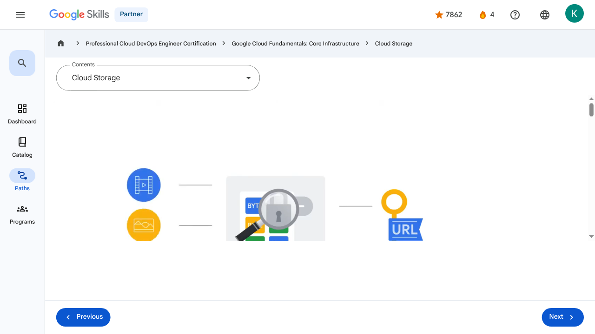

# Storage in the Cloud - Cloud Storage | Google Skills for Partners

---

## Metadata

- **URL:** https://partner.skills.google/paths/20/course_sessions/39706059/video/630086
- **Lesson type:** `video`
- **Path ID:** `20`
- **Container type:** `course_sessions`
- **Container ID:** `39706059`
- **Lesson ID:** `630086`
- **Generated:** 2026-07-10 04:58:37

---

## Open Human-Readable HTML

[Open readable_page.html](readable_page.html)

> README/GitHub Markdown usually blocks playable iframes. Open `readable_page.html` to see the playable YouTube frame and browser-like lesson page.

---

## Screenshot



---

## YouTube Video

**Video ID:** `pLMkOa4FbwI`

[](https://www.youtube.com/watch?v=pLMkOa4FbwI)

[Open YouTube Video](https://www.youtube.com/watch?v=pLMkOa4FbwI)

---

## Transcript

### 00:00

Let’s begin with Cloud Storage, which is a service that offers developers and IT organizations durable and highly available object storage.

### 00:09

But what is object storage?

### 00:12

Object storage is a computer data storage architecture that manages data as “objects” and not

### 00:17

as a file and folder hierarchy (file storage), or as chunks of a disk (block storage).

### 00:24

These objects are stored in a packaged format which contains the binary form of the actual data itself, as

### 00:29

well as relevant associated meta-data (such as date created, author, resource type, and permissions), and a globally unique identifier.

### 00:40

These unique keys are in the form of URLs, which means object storage interacts well with web technologies.

### 00:47

Data commonly stored as objects include video, pictures, and audio recordings.

### 00:53

Cloud Storage is Google’s object storage product.

### 00:56

It allows customers to store any amount of data, and to retrieve it as often as needed.

### 01:00

It’s a fully managed scalable service that has a wide variety of uses.

### 01:05

A few examples include serving website content, storing data for archival and disaster recovery, and distributing large data objects to end users via Direct Download.

### 01:17

Cloud Storage’s primary use is whenever binary large-object storage (also known as a “BLOB”) is needed for online content

### 01:23

such as videos and photos, for backup and archived data and for storage of intermediate results in processing workflows.

### 01:31

Cloud Storage files are organized into buckets.

### 01:35

A bucket needs a globally unique name and a specific geographic location for where it should be stored, and an ideal location for a bucket is where latency is minimized.

### 01:46

For example, if most of your users are in Europe, you probably want to pick a

### 01:49

European location, so either a specific Google Cloud region in Europe, or else the EU multi-region.

### 01:57

The storage objects offered by Cloud Storage are immutable, which means that you do not edit them, but instead a new version is created with every change made.

### 02:07

Administrators have the option to either allow each new version to completely overwrite the older one, or

### 02:11

to keep track of each change made to a particular object by enabling “versioning” within a bucket.

### 02:19

If you choose to use versioning, Cloud Storage will keep a detailed history of modifications -- that is, overwrites or deletes -- of all objects contained in that bucket.

### 02:29

If you don’t turn on object versioning, by default new versions will always overwrite older versions.

### 02:36

With object versioning enabled, you can list the archived versions of an object, restore an object to an older state, or permanently delete a version of an object, as needed.

### 02:47

In many cases, personally identifiable information may be contained in data objects, so controlling access to stored data is essential to ensuring security and privacy are maintained.

### 02:59

Using IAM roles and, where needed, access control lists (ACLs), organizations can conform to security best practices, which require each

### 03:06

user to have access and permissions to only the resources they need to do their jobs, and no more than that.

### 03:15

There are a couple of options to control user access to objects and buckets.

### 03:20

For most purposes, IAM is sufficient.

### 03:23

Roles are inherited from project to bucket to object.

### 03:27

If you need finer control, you can create access control lists.

### 03:31

Each access control list consists of two pieces of information.

### 03:36

The first is a scope, which defines who can access and perform an action.

### 03:40

This can be a specific user or group of users.

### 03:44

The second is a permission, which defines what actions can be performed, like read or write.

### 03:50

Because storing and retrieving large amounts of object data can quickly become expensive, Cloud Storage also offers lifecycle management policies.

### 04:00

For example, you could tell Cloud Storage to delete objects older than 365 days; or to delete objects created before January

### 04:08

1, 2013; or to keep only the 3 most recent versions of each object in a bucket that has versioning enabled.

### 04:16

Having this control ensures that you’re not paying for more than you actually need.

### 00:00

Let’s begin with Cloud Storage, which is a service that offers developers and IT organizations durable and highly available object storage. 00:09 But what is object storage? 00:12 Object storage is a computer data storage architecture that manages data as “objects” and not 00:17 as a file and folder hierarchy (file storage), or as chunks of a disk (block storage). 00:24 These objects are stored in a packaged format which contains the binary form of the actual data itself, as 00:29 well as relevant associated meta-data (such as date created, author, resource type, and permissions), and a globally unique identifier. 00:40 These unique keys are in the form of URLs, which means object storage interacts well with web technologies. 00:47 Data commonly stored as objects include video, pictures, and audio recordings. 00:53 Cloud Storage is Google’s object storage product. 00:56 It allows customers to store any amount of data, and to retrieve it as often as needed. 01:00 It’s a fully managed scalable service that has a wide variety of uses. 01:05 A few examples include serving website content, storing data for archival and disaster recovery, and distributing large data objects to end users via Direct Download. 01:17 Cloud Storage’s primary use is whenever binary large-object storage (also known as a “BLOB”) is needed for online content 01:23 such as videos and photos, for backup and archived data and for storage of intermediate results in processing workflows. 01:31 Cloud Storage files are organized into buckets. 01:35 A bucket needs a globally unique name and a specific geographic location for where it should be stored, and an ideal location for a bucket is where latency is minimized. 01:46 For example, if most of your users are in Europe, you probably want to pick a 01:49 European location, so either a specific Google Cloud region in Europe, or else the EU multi-region. 01:57 The storage objects offered by Cloud Storage are immutable, which means that you do not edit them, but instead a new version is created with every change made. 02:07 Administrators have the option to either allow each new version to completely overwrite the older one, or 02:11 to keep track of each change made to a particular object by enabling “versioning” within a bucket. 02:19 If you choose to use versioning, Cloud Storage will keep a detailed history of modifications -- that is, overwrites or deletes -- of all objects contained in that bucket. 02:29 If you don’t turn on object versioning, by default new versions will always overwrite older versions. 02:36 With object versioning enabled, you can list the archived versions of an object, restore an object to an older state, or permanently delete a version of an object, as needed. 02:47 In many cases, personally identifiable information may be contained in data objects, so controlling access to stored data is essential to ensuring security and privacy are maintained. 02:59 Using IAM roles and, where needed, access control lists (ACLs), organizations can conform to security best practices, which require each 03:06 user to have access and permissions to only the resources they need to do their jobs, and no more than that. 03:15 There are a couple of options to control user access to objects and buckets. 03:20 For most purposes, IAM is sufficient. 03:23 Roles are inherited from project to bucket to object. 03:27 If you need finer control, you can create access control lists. 03:31 Each access control list consists of two pieces of information. 03:36 The first is a scope, which defines who can access and perform an action. 03:40 This can be a specific user or group of users. 03:44 The second is a permission, which defines what actions can be performed, like read or write. 03:50 Because storing and retrieving large amounts of object data can quickly become expensive, Cloud Storage also offers lifecycle management policies. 04:00 For example, you could tell Cloud Storage to delete objects older than 365 days; or to delete objects created before January 04:08 1, 2013; or to keep only the 3 most recent versions of each object in a bucket that has versioning enabled. 04:16 Having this control ensures that you’re not paying for more than you actually need.

---

## Page Text

Partner
4
navigate_next
Professional Cloud DevOps Engineer Certification
navigate_next
Google Cloud Fundamentals: Core Infrastructure
navigate_next
Cloud Storage
Previous
Next
Recertify in 3 simple steps:
Link your Google Skills and certification account profiles using the same email to get started.
Instantly see which certifications are eligible for renewal.
Complete courses and skill badges to renew your certifications automatically.

By clicking "Accept", I consent to share my name, email, and course completion data with Google Skills' certification partner, CM Connect, to receive continuing education credit for certification renewal.

---

## Images

### Image 1


### Image 2


---

## Main Resources

### youtube

- [Youtube](https://www.youtube.com/@googlecloud)

### videos

- [Course Introduction](https://partner.skills.google/paths/20/course_sessions/39706059/video/630060)
- [Cloud computing overview](https://partner.skills.google/paths/20/course_sessions/39706059/video/630061)
- [IaaS and PaaS](https://partner.skills.google/paths/20/course_sessions/39706059/video/630062)
- [The Google Cloud network](https://partner.skills.google/paths/20/course_sessions/39706059/video/630063)
- [Environmental impact](https://partner.skills.google/paths/20/course_sessions/39706059/video/630064)
- [Security](https://partner.skills.google/paths/20/course_sessions/39706059/video/630065)
- [Open source ecosystems](https://partner.skills.google/paths/20/course_sessions/39706059/video/630066)
- [Pricing and billing](https://partner.skills.google/paths/20/course_sessions/39706059/video/630067)
- [Google Cloud resource hierarchy](https://partner.skills.google/paths/20/course_sessions/39706059/video/630069)
- [Identity and Access Management (IAM)](https://partner.skills.google/paths/20/course_sessions/39706059/video/630070)
- [Service accounts](https://partner.skills.google/paths/20/course_sessions/39706059/video/630071)
- [Cloud Identity](https://partner.skills.google/paths/20/course_sessions/39706059/video/630072)
- [Interacting with Google Cloud](https://partner.skills.google/paths/20/course_sessions/39706059/video/630073)
- [Virtual Private Cloud networking](https://partner.skills.google/paths/20/course_sessions/39706059/video/630076)
- [Compute Engine](https://partner.skills.google/paths/20/course_sessions/39706059/video/630077)
- [Scaling virtual machines](https://partner.skills.google/paths/20/course_sessions/39706059/video/630078)
- [Important VPC compatibilities](https://partner.skills.google/paths/20/course_sessions/39706059/video/630079)
- [Cloud Load Balancing](https://partner.skills.google/paths/20/course_sessions/39706059/video/630080)
- [Cloud DNS and Cloud CDN](https://partner.skills.google/paths/20/course_sessions/39706059/video/630081)
- [Connecting networks to Google VPC](https://partner.skills.google/paths/20/course_sessions/39706059/video/630082)
- [Google Cloud storage options](https://partner.skills.google/paths/20/course_sessions/39706059/video/630085)
- [Cloud Storage](https://partner.skills.google/paths/20/course_sessions/39706059/video/630086)
- [Cloud Storage: Storage classes and data transfer](https://partner.skills.google/paths/20/course_sessions/39706059/video/630087)
- [Cloud SQL](https://partner.skills.google/paths/20/course_sessions/39706059/video/630088)
- [Spanner](https://partner.skills.google/paths/20/course_sessions/39706059/video/630089)
- [Firestore](https://partner.skills.google/paths/20/course_sessions/39706059/video/630090)
- [Bigtable](https://partner.skills.google/paths/20/course_sessions/39706059/video/630091)
- [Comparing storage options](https://partner.skills.google/paths/20/course_sessions/39706059/video/630092)
- [Introduction to containers](https://partner.skills.google/paths/20/course_sessions/39706059/video/630095)
- [Kubernetes](https://partner.skills.google/paths/20/course_sessions/39706059/video/630096)
- [Google Kubernetes Engine](https://partner.skills.google/paths/20/course_sessions/39706059/video/630097)
- [Cloud Run](https://partner.skills.google/paths/20/course_sessions/39706059/video/630099)
- [Development in the cloud](https://partner.skills.google/paths/20/course_sessions/39706059/video/630100)
- [Prompt Engineering](https://partner.skills.google/paths/20/course_sessions/39706059/video/630103)
- [Course summary](https://partner.skills.google/paths/20/course_sessions/39706059/video/630105)
- [Resource](https://partner.skills.google/paths/20/course_sessions/39706059/video/630085)
- [Resource](https://partner.skills.google/paths/20/course_sessions/39706059/video/630087)

### labs

- [Resource](https://support.google.com/qwiklabs/contact/Google_Skills_Partner)
- [Google Cloud Fundamentals: Getting Started with Cloud Marketplace](https://partner.skills.google/paths/20/course_sessions/39706059/labs/630074)
- [Get Started with Virtual Private Cloud Networking and Compute Engine](https://partner.skills.google/paths/20/course_sessions/39706059/labs/630083)
- [Google Cloud Fundamentals: Getting Started with Cloud Storage and Cloud SQL](https://partner.skills.google/paths/20/course_sessions/39706059/labs/630093)
- [Hello Cloud Run](https://partner.skills.google/paths/20/course_sessions/39706059/labs/630101)

### external_links

- [Resource](https://partner.skills.google/)
- [Professional Cloud DevOps Engineer Certification](https://partner.skills.google/paths/20)
- [Google Cloud Fundamentals: Core Infrastructure](https://partner.skills.google/paths/20/course_templates/60)
- [Dashboard](https://partner.skills.google/)
- [Catalog](https://partner.skills.google/catalog)
- [Paths](https://partner.skills.google/paths)
- [Subscriptions](https://partner.skills.google/subscriptions)
- [Activities](https://partner.skills.google/profile/stay_on_track)
- [Achievements](https://partner.skills.google/profile/badges)
- [Resource](https://partner.skills.google/profile/activity)
- [Resource](https://partner.skills.google/my_account/profile)
- [Programs](https://partner.skills.google/my_account/programs)
- [Overview](https://partner.skills.google/paths/20/course_templates/60)
- [Quiz](https://partner.skills.google/paths/20/course_sessions/39706059/quizzes/630068)
- [Quiz](https://partner.skills.google/paths/20/course_sessions/39706059/quizzes/630075)
- [Quiz](https://partner.skills.google/paths/20/course_sessions/39706059/quizzes/630084)
- [Quiz](https://partner.skills.google/paths/20/course_sessions/39706059/quizzes/630094)
- [Quiz](https://partner.skills.google/paths/20/course_sessions/39706059/quizzes/630098)
- [Quiz](https://partner.skills.google/paths/20/course_sessions/39706059/quizzes/630102)
- [Quiz](https://partner.skills.google/paths/20/course_sessions/39706059/quizzes/630104)
- [Course resources](https://partner.skills.google/paths/20/course_sessions/39706059/documents/630106)
- [Claim credential](https://partner.skills.google/paths/20/course_templates/60/badge)
- [Course Survey
      Recommended](https://partner.skills.google/paths/20/course_templates/60/course_surveys/0)
- [Resource](https://partner.skills.google/paths/20/course_templates/60/preview)

---

## Headings

- **H3**: Transcript
- **H2**: Recertify in 3 simple steps:
- **H1**: A newer version of this course is available. Your progress will carry over if you choose to upgrade. However, your completion percentage may change if the new version has added or removed any learning activities. Click the preview button to see the course changes before upgrading.
---

## Raw Files

- [readable_page.html](readable_page.html)
- [page.html](page.html)
- [page_text.txt](page_text.txt)
- [session.json](session.json)
- [headings.json](headings.json)
- [links.json](links.json)
- [images.json](images.json)
- [resources.json](resources.json)
- [youtube_links.json](youtube_links.json)
- [transcript.json](transcript.json)
- [transcript.txt](transcript.txt)
- [plugin_extra.json](plugin_extra.json)
- [screenshot.png](screenshot.png)

## Plugin Extra Data

```json
{
  "content_kind": "video"
}
```
