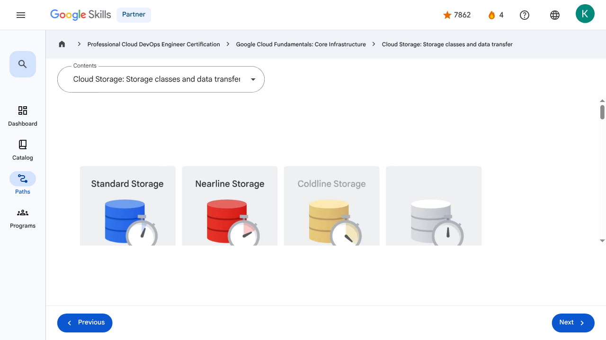

# Storage in the Cloud - Cloud Storage: Storage classes and data transfer | Google Skills for Partners

---

## Metadata

- **URL:** https://partner.skills.google/paths/20/course_sessions/39706059/video/630087
- **Lesson type:** `video`
- **Path ID:** `20`
- **Container type:** `course_sessions`
- **Container ID:** `39706059`
- **Lesson ID:** `630087`
- **Generated:** 2026-07-10 04:58:58

---

## Open Human-Readable HTML

[Open readable_page.html](readable_page.html)

> README/GitHub Markdown usually blocks playable iframes. Open `readable_page.html` to see the playable YouTube frame and browser-like lesson page.

---

## Screenshot



---

## YouTube Video

**Video ID:** `A5a8sPL6PjY`

[](https://www.youtube.com/watch?v=A5a8sPL6PjY)

[Open YouTube Video](https://www.youtube.com/watch?v=A5a8sPL6PjY)

---

## Transcript

### 00:00

There are four primary storage classes in Cloud Storage.

### 00:04

The first is Standard Storage.

### 00:07

Standard Storage is considered best for frequently accessed, or “hot,” data.

### 00:11

It’s also great for data that’s stored for only brief periods of time.

### 00:16

The second storage class is Nearline Storage.

### 00:19

This is best for storing infrequently accessed data, like reading or modifying data on average once a month or less.

### 00:26

Examples might include data backups, long-tail multimedia content, or data archiving.

### 00:34

The third storage class is Coldline Storage.

### 00:37

This is also a low-cost option for storing infrequently accessed data.

### 00:41

However, as compared to Nearline Storage, Coldline Storage is meant for reading or modifying data, at most, once every 90 days.

### 00:50

And the fourth storage class is Archive Storage.

### 00:54

This is the lowest-cost option, used ideally for data archiving, online backup, and disaster recovery.

### 01:01

It’s the best choice for data that you plan to access less than once a year,

### 01:05

because it has higher costs for data access and operations and a 365-day minimum storage duration.

### 01:13

Although each of these four classes has differences, it’s worth noting there are several characteristics that apply across all of these storage classes.

### 01:23

These include: Unlimited storage with no minimum object size requirement, worldwide accessibility and locations, low latency and high durability, a

### 01:33

uniform experience, which extends to security, tools, and APIs, and geo-redundancy if data is stored in a multi-region or dual-region.

### 01:46

This means placing physical servers in geographically diverse data centers to protect against catastrophic events and natural disasters, and load-balancing traffic for optimal performance.

### 01:58

Cloud Storage also provides a feature called Autoclass, which automatically transitions objects to appropriate storage classes based on each object's access pattern.

### 02:09

The feature moves data that is not accessed to colder storage classes to reduce storage cost and moves data that is accessed to Standard storage to optimize future accesses.

### 02:20

Autoclass simplifies and automates cost saving for your Cloud Storage data.

### 02:26

Cloud Storage has no minimum fee because you pay only for what you use, and prior provisioning of capacity isn’t necessary.

### 02:34

And from a security perspective, Cloud Storage always encrypts data on the server side, before it’s written to disk, at no additional charge.

### 02:43

Data traveling between a customer’s device and Google is encrypted by default using HTTPS/TLS, which is Transport Layer Security.

### 02:53

Regardless of which storage class you choose, there are several ways to bring data into Cloud Storage.

### 02:58

Many customers simply carry out their own online transfer using gcloud storage, which is the Cloud Storage command from the Cloud SDK.

### 03:07

Data can also be moved in by using a drag and drop option in the Cloud Console, if accessed through the Google Chrome web browser.

### 03:15

But what if you have to upload terabytes or even petabytes of data?

### 03:20

Storage Transfer Service enables you to import large amounts of online data into Cloud Storage quickly and cost-effectively.

### 03:28

The Storage Transfer Service lets you schedule and manage batch transfers to Cloud Storage from another cloud provider, from a different Cloud Storage region, or from an HTTP(S) endpoint.

### 03:38

And then there is the Transfer Appliance, which is a rackable, high-capacity storage server that you lease from Google Cloud.

### 03:47

You connect it to your network, load it with data, and then ship it to an upload facility where the data is uploaded to Cloud Storage.

### 03:55

You can transfer up to a petabyte of data on a single appliance.

### 04:00

Cloud Storage’s tight integration with other Google Cloud products and services means that there are many additional ways to move data into the service.

### 04:08

For example, you can import and export tables to and from both BigQuery and Cloud SQL.

### 04:15

You can also store App Engine logs, Firestore backups, and objects used by App Engine applications, like images.

### 04:24

Cloud Storage can also store instance startup scripts, Compute Engine images, and objects used by Compute Engine applications.

### 00:00

There are four primary storage classes in Cloud Storage. 00:04 The first is Standard Storage. 00:07 Standard Storage is considered best for frequently accessed, or “hot,” data. 00:11 It’s also great for data that’s stored for only brief periods of time. 00:16 The second storage class is Nearline Storage. 00:19 This is best for storing infrequently accessed data, like reading or modifying data on average once a month or less. 00:26 Examples might include data backups, long-tail multimedia content, or data archiving. 00:34 The third storage class is Coldline Storage. 00:37 This is also a low-cost option for storing infrequently accessed data. 00:41 However, as compared to Nearline Storage, Coldline Storage is meant for reading or modifying data, at most, once every 90 days. 00:50 And the fourth storage class is Archive Storage. 00:54 This is the lowest-cost option, used ideally for data archiving, online backup, and disaster recovery. 01:01 It’s the best choice for data that you plan to access less than once a year, 01:05 because it has higher costs for data access and operations and a 365-day minimum storage duration. 01:13 Although each of these four classes has differences, it’s worth noting there are several characteristics that apply across all of these storage classes. 01:23 These include: Unlimited storage with no minimum object size requirement, worldwide accessibility and locations, low latency and high durability, a 01:33 uniform experience, which extends to security, tools, and APIs, and geo-redundancy if data is stored in a multi-region or dual-region. 01:46 This means placing physical servers in geographically diverse data centers to protect against catastrophic events and natural disasters, and load-balancing traffic for optimal performance. 01:58 Cloud Storage also provides a feature called Autoclass, which automatically transitions objects to appropriate storage classes based on each object's access pattern. 02:09 The feature moves data that is not accessed to colder storage classes to reduce storage cost and moves data that is accessed to Standard storage to optimize future accesses. 02:20 Autoclass simplifies and automates cost saving for your Cloud Storage data. 02:26 Cloud Storage has no minimum fee because you pay only for what you use, and prior provisioning of capacity isn’t necessary. 02:34 And from a security perspective, Cloud Storage always encrypts data on the server side, before it’s written to disk, at no additional charge. 02:43 Data traveling between a customer’s device and Google is encrypted by default using HTTPS/TLS, which is Transport Layer Security. 02:53 Regardless of which storage class you choose, there are several ways to bring data into Cloud Storage. 02:58 Many customers simply carry out their own online transfer using gcloud storage, which is the Cloud Storage command from the Cloud SDK. 03:07 Data can also be moved in by using a drag and drop option in the Cloud Console, if accessed through the Google Chrome web browser. 03:15 But what if you have to upload terabytes or even petabytes of data? 03:20 Storage Transfer Service enables you to import large amounts of online data into Cloud Storage quickly and cost-effectively. 03:28 The Storage Transfer Service lets you schedule and manage batch transfers to Cloud Storage from another cloud provider, from a different Cloud Storage region, or from an HTTP(S) endpoint. 03:38 And then there is the Transfer Appliance, which is a rackable, high-capacity storage server that you lease from Google Cloud. 03:47 You connect it to your network, load it with data, and then ship it to an upload facility where the data is uploaded to Cloud Storage. 03:55 You can transfer up to a petabyte of data on a single appliance. 04:00 Cloud Storage’s tight integration with other Google Cloud products and services means that there are many additional ways to move data into the service. 04:08 For example, you can import and export tables to and from both BigQuery and Cloud SQL. 04:15 You can also store App Engine logs, Firestore backups, and objects used by App Engine applications, like images. 04:24 Cloud Storage can also store instance startup scripts, Compute Engine images, and objects used by Compute Engine applications.

---

## Page Text

Partner
4
navigate_next
Professional Cloud DevOps Engineer Certification
navigate_next
Google Cloud Fundamentals: Core Infrastructure
navigate_next
Cloud Storage: Storage classes and data transfer
Previous
Next
Recertify in 3 simple steps:
Link your Google Skills and certification account profiles using the same email to get started.
Instantly see which certifications are eligible for renewal.
Complete courses and skill badges to renew your certifications automatically.

By clicking "Accept", I consent to share my name, email, and course completion data with Google Skills' certification partner, CM Connect, to receive continuing education credit for certification renewal.

---

## Images

### Image 1


### Image 2


---

## Main Resources

### youtube

- [Youtube](https://www.youtube.com/@googlecloud)

### videos

- [Course Introduction](https://partner.skills.google/paths/20/course_sessions/39706059/video/630060)
- [Cloud computing overview](https://partner.skills.google/paths/20/course_sessions/39706059/video/630061)
- [IaaS and PaaS](https://partner.skills.google/paths/20/course_sessions/39706059/video/630062)
- [The Google Cloud network](https://partner.skills.google/paths/20/course_sessions/39706059/video/630063)
- [Environmental impact](https://partner.skills.google/paths/20/course_sessions/39706059/video/630064)
- [Security](https://partner.skills.google/paths/20/course_sessions/39706059/video/630065)
- [Open source ecosystems](https://partner.skills.google/paths/20/course_sessions/39706059/video/630066)
- [Pricing and billing](https://partner.skills.google/paths/20/course_sessions/39706059/video/630067)
- [Google Cloud resource hierarchy](https://partner.skills.google/paths/20/course_sessions/39706059/video/630069)
- [Identity and Access Management (IAM)](https://partner.skills.google/paths/20/course_sessions/39706059/video/630070)
- [Service accounts](https://partner.skills.google/paths/20/course_sessions/39706059/video/630071)
- [Cloud Identity](https://partner.skills.google/paths/20/course_sessions/39706059/video/630072)
- [Interacting with Google Cloud](https://partner.skills.google/paths/20/course_sessions/39706059/video/630073)
- [Virtual Private Cloud networking](https://partner.skills.google/paths/20/course_sessions/39706059/video/630076)
- [Compute Engine](https://partner.skills.google/paths/20/course_sessions/39706059/video/630077)
- [Scaling virtual machines](https://partner.skills.google/paths/20/course_sessions/39706059/video/630078)
- [Important VPC compatibilities](https://partner.skills.google/paths/20/course_sessions/39706059/video/630079)
- [Cloud Load Balancing](https://partner.skills.google/paths/20/course_sessions/39706059/video/630080)
- [Cloud DNS and Cloud CDN](https://partner.skills.google/paths/20/course_sessions/39706059/video/630081)
- [Connecting networks to Google VPC](https://partner.skills.google/paths/20/course_sessions/39706059/video/630082)
- [Google Cloud storage options](https://partner.skills.google/paths/20/course_sessions/39706059/video/630085)
- [Cloud Storage](https://partner.skills.google/paths/20/course_sessions/39706059/video/630086)
- [Cloud Storage: Storage classes and data transfer](https://partner.skills.google/paths/20/course_sessions/39706059/video/630087)
- [Cloud SQL](https://partner.skills.google/paths/20/course_sessions/39706059/video/630088)
- [Spanner](https://partner.skills.google/paths/20/course_sessions/39706059/video/630089)
- [Firestore](https://partner.skills.google/paths/20/course_sessions/39706059/video/630090)
- [Bigtable](https://partner.skills.google/paths/20/course_sessions/39706059/video/630091)
- [Comparing storage options](https://partner.skills.google/paths/20/course_sessions/39706059/video/630092)
- [Introduction to containers](https://partner.skills.google/paths/20/course_sessions/39706059/video/630095)
- [Kubernetes](https://partner.skills.google/paths/20/course_sessions/39706059/video/630096)
- [Google Kubernetes Engine](https://partner.skills.google/paths/20/course_sessions/39706059/video/630097)
- [Cloud Run](https://partner.skills.google/paths/20/course_sessions/39706059/video/630099)
- [Development in the cloud](https://partner.skills.google/paths/20/course_sessions/39706059/video/630100)
- [Prompt Engineering](https://partner.skills.google/paths/20/course_sessions/39706059/video/630103)
- [Course summary](https://partner.skills.google/paths/20/course_sessions/39706059/video/630105)
- [Resource](https://partner.skills.google/paths/20/course_sessions/39706059/video/630086)
- [Resource](https://partner.skills.google/paths/20/course_sessions/39706059/video/630088)

### labs

- [Resource](https://support.google.com/qwiklabs/contact/Google_Skills_Partner)
- [Google Cloud Fundamentals: Getting Started with Cloud Marketplace](https://partner.skills.google/paths/20/course_sessions/39706059/labs/630074)
- [Get Started with Virtual Private Cloud Networking and Compute Engine](https://partner.skills.google/paths/20/course_sessions/39706059/labs/630083)
- [Google Cloud Fundamentals: Getting Started with Cloud Storage and Cloud SQL](https://partner.skills.google/paths/20/course_sessions/39706059/labs/630093)
- [Hello Cloud Run](https://partner.skills.google/paths/20/course_sessions/39706059/labs/630101)

### external_links

- [Resource](https://partner.skills.google/)
- [Professional Cloud DevOps Engineer Certification](https://partner.skills.google/paths/20)
- [Google Cloud Fundamentals: Core Infrastructure](https://partner.skills.google/paths/20/course_templates/60)
- [Dashboard](https://partner.skills.google/)
- [Catalog](https://partner.skills.google/catalog)
- [Paths](https://partner.skills.google/paths)
- [Subscriptions](https://partner.skills.google/subscriptions)
- [Activities](https://partner.skills.google/profile/stay_on_track)
- [Achievements](https://partner.skills.google/profile/badges)
- [Resource](https://partner.skills.google/profile/activity)
- [Resource](https://partner.skills.google/my_account/profile)
- [Programs](https://partner.skills.google/my_account/programs)
- [Overview](https://partner.skills.google/paths/20/course_templates/60)
- [Quiz](https://partner.skills.google/paths/20/course_sessions/39706059/quizzes/630068)
- [Quiz](https://partner.skills.google/paths/20/course_sessions/39706059/quizzes/630075)
- [Quiz](https://partner.skills.google/paths/20/course_sessions/39706059/quizzes/630084)
- [Quiz](https://partner.skills.google/paths/20/course_sessions/39706059/quizzes/630094)
- [Quiz](https://partner.skills.google/paths/20/course_sessions/39706059/quizzes/630098)
- [Quiz](https://partner.skills.google/paths/20/course_sessions/39706059/quizzes/630102)
- [Quiz](https://partner.skills.google/paths/20/course_sessions/39706059/quizzes/630104)
- [Course resources](https://partner.skills.google/paths/20/course_sessions/39706059/documents/630106)
- [Claim credential](https://partner.skills.google/paths/20/course_templates/60/badge)
- [Course Survey
      Recommended](https://partner.skills.google/paths/20/course_templates/60/course_surveys/0)
- [Resource](https://partner.skills.google/paths/20/course_templates/60/preview)

---

## Headings

- **H3**: Transcript
- **H2**: Recertify in 3 simple steps:
- **H1**: A newer version of this course is available. Your progress will carry over if you choose to upgrade. However, your completion percentage may change if the new version has added or removed any learning activities. Click the preview button to see the course changes before upgrading.
---

## Raw Files

- [readable_page.html](readable_page.html)
- [page.html](page.html)
- [page_text.txt](page_text.txt)
- [session.json](session.json)
- [headings.json](headings.json)
- [links.json](links.json)
- [images.json](images.json)
- [resources.json](resources.json)
- [youtube_links.json](youtube_links.json)
- [transcript.json](transcript.json)
- [transcript.txt](transcript.txt)
- [plugin_extra.json](plugin_extra.json)
- [screenshot.png](screenshot.png)

## Plugin Extra Data

```json
{
  "content_kind": "video"
}
```
