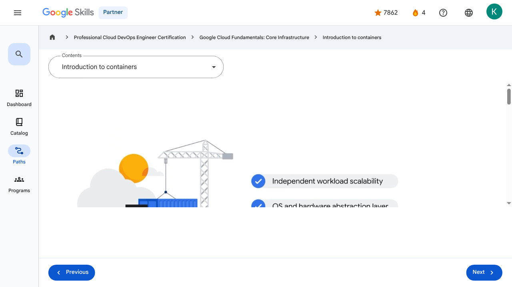
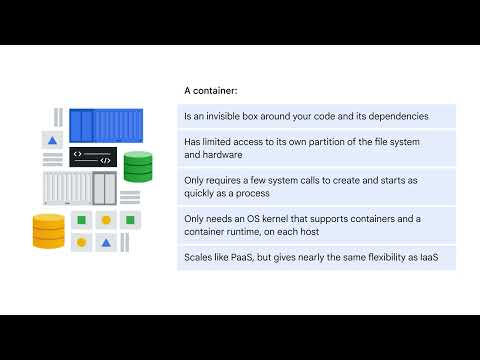

# Containers in the Cloud - Introduction to containers | Google Skills for Partners

> Offline lesson archive generated by Google Skills scraper.

---

## Metadata

- **Original URL:** https://partner.skills.google/paths/20/course_sessions/39706059/video/630095
- **Lesson type:** `video`
- **Path ID:** `20`
- **Container type:** `course_sessions`
- **Container ID:** `39706059`
- **Lesson ID:** `630095`
- **Generated:** 2026-07-10 05:01:00

---

## Full Page Screenshot

---

## Video

### YouTube Video `fkyu-gVr4IU`

---

## Transcript

**00:00**

In this section of the course we’ll explore containers and help you understand how they are used.

**00:06**

Infrastructure as a service, or IaaS, allows you to share compute resources with other developers by using virtual machines to virtualize the hardware.

**00:16**

This lets each developer deploy their own operating system (OS), access the hardware, and build

**00:22**

their applications in a self- contained environment with access to RAM, file systems, networking interfaces, etc.

**00:30**

This is where containers come in.

**00:33**

The idea of a container is to give the independent scalability of workloads in PaaS and an abstraction layer of the OS and hardware in IaaS.

**00:43**

A configurable system lets you install your favorite runtime, web server, database, or middleware, configure the

**00:48**

underlying system resources, such as disk space, disk I/O, or networking, and build as you like.

**00:56**

But flexibility comes with a cost.

**00:59**

The smallest unit of compute is an app with its VM.

**01:03**

The guest OS might be large, even gigabytes in size, and take minutes to boot.

**01:08**

As demand for your application increases, you have to copy an entire VM and boot the guest OS for each instance of your app, which can be slow and costly.

**01:19**

A container is an invisible box around your code and its dependencies with limited access to its own partition of the file system and hardware.

**01:27**

It only requires a few system calls to create and it starts as quickly as a process.

**01:33**

All that’s needed on each host is an OS kernel that supports containers and a container runtime.

**01:39**

In essence, the OS is being virtualized.

**01:43**

It scales like PaaS but gives you nearly the same flexibility as IaaS.

**01:48**

This makes code ultra portable, and the OS and hardware can be treated as a black box.

**01:54**

So you can go from development, to staging, to production, or from your laptop to the cloud, without changing or rebuilding anything.

**02:02**

Google Kubernetes Engine (GKE) acts as a bridge between these models, providing the automation of PaaS with the granular control of IaaS.

**02:11**

As an example, let’s say you want to scale a web server.

**02:15**

With a container, you can do this in seconds and deploy dozens or hundreds of them, depending on the size of your workload, on a single host.

**02:24**

That's just a simple example of scaling one container running the whole application on a single host.

**02:29**

However, you'll probably want to build your applications using lots of containers, each performing their own function like microservices.

**02:38**

If you build them this way and connect them with network connections, you can make them modular, deploy easily, and scale independently across a group of hosts.

**02:47**

The hosts can scale up and down and start and stop containers as demand for your app changes or as hosts fail.

**00:00**

In this section of the course we’ll explore containers and help you understand how they are used. 00:06 Infrastructure as a service, or IaaS, allows you to share compute resources with other developers by using virtual machines to virtualize the hardware. 00:16 This lets each developer deploy their own operating system (OS), access the hardware, and build 00:22 their applications in a self- contained environment with access to RAM, file systems, networking interfaces, etc. 00:30 This is where containers come in. 00:33 The idea of a container is to give the independent scalability of workloads in PaaS and an abstraction layer of the OS and hardware in IaaS. 00:43 A configurable system lets you install your favorite runtime, web server, database, or middleware, configure the 00:48 underlying system resources, such as disk space, disk I/O, or networking, and build as you like. 00:56 But flexibility comes with a cost. 00:59 The smallest unit of compute is an app with its VM. 01:03 The guest OS might be large, even gigabytes in size, and take minutes to boot. 01:08 As demand for your application increases, you have to copy an entire VM and boot the guest OS for each instance of your app, which can be slow and costly. 01:19 A container is an invisible box around your code and its dependencies with limited access to its own partition of the file system and hardware. 01:27 It only requires a few system calls to create and it starts as quickly as a process. 01:33 All that’s needed on each host is an OS kernel that supports containers and a container runtime. 01:39 In essence, the OS is being virtualized. 01:43 It scales like PaaS but gives you nearly the same flexibility as IaaS. 01:48 This makes code ultra portable, and the OS and hardware can be treated as a black box. 01:54 So you can go from development, to staging, to production, or from your laptop to the cloud, without changing or rebuilding anything. 02:02 Google Kubernetes Engine (GKE) acts as a bridge between these models, providing the automation of PaaS with the granular control of IaaS. 02:11 As an example, let’s say you want to scale a web server. 02:15 With a container, you can do this in seconds and deploy dozens or hundreds of them, depending on the size of your workload, on a single host. 02:24 That's just a simple example of scaling one container running the whole application on a single host. 02:29 However, you'll probably want to build your applications using lots of containers, each performing their own function like microservices. 02:38 If you build them this way and connect them with network connections, you can make them modular, deploy easily, and scale independently across a group of hosts. 02:47 The hosts can scale up and down and start and stop containers as demand for your app changes or as hosts fail.

---

## Lesson Text

Partner
4
navigate_next
Professional Cloud DevOps Engineer Certification
navigate_next
Google Cloud Fundamentals: Core Infrastructure
navigate_next
Introduction to containers
Previous
Next
Recertify in 3 simple steps:
Link your Google Skills and certification account profiles using the same email to get started.
Instantly see which certifications are eligible for renewal.
Complete courses and skill badges to renew your certifications automatically.

By clicking "Accept", I consent to share my name, email, and course completion data with Google Skills' certification partner, CM Connect, to receive continuing education credit for certification renewal.

---

## Images

### Image 1

### Image 2

---

## Main Resources

### youtube

- [Youtube](https://www.youtube.com/@googlecloud)

### videos

- [Course Introduction](https://partner.skills.google/paths/20/course_sessions/39706059/video/630060)
- [Cloud computing overview](https://partner.skills.google/paths/20/course_sessions/39706059/video/630061)
- [IaaS and PaaS](https://partner.skills.google/paths/20/course_sessions/39706059/video/630062)
- [The Google Cloud network](https://partner.skills.google/paths/20/course_sessions/39706059/video/630063)
- [Environmental impact](https://partner.skills.google/paths/20/course_sessions/39706059/video/630064)
- [Security](https://partner.skills.google/paths/20/course_sessions/39706059/video/630065)
- [Open source ecosystems](https://partner.skills.google/paths/20/course_sessions/39706059/video/630066)
- [Pricing and billing](https://partner.skills.google/paths/20/course_sessions/39706059/video/630067)
- [Google Cloud resource hierarchy](https://partner.skills.google/paths/20/course_sessions/39706059/video/630069)
- [Identity and Access Management (IAM)](https://partner.skills.google/paths/20/course_sessions/39706059/video/630070)
- [Service accounts](https://partner.skills.google/paths/20/course_sessions/39706059/video/630071)
- [Cloud Identity](https://partner.skills.google/paths/20/course_sessions/39706059/video/630072)
- [Interacting with Google Cloud](https://partner.skills.google/paths/20/course_sessions/39706059/video/630073)
- [Virtual Private Cloud networking](https://partner.skills.google/paths/20/course_sessions/39706059/video/630076)
- [Compute Engine](https://partner.skills.google/paths/20/course_sessions/39706059/video/630077)
- [Scaling virtual machines](https://partner.skills.google/paths/20/course_sessions/39706059/video/630078)
- [Important VPC compatibilities](https://partner.skills.google/paths/20/course_sessions/39706059/video/630079)
- [Cloud Load Balancing](https://partner.skills.google/paths/20/course_sessions/39706059/video/630080)
- [Cloud DNS and Cloud CDN](https://partner.skills.google/paths/20/course_sessions/39706059/video/630081)
- [Connecting networks to Google VPC](https://partner.skills.google/paths/20/course_sessions/39706059/video/630082)
- [Google Cloud storage options](https://partner.skills.google/paths/20/course_sessions/39706059/video/630085)
- [Cloud Storage](https://partner.skills.google/paths/20/course_sessions/39706059/video/630086)
- [Cloud Storage: Storage classes and data transfer](https://partner.skills.google/paths/20/course_sessions/39706059/video/630087)
- [Cloud SQL](https://partner.skills.google/paths/20/course_sessions/39706059/video/630088)
- [Spanner](https://partner.skills.google/paths/20/course_sessions/39706059/video/630089)
- [Firestore](https://partner.skills.google/paths/20/course_sessions/39706059/video/630090)
- [Bigtable](https://partner.skills.google/paths/20/course_sessions/39706059/video/630091)
- [Comparing storage options](https://partner.skills.google/paths/20/course_sessions/39706059/video/630092)
- [Introduction to containers](https://partner.skills.google/paths/20/course_sessions/39706059/video/630095)
- [Kubernetes](https://partner.skills.google/paths/20/course_sessions/39706059/video/630096)
- [Google Kubernetes Engine](https://partner.skills.google/paths/20/course_sessions/39706059/video/630097)
- [Cloud Run](https://partner.skills.google/paths/20/course_sessions/39706059/video/630099)
- [Development in the cloud](https://partner.skills.google/paths/20/course_sessions/39706059/video/630100)
- [Prompt Engineering](https://partner.skills.google/paths/20/course_sessions/39706059/video/630103)
- [Course summary](https://partner.skills.google/paths/20/course_sessions/39706059/video/630105)
- [Resource](https://partner.skills.google/paths/20/course_sessions/39706059/video/630096)

### labs

- [Resource](https://support.google.com/qwiklabs/contact/Google_Skills_Partner)
- [Google Cloud Fundamentals: Getting Started with Cloud Marketplace](https://partner.skills.google/paths/20/course_sessions/39706059/labs/630074)
- [Get Started with Virtual Private Cloud Networking and Compute Engine](https://partner.skills.google/paths/20/course_sessions/39706059/labs/630083)
- [Google Cloud Fundamentals: Getting Started with Cloud Storage and Cloud SQL](https://partner.skills.google/paths/20/course_sessions/39706059/labs/630093)
- [Hello Cloud Run](https://partner.skills.google/paths/20/course_sessions/39706059/labs/630101)

### external_links

- [Resource](https://partner.skills.google/)
- [Professional Cloud DevOps Engineer Certification](https://partner.skills.google/paths/20)
- [Google Cloud Fundamentals: Core Infrastructure](https://partner.skills.google/paths/20/course_templates/60)
- [Dashboard](https://partner.skills.google/)
- [Catalog](https://partner.skills.google/catalog)
- [Paths](https://partner.skills.google/paths)
- [Subscriptions](https://partner.skills.google/subscriptions)
- [Activities](https://partner.skills.google/profile/stay_on_track)
- [Achievements](https://partner.skills.google/profile/badges)
- [Resource](https://partner.skills.google/profile/activity)
- [Resource](https://partner.skills.google/my_account/profile)
- [Programs](https://partner.skills.google/my_account/programs)
- [Overview](https://partner.skills.google/paths/20/course_templates/60)
- [Quiz](https://partner.skills.google/paths/20/course_sessions/39706059/quizzes/630068)
- [Quiz](https://partner.skills.google/paths/20/course_sessions/39706059/quizzes/630075)
- [Quiz](https://partner.skills.google/paths/20/course_sessions/39706059/quizzes/630084)
- [Quiz](https://partner.skills.google/paths/20/course_sessions/39706059/quizzes/630094)
- [Quiz](https://partner.skills.google/paths/20/course_sessions/39706059/quizzes/630098)
- [Quiz](https://partner.skills.google/paths/20/course_sessions/39706059/quizzes/630102)
- [Quiz](https://partner.skills.google/paths/20/course_sessions/39706059/quizzes/630104)
- [Course resources](https://partner.skills.google/paths/20/course_sessions/39706059/documents/630106)
- [Claim credential](https://partner.skills.google/paths/20/course_templates/60/badge)
- [Course Survey
      Recommended](https://partner.skills.google/paths/20/course_templates/60/course_surveys/0)
- [Resource](https://partner.skills.google/paths/20/course_sessions/39706059/quizzes/630094)
- [Resource](https://partner.skills.google/paths/20/course_templates/60/preview)

---

## Headings

- **H3**: Transcript
- **H2**: Recertify in 3 simple steps:
- **H1**: A newer version of this course is available. Your progress will carry over if you choose to upgrade. However, your completion percentage may change if the new version has added or removed any learning activities. Click the preview button to see the course changes before upgrading.

---

## Code Blocks / Commands

_No code blocks found._

---

## Related Files

- [README.md](README.md)
- [lesson.md](lesson.md)
- [readable_page.html](readable_page.html)
- [page.html](page.html)
- [page_text.txt](page_text.txt)
- [transcript.txt](transcript.txt)
- [screenshot.png](screenshot.png)
- [assets/](assets/)
- [assets/](assets/)
