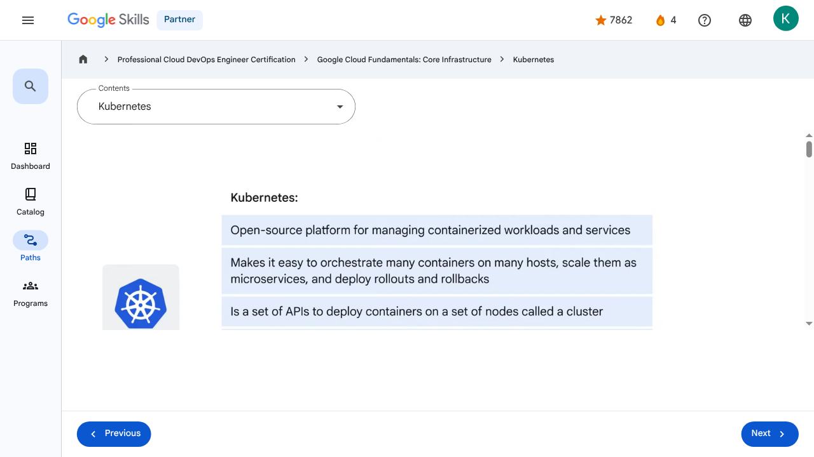

# Containers in the Cloud - Kubernetes | Google Skills for Partners

---

## Metadata

- **URL:** https://partner.skills.google/paths/20/course_sessions/39706059/video/630096
- **Lesson type:** `video`
- **Path ID:** `20`
- **Container type:** `course_sessions`
- **Container ID:** `39706059`
- **Lesson ID:** `630096`
- **Generated:** 2026-07-10 05:01:22

---

## Open Human-Readable HTML

[Open readable_page.html](readable_page.html)

> README/GitHub Markdown usually blocks playable iframes. Open `readable_page.html` to see the playable YouTube frame and browser-like lesson page.

---

## Screenshot



---

## YouTube Video

**Video ID:** `4NTyB0eEB_A`

[](https://www.youtube.com/watch?v=4NTyB0eEB_A)

[Open YouTube Video](https://www.youtube.com/watch?v=4NTyB0eEB_A)

---

## Transcript

### 00:00

A product that helps manage and scale containerized applications is Kubernetes.

### 00:04

So to save time and effort when scaling applications and workloads, Kubernetes can be bootstrapped using Google Kubernetes Engine (GKE).

### 00:13

So, what is Kubernetes?

### 00:17

Kubernetes is an open-source platform for managing containerized workloads and services.

### 00:23

It makes it easy to orchestrate many containers on many hosts, scale them as microservices, and easily deploy rollouts and rollbacks.

### 00:31

At the highest level, Kubernetes is a set of APIs that you can use to deploy containers on a set of nodes called a cluster.

### 00:40

The system is divided into a set of primary components that run as the control plane and a set of nodes that run containers.

### 00:48

In Kubernetes, a node represents a computing instance, like a machine.

### 00:52

Note that this is different to a node on Google Cloud which is a virtual machine running in Compute Engine.

### 00:59

You can describe a set of applications and how they should interact with each other, and Kubernetes determines how to make that happen.

### 01:07

Deploying containers on nodes by using a wrapper around one or more containers is what defines a Pod.

### 01:14

A Pod is the smallest unit in Kubernetes that you can create or deploy.

### 01:18

It represents a running process on your cluster as either a component of your application or an entire app.

### 01:25

Generally, you only have one container per Pod, but if you have multiple containers with a hard

### 01:30

dependency, you can package them into a single Pod and share networking and storage resources between them.

### 01:37

The Pod provides a unique network IP and set of ports for your containers and configurable options that govern how your containers should run.

### 01:45

One way to run a container in a Pod in Kubernetes is to use the kubectl run command, which starts a Deployment with a container running inside a Pod.

### 01:55

A Deployment represents a group of replicas of the same Pod and keeps your Pods running even when the nodes they run on fail.

### 02:03

A Deployment could represent a component of an application or even an entire app.

### 02:09

To see a list of the running Pods in your project, run the command: $ kubectl get pods.

### 02:15

Kubernetes creates a Service with a fixed IP address for your Pods, and a controller says "I need to attach

### 02:19

an external load balancer with a public IP address to that Service so others outside the cluster can access it."

### 02:26

In GKE, the load balancer is created as a network load balancer.

### 02:32

Any client that reaches that IP address will be routed to a Pod behind the Service.

### 02:39

A Service is an abstraction which defines a logical set of Pods and a policy by which to access them.

### 02:45

As Deployments create and destroy Pods, Pods will be assigned their own IP addresses, but those addresses don't remain stable over time.

### 02:55

A Service group is a set of Pods and provides a stable endpoint (or fixed IP address) for them.

### 03:01

For example, if you create two sets of Pods called frontend and backend and put them

### 03:05

behind their own Services, the backend Pods might change, but frontend Pods are not aware of this.

### 03:13

They simply refer to the backend Service.

### 03:16

To scale a Deployment, run the kubectl scale command.

### 03:20

In this example, three Pods are created in your Deployment, and they're placed behind the Service and share one fixed IP address.

### 03:29

You could also use autoscaling with other kinds of parameters.

### 03:33

For example, you can specify that the number of Pods should increase when CPU utilization reaches a certain limit.

### 03:41

So far, we’ve seen how to run imperative commands like expose and scale.

### 03:46

This works well to learn and test Kubernetes step-by-step.

### 03:49

But the real strength of Kubernetes comes when you work in a declarative way.

### 03:54

Instead of issuing commands, you provide a configuration file that tells Kubernetes what you want your desired state to look like, and Kubernetes determines how to do it.

### 04:04

You accomplish this by using a Deployment config file.

### 04:08

You can check your Deployment to make sure the proper number of replicas is running by using either kubectl get deployments or kubectl describe deployments.

### 04:17

To run five replicas instead of three, all you do is update the Deployment config file and run the kubectl apply command to use the updated config file.

### 04:27

You can still reach your endpoint as before by using kubectl get services to get the external IP of the Service and reach the public IP address from a client.

### 04:37

The last question is, what happens when you want to update a new version of your app?

### 04:42

Well, you want to update your container to get new code in front of users, but rolling out all those changes at one time would be risky.

### 04:49

So in this case, you would use kubectl rollout or change your deployment configuration file and then apply the change using kubectl apply.

### 04:59

New Pods will then be created according to your new update strategy.

### 05:02

Here’s an example configuration that will create new version Pods individually and wait for a new Pod to be available before destroying one of the old Pods.

### 00:00

A product that helps manage and scale containerized applications is Kubernetes. 00:04 So to save time and effort when scaling applications and workloads, Kubernetes can be bootstrapped using Google Kubernetes Engine (GKE). 00:13 So, what is Kubernetes? 00:17 Kubernetes is an open-source platform for managing containerized workloads and services. 00:23 It makes it easy to orchestrate many containers on many hosts, scale them as microservices, and easily deploy rollouts and rollbacks. 00:31 At the highest level, Kubernetes is a set of APIs that you can use to deploy containers on a set of nodes called a cluster. 00:40 The system is divided into a set of primary components that run as the control plane and a set of nodes that run containers. 00:48 In Kubernetes, a node represents a computing instance, like a machine. 00:52 Note that this is different to a node on Google Cloud which is a virtual machine running in Compute Engine. 00:59 You can describe a set of applications and how they should interact with each other, and Kubernetes determines how to make that happen. 01:07 Deploying containers on nodes by using a wrapper around one or more containers is what defines a Pod. 01:14 A Pod is the smallest unit in Kubernetes that you can create or deploy. 01:18 It represents a running process on your cluster as either a component of your application or an entire app. 01:25 Generally, you only have one container per Pod, but if you have multiple containers with a hard 01:30 dependency, you can package them into a single Pod and share networking and storage resources between them. 01:37 The Pod provides a unique network IP and set of ports for your containers and configurable options that govern how your containers should run. 01:45 One way to run a container in a Pod in Kubernetes is to use the kubectl run command, which starts a Deployment with a container running inside a Pod. 01:55 A Deployment represents a group of replicas of the same Pod and keeps your Pods running even when the nodes they run on fail. 02:03 A Deployment could represent a component of an application or even an entire app. 02:09 To see a list of the running Pods in your project, run the command: $ kubectl get pods. 02:15 Kubernetes creates a Service with a fixed IP address for your Pods, and a controller says "I need to attach 02:19 an external load balancer with a public IP address to that Service so others outside the cluster can access it." 02:26 In GKE, the load balancer is created as a network load balancer. 02:32 Any client that reaches that IP address will be routed to a Pod behind the Service. 02:39 A Service is an abstraction which defines a logical set of Pods and a policy by which to access them. 02:45 As Deployments create and destroy Pods, Pods will be assigned their own IP addresses, but those addresses don't remain stable over time. 02:55 A Service group is a set of Pods and provides a stable endpoint (or fixed IP address) for them. 03:01 For example, if you create two sets of Pods called frontend and backend and put them 03:05 behind their own Services, the backend Pods might change, but frontend Pods are not aware of this. 03:13 They simply refer to the backend Service. 03:16 To scale a Deployment, run the kubectl scale command. 03:20 In this example, three Pods are created in your Deployment, and they're placed behind the Service and share one fixed IP address. 03:29 You could also use autoscaling with other kinds of parameters. 03:33 For example, you can specify that the number of Pods should increase when CPU utilization reaches a certain limit. 03:41 So far, we’ve seen how to run imperative commands like expose and scale. 03:46 This works well to learn and test Kubernetes step-by-step. 03:49 But the real strength of Kubernetes comes when you work in a declarative way. 03:54 Instead of issuing commands, you provide a configuration file that tells Kubernetes what you want your desired state to look like, and Kubernetes determines how to do it. 04:04 You accomplish this by using a Deployment config file. 04:08 You can check your Deployment to make sure the proper number of replicas is running by using either kubectl get deployments or kubectl describe deployments. 04:17 To run five replicas instead of three, all you do is update the Deployment config file and run the kubectl apply command to use the updated config file. 04:27 You can still reach your endpoint as before by using kubectl get services to get the external IP of the Service and reach the public IP address from a client. 04:37 The last question is, what happens when you want to update a new version of your app? 04:42 Well, you want to update your container to get new code in front of users, but rolling out all those changes at one time would be risky. 04:49 So in this case, you would use kubectl rollout or change your deployment configuration file and then apply the change using kubectl apply. 04:59 New Pods will then be created according to your new update strategy. 05:02 Here’s an example configuration that will create new version Pods individually and wait for a new Pod to be available before destroying one of the old Pods.

---

## Page Text

Partner
4
navigate_next
Professional Cloud DevOps Engineer Certification
navigate_next
Google Cloud Fundamentals: Core Infrastructure
navigate_next
Kubernetes
Previous
Next
Recertify in 3 simple steps:
Link your Google Skills and certification account profiles using the same email to get started.
Instantly see which certifications are eligible for renewal.
Complete courses and skill badges to renew your certifications automatically.

By clicking "Accept", I consent to share my name, email, and course completion data with Google Skills' certification partner, CM Connect, to receive continuing education credit for certification renewal.

---

## Images

### Image 1


### Image 2


---

## Main Resources

### youtube

- [Youtube](https://www.youtube.com/@googlecloud)

### videos

- [Course Introduction](https://partner.skills.google/paths/20/course_sessions/39706059/video/630060)
- [Cloud computing overview](https://partner.skills.google/paths/20/course_sessions/39706059/video/630061)
- [IaaS and PaaS](https://partner.skills.google/paths/20/course_sessions/39706059/video/630062)
- [The Google Cloud network](https://partner.skills.google/paths/20/course_sessions/39706059/video/630063)
- [Environmental impact](https://partner.skills.google/paths/20/course_sessions/39706059/video/630064)
- [Security](https://partner.skills.google/paths/20/course_sessions/39706059/video/630065)
- [Open source ecosystems](https://partner.skills.google/paths/20/course_sessions/39706059/video/630066)
- [Pricing and billing](https://partner.skills.google/paths/20/course_sessions/39706059/video/630067)
- [Google Cloud resource hierarchy](https://partner.skills.google/paths/20/course_sessions/39706059/video/630069)
- [Identity and Access Management (IAM)](https://partner.skills.google/paths/20/course_sessions/39706059/video/630070)
- [Service accounts](https://partner.skills.google/paths/20/course_sessions/39706059/video/630071)
- [Cloud Identity](https://partner.skills.google/paths/20/course_sessions/39706059/video/630072)
- [Interacting with Google Cloud](https://partner.skills.google/paths/20/course_sessions/39706059/video/630073)
- [Virtual Private Cloud networking](https://partner.skills.google/paths/20/course_sessions/39706059/video/630076)
- [Compute Engine](https://partner.skills.google/paths/20/course_sessions/39706059/video/630077)
- [Scaling virtual machines](https://partner.skills.google/paths/20/course_sessions/39706059/video/630078)
- [Important VPC compatibilities](https://partner.skills.google/paths/20/course_sessions/39706059/video/630079)
- [Cloud Load Balancing](https://partner.skills.google/paths/20/course_sessions/39706059/video/630080)
- [Cloud DNS and Cloud CDN](https://partner.skills.google/paths/20/course_sessions/39706059/video/630081)
- [Connecting networks to Google VPC](https://partner.skills.google/paths/20/course_sessions/39706059/video/630082)
- [Google Cloud storage options](https://partner.skills.google/paths/20/course_sessions/39706059/video/630085)
- [Cloud Storage](https://partner.skills.google/paths/20/course_sessions/39706059/video/630086)
- [Cloud Storage: Storage classes and data transfer](https://partner.skills.google/paths/20/course_sessions/39706059/video/630087)
- [Cloud SQL](https://partner.skills.google/paths/20/course_sessions/39706059/video/630088)
- [Spanner](https://partner.skills.google/paths/20/course_sessions/39706059/video/630089)
- [Firestore](https://partner.skills.google/paths/20/course_sessions/39706059/video/630090)
- [Bigtable](https://partner.skills.google/paths/20/course_sessions/39706059/video/630091)
- [Comparing storage options](https://partner.skills.google/paths/20/course_sessions/39706059/video/630092)
- [Introduction to containers](https://partner.skills.google/paths/20/course_sessions/39706059/video/630095)
- [Kubernetes](https://partner.skills.google/paths/20/course_sessions/39706059/video/630096)
- [Google Kubernetes Engine](https://partner.skills.google/paths/20/course_sessions/39706059/video/630097)
- [Cloud Run](https://partner.skills.google/paths/20/course_sessions/39706059/video/630099)
- [Development in the cloud](https://partner.skills.google/paths/20/course_sessions/39706059/video/630100)
- [Prompt Engineering](https://partner.skills.google/paths/20/course_sessions/39706059/video/630103)
- [Course summary](https://partner.skills.google/paths/20/course_sessions/39706059/video/630105)
- [Resource](https://partner.skills.google/paths/20/course_sessions/39706059/video/630095)
- [Resource](https://partner.skills.google/paths/20/course_sessions/39706059/video/630097)

### labs

- [Resource](https://support.google.com/qwiklabs/contact/Google_Skills_Partner)
- [Google Cloud Fundamentals: Getting Started with Cloud Marketplace](https://partner.skills.google/paths/20/course_sessions/39706059/labs/630074)
- [Get Started with Virtual Private Cloud Networking and Compute Engine](https://partner.skills.google/paths/20/course_sessions/39706059/labs/630083)
- [Google Cloud Fundamentals: Getting Started with Cloud Storage and Cloud SQL](https://partner.skills.google/paths/20/course_sessions/39706059/labs/630093)
- [Hello Cloud Run](https://partner.skills.google/paths/20/course_sessions/39706059/labs/630101)

### external_links

- [Resource](https://partner.skills.google/)
- [Professional Cloud DevOps Engineer Certification](https://partner.skills.google/paths/20)
- [Google Cloud Fundamentals: Core Infrastructure](https://partner.skills.google/paths/20/course_templates/60)
- [Dashboard](https://partner.skills.google/)
- [Catalog](https://partner.skills.google/catalog)
- [Paths](https://partner.skills.google/paths)
- [Subscriptions](https://partner.skills.google/subscriptions)
- [Activities](https://partner.skills.google/profile/stay_on_track)
- [Achievements](https://partner.skills.google/profile/badges)
- [Resource](https://partner.skills.google/profile/activity)
- [Resource](https://partner.skills.google/my_account/profile)
- [Programs](https://partner.skills.google/my_account/programs)
- [Overview](https://partner.skills.google/paths/20/course_templates/60)
- [Quiz](https://partner.skills.google/paths/20/course_sessions/39706059/quizzes/630068)
- [Quiz](https://partner.skills.google/paths/20/course_sessions/39706059/quizzes/630075)
- [Quiz](https://partner.skills.google/paths/20/course_sessions/39706059/quizzes/630084)
- [Quiz](https://partner.skills.google/paths/20/course_sessions/39706059/quizzes/630094)
- [Quiz](https://partner.skills.google/paths/20/course_sessions/39706059/quizzes/630098)
- [Quiz](https://partner.skills.google/paths/20/course_sessions/39706059/quizzes/630102)
- [Quiz](https://partner.skills.google/paths/20/course_sessions/39706059/quizzes/630104)
- [Course resources](https://partner.skills.google/paths/20/course_sessions/39706059/documents/630106)
- [Claim credential](https://partner.skills.google/paths/20/course_templates/60/badge)
- [Course Survey
      Recommended](https://partner.skills.google/paths/20/course_templates/60/course_surveys/0)
- [Resource](https://partner.skills.google/paths/20/course_templates/60/preview)

---

## Headings

- **H3**: Transcript
- **H2**: Recertify in 3 simple steps:
- **H1**: A newer version of this course is available. Your progress will carry over if you choose to upgrade. However, your completion percentage may change if the new version has added or removed any learning activities. Click the preview button to see the course changes before upgrading.
---

## Raw Files

- [readable_page.html](readable_page.html)
- [page.html](page.html)
- [page_text.txt](page_text.txt)
- [session.json](session.json)
- [headings.json](headings.json)
- [links.json](links.json)
- [images.json](images.json)
- [resources.json](resources.json)
- [youtube_links.json](youtube_links.json)
- [transcript.json](transcript.json)
- [transcript.txt](transcript.txt)
- [plugin_extra.json](plugin_extra.json)
- [screenshot.png](screenshot.png)

## Plugin Extra Data

```json
{
  "content_kind": "video"
}
```
