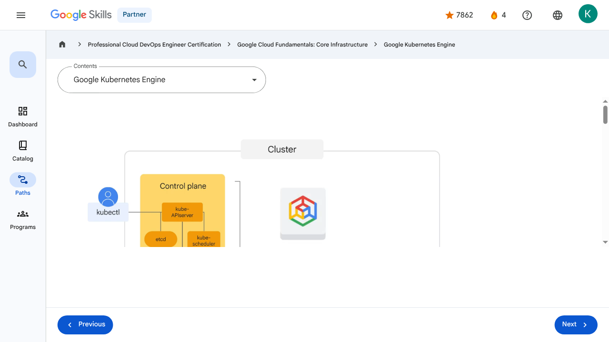
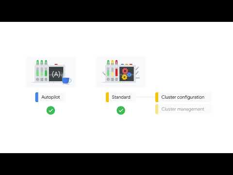

# Containers in the Cloud - Google Kubernetes Engine | Google Skills for Partners

> Offline lesson archive generated by Google Skills scraper.

---

## Metadata

- **Original URL:** https://partner.skills.google/paths/20/course_sessions/39706059/video/630097
- **Lesson type:** `video`
- **Path ID:** `20`
- **Container type:** `course_sessions`
- **Container ID:** `39706059`
- **Lesson ID:** `630097`
- **Generated:** 2026-07-10 05:01:44

---

## Full Page Screenshot

---

## Video

### YouTube Video `HMcFwcqNjOY`

---

## Transcript

**00:00**

So now that we have a basic understanding of containers and Kubernetes, let’s talk about Google Kubernetes Engine, or GKE.

**00:08**

GKE is a Google-hosted managed Kubernetes service in the cloud.

**00:12**

The GKE environment consists of multiple machines, specifically Compute Engine instances, grouped together to form a cluster.

**00:21**

You can create a Kubernetes cluster with GKE, but how is GKE different from Kubernetes?

**00:27**

From the user’s perspective, it’s a lot simpler.

**00:30**

GKE manages all the control plane components for us.

**00:34**

It still exposes an IP address to which we send all of our Kubernetes API

**00:38**

requests, but GKE is responsible for provisioning and managing all the control plane infrastructure behind it.

**00:45**

It also eliminates the need for a separate control plane.

**00:49**

Node configuration and management depends on the type of GKE mode you use.

**00:54**

With the Autopilot mode, which is recommended, GKE manages the underlying infrastructure such as node configuration, autoscaling, auto- upgrades, baseline security configurations, and baseline networking configuration.

**01:09**

With the Standard mode, you manage the underlying infrastructure, including configuring the individual nodes.

**01:16**

Let’s examine the benefits and functionality of Autopilot in more detail.

**01:21**

Autopilot is optimized for production.

**01:24**

Autopilot helps produce a strong security posture.

**01:28**

And Autopilot also promotes operational efficiency.

**01:32**

The GKE Standard mode has the same functionality as Autopilot, but you’re responsible for the configuration, management, and optimization of the cluster.

**01:41**

Unless you require the specific level of configuration control offered by GKE standard, it’s recommended that you use Autopilot mode.

**01:50**

You can create a Kubernetes cluster with GKE by using the Google Cloud console or the gcloud command that's provided by the Cloud software development kit.

**02:00**

GKE clusters can be customized, and they support different machine types, number of nodes, and network settings.

**02:07**

Kubernetes provides the mechanisms through which you interact with your cluster.

**02:12**

Kubernetes commands and resources are used to deploy and manage applications, perform administration tasks, set policies, and monitor the health of deployed workloads.

**02:23**

Running a GKE cluster comes with the benefit of advanced cluster management features that Google Cloud provides.

**02:30**

These include Google Cloud's load-balancing for Compute Engine instances; Node pools to designate subsets of nodes within a cluster for additional flexibility; Automatic scaling of your cluster's node instance

**02:41**

count; Automatic upgrades for your cluster's node software; Node auto-repair to maintain node health and availability; And logging and monitoring with Google Cloud Observability for visibility into your cluster.

**02:56**

To start up Kubernetes on a cluster in GKE, all you do is run this command: gcloud container clusters create-auto k1 --region, specifying the cluster region.

**00:00**

So now that we have a basic understanding of containers and Kubernetes, let’s talk about Google Kubernetes Engine, or GKE. 00:08 GKE is a Google-hosted managed Kubernetes service in the cloud. 00:12 The GKE environment consists of multiple machines, specifically Compute Engine instances, grouped together to form a cluster. 00:21 You can create a Kubernetes cluster with GKE, but how is GKE different from Kubernetes? 00:27 From the user’s perspective, it’s a lot simpler. 00:30 GKE manages all the control plane components for us. 00:34 It still exposes an IP address to which we send all of our Kubernetes API 00:38 requests, but GKE is responsible for provisioning and managing all the control plane infrastructure behind it. 00:45 It also eliminates the need for a separate control plane. 00:49 Node configuration and management depends on the type of GKE mode you use. 00:54 With the Autopilot mode, which is recommended, GKE manages the underlying infrastructure such as node configuration, autoscaling, auto- upgrades, baseline security configurations, and baseline networking configuration. 01:09 With the Standard mode, you manage the underlying infrastructure, including configuring the individual nodes. 01:16 Let’s examine the benefits and functionality of Autopilot in more detail. 01:21 Autopilot is optimized for production. 01:24 Autopilot helps produce a strong security posture. 01:28 And Autopilot also promotes operational efficiency. 01:32 The GKE Standard mode has the same functionality as Autopilot, but you’re responsible for the configuration, management, and optimization of the cluster. 01:41 Unless you require the specific level of configuration control offered by GKE standard, it’s recommended that you use Autopilot mode. 01:50 You can create a Kubernetes cluster with GKE by using the Google Cloud console or the gcloud command that's provided by the Cloud software development kit. 02:00 GKE clusters can be customized, and they support different machine types, number of nodes, and network settings. 02:07 Kubernetes provides the mechanisms through which you interact with your cluster. 02:12 Kubernetes commands and resources are used to deploy and manage applications, perform administration tasks, set policies, and monitor the health of deployed workloads. 02:23 Running a GKE cluster comes with the benefit of advanced cluster management features that Google Cloud provides. 02:30 These include Google Cloud's load-balancing for Compute Engine instances; Node pools to designate subsets of nodes within a cluster for additional flexibility; Automatic scaling of your cluster's node instance 02:41 count; Automatic upgrades for your cluster's node software; Node auto-repair to maintain node health and availability; And logging and monitoring with Google Cloud Observability for visibility into your cluster. 02:56 To start up Kubernetes on a cluster in GKE, all you do is run this command: gcloud container clusters create-auto k1 --region, specifying the cluster region.

---

## Lesson Text

Partner
4
navigate_next
Professional Cloud DevOps Engineer Certification
navigate_next
Google Cloud Fundamentals: Core Infrastructure
navigate_next
Google Kubernetes Engine
Previous
Next
Recertify in 3 simple steps:
Link your Google Skills and certification account profiles using the same email to get started.
Instantly see which certifications are eligible for renewal.
Complete courses and skill badges to renew your certifications automatically.

By clicking "Accept", I consent to share my name, email, and course completion data with Google Skills' certification partner, CM Connect, to receive continuing education credit for certification renewal.

---

## Images

### Image 1

### Image 2

---

## Main Resources

### youtube

- [Youtube](https://www.youtube.com/@googlecloud)

### videos

- [Course Introduction](https://partner.skills.google/paths/20/course_sessions/39706059/video/630060)
- [Cloud computing overview](https://partner.skills.google/paths/20/course_sessions/39706059/video/630061)
- [IaaS and PaaS](https://partner.skills.google/paths/20/course_sessions/39706059/video/630062)
- [The Google Cloud network](https://partner.skills.google/paths/20/course_sessions/39706059/video/630063)
- [Environmental impact](https://partner.skills.google/paths/20/course_sessions/39706059/video/630064)
- [Security](https://partner.skills.google/paths/20/course_sessions/39706059/video/630065)
- [Open source ecosystems](https://partner.skills.google/paths/20/course_sessions/39706059/video/630066)
- [Pricing and billing](https://partner.skills.google/paths/20/course_sessions/39706059/video/630067)
- [Google Cloud resource hierarchy](https://partner.skills.google/paths/20/course_sessions/39706059/video/630069)
- [Identity and Access Management (IAM)](https://partner.skills.google/paths/20/course_sessions/39706059/video/630070)
- [Service accounts](https://partner.skills.google/paths/20/course_sessions/39706059/video/630071)
- [Cloud Identity](https://partner.skills.google/paths/20/course_sessions/39706059/video/630072)
- [Interacting with Google Cloud](https://partner.skills.google/paths/20/course_sessions/39706059/video/630073)
- [Virtual Private Cloud networking](https://partner.skills.google/paths/20/course_sessions/39706059/video/630076)
- [Compute Engine](https://partner.skills.google/paths/20/course_sessions/39706059/video/630077)
- [Scaling virtual machines](https://partner.skills.google/paths/20/course_sessions/39706059/video/630078)
- [Important VPC compatibilities](https://partner.skills.google/paths/20/course_sessions/39706059/video/630079)
- [Cloud Load Balancing](https://partner.skills.google/paths/20/course_sessions/39706059/video/630080)
- [Cloud DNS and Cloud CDN](https://partner.skills.google/paths/20/course_sessions/39706059/video/630081)
- [Connecting networks to Google VPC](https://partner.skills.google/paths/20/course_sessions/39706059/video/630082)
- [Google Cloud storage options](https://partner.skills.google/paths/20/course_sessions/39706059/video/630085)
- [Cloud Storage](https://partner.skills.google/paths/20/course_sessions/39706059/video/630086)
- [Cloud Storage: Storage classes and data transfer](https://partner.skills.google/paths/20/course_sessions/39706059/video/630087)
- [Cloud SQL](https://partner.skills.google/paths/20/course_sessions/39706059/video/630088)
- [Spanner](https://partner.skills.google/paths/20/course_sessions/39706059/video/630089)
- [Firestore](https://partner.skills.google/paths/20/course_sessions/39706059/video/630090)
- [Bigtable](https://partner.skills.google/paths/20/course_sessions/39706059/video/630091)
- [Comparing storage options](https://partner.skills.google/paths/20/course_sessions/39706059/video/630092)
- [Introduction to containers](https://partner.skills.google/paths/20/course_sessions/39706059/video/630095)
- [Kubernetes](https://partner.skills.google/paths/20/course_sessions/39706059/video/630096)
- [Google Kubernetes Engine](https://partner.skills.google/paths/20/course_sessions/39706059/video/630097)
- [Cloud Run](https://partner.skills.google/paths/20/course_sessions/39706059/video/630099)
- [Development in the cloud](https://partner.skills.google/paths/20/course_sessions/39706059/video/630100)
- [Prompt Engineering](https://partner.skills.google/paths/20/course_sessions/39706059/video/630103)
- [Course summary](https://partner.skills.google/paths/20/course_sessions/39706059/video/630105)
- [Resource](https://partner.skills.google/paths/20/course_sessions/39706059/video/630096)

### labs

- [Resource](https://support.google.com/qwiklabs/contact/Google_Skills_Partner)
- [Google Cloud Fundamentals: Getting Started with Cloud Marketplace](https://partner.skills.google/paths/20/course_sessions/39706059/labs/630074)
- [Get Started with Virtual Private Cloud Networking and Compute Engine](https://partner.skills.google/paths/20/course_sessions/39706059/labs/630083)
- [Google Cloud Fundamentals: Getting Started with Cloud Storage and Cloud SQL](https://partner.skills.google/paths/20/course_sessions/39706059/labs/630093)
- [Hello Cloud Run](https://partner.skills.google/paths/20/course_sessions/39706059/labs/630101)

### external_links

- [Resource](https://partner.skills.google/)
- [Professional Cloud DevOps Engineer Certification](https://partner.skills.google/paths/20)
- [Google Cloud Fundamentals: Core Infrastructure](https://partner.skills.google/paths/20/course_templates/60)
- [Dashboard](https://partner.skills.google/)
- [Catalog](https://partner.skills.google/catalog)
- [Paths](https://partner.skills.google/paths)
- [Subscriptions](https://partner.skills.google/subscriptions)
- [Activities](https://partner.skills.google/profile/stay_on_track)
- [Achievements](https://partner.skills.google/profile/badges)
- [Resource](https://partner.skills.google/profile/activity)
- [Resource](https://partner.skills.google/my_account/profile)
- [Programs](https://partner.skills.google/my_account/programs)
- [Overview](https://partner.skills.google/paths/20/course_templates/60)
- [Quiz](https://partner.skills.google/paths/20/course_sessions/39706059/quizzes/630068)
- [Quiz](https://partner.skills.google/paths/20/course_sessions/39706059/quizzes/630075)
- [Quiz](https://partner.skills.google/paths/20/course_sessions/39706059/quizzes/630084)
- [Quiz](https://partner.skills.google/paths/20/course_sessions/39706059/quizzes/630094)
- [Quiz](https://partner.skills.google/paths/20/course_sessions/39706059/quizzes/630098)
- [Quiz](https://partner.skills.google/paths/20/course_sessions/39706059/quizzes/630102)
- [Quiz](https://partner.skills.google/paths/20/course_sessions/39706059/quizzes/630104)
- [Course resources](https://partner.skills.google/paths/20/course_sessions/39706059/documents/630106)
- [Claim credential](https://partner.skills.google/paths/20/course_templates/60/badge)
- [Course Survey
      Recommended](https://partner.skills.google/paths/20/course_templates/60/course_surveys/0)
- [Resource](https://partner.skills.google/paths/20/course_sessions/39706059/quizzes/630098)
- [Resource](https://partner.skills.google/paths/20/course_templates/60/preview)

---

## Headings

- **H3**: Transcript
- **H2**: Recertify in 3 simple steps:
- **H1**: A newer version of this course is available. Your progress will carry over if you choose to upgrade. However, your completion percentage may change if the new version has added or removed any learning activities. Click the preview button to see the course changes before upgrading.

---

## Code Blocks / Commands

_No code blocks found._

---

## Related Files

- [README.md](README.md)
- [lesson.md](lesson.md)
- [readable_page.html](readable_page.html)
- [page.html](page.html)
- [page_text.txt](page_text.txt)
- [transcript.txt](transcript.txt)
- [screenshot.png](screenshot.png)
- [assets/](assets/)
- [assets/](assets/)
