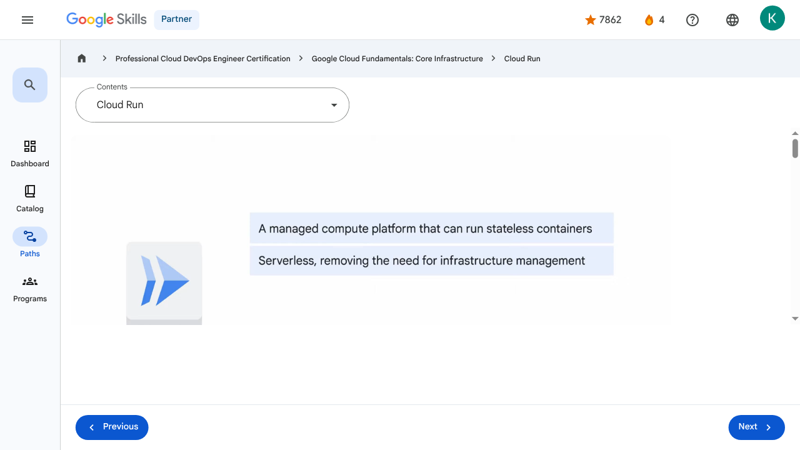

# Applications in the Cloud - Cloud Run | Google Skills for Partners

---

## Metadata

- **URL:** https://partner.skills.google/paths/20/course_sessions/39706059/video/630099
- **Lesson type:** `video`
- **Path ID:** `20`
- **Container type:** `course_sessions`
- **Container ID:** `39706059`
- **Lesson ID:** `630099`
- **Generated:** 2026-07-10 05:02:05

---

## Open Human-Readable HTML

[Open readable_page.html](readable_page.html)

> README/GitHub Markdown usually blocks playable iframes. Open `readable_page.html` to see the playable YouTube frame and browser-like lesson page.

---

## Screenshot



---

## YouTube Video

**Video ID:** `R3Ec_4tC3oc`

[](https://www.youtube.com/watch?v=R3Ec_4tC3oc)

[Open YouTube Video](https://www.youtube.com/watch?v=R3Ec_4tC3oc)

---

## Transcript

### 00:00

So far in this course, we’ve provided an introduction to Google Cloud and explored the options and benefits related to using virtual machines, networks, storage, and containers in the Cloud.

### 00:12

In the final section of the course, we’ll turn our attention to developing applications in the Cloud.

### 00:17

We’ll begin with Cloud Run, which is a managed compute platform that runs stateless containers via web requests or Pub/Sub events.

### 00:27

Cloud Run is serverless.

### 00:29

That means it removes all infrastructure management tasks so you can focus on developing applications.

### 00:34

It’s built on Knative, an open API and runtime environment built on Kubernetes.

### 00:42

It can be fully managed on Google Cloud, on Google Kubernetes Engine, or anywhere Knative runs.

### 00:49

Cloud Run is fast.

### 00:50

It can automatically scale up and down from zero almost instantaneously, and it charges only for

### 00:56

the resources used, calculated down to the nearest 100 milliseconds, so you‘ll never pay for over-provisioned resources.

### 01:05

The Cloud Run developer workflow is a straightforward three-step process.

### 01:10

First, you write your application using your favorite programming language.

### 01:15

This application should start a server that listens for web requests.

### 01:19

Second, you build and package your application into a container image.

### 01:25

And third, the container image is pushed to Artifact Registry, where Cloud Run will deploy it.

### 01:32

Once you’ve deployed your container image, you’ll get a unique HTTPS URL back.

### 01:38

Cloud Run then starts your container on demand to handle requests, and ensures that all incoming requests are handled by dynamically adding and removing containers.

### 01:48

Because Cloud Run is serverless, it means that you, as a developer, can focus on building your application and not on building and maintaining the infrastructure that powers it.

### 01:58

For some use cases, a container-based workflow is great, because it gives you a great amount of transparency and flexibility.

### 02:04

Sometimes, you’re just looking for a way to turn source code into an HTTPS endpoint, and you

### 02:09

want your vendor to make sure your container image is secure, well-configured and built in a consistent way.

### 02:17

With Cloud Run, you can do both.

### 02:19

You can use a container-based workflow, as well as a source-based workflow.

### 02:24

The source-based approach will deploy source code instead of a container image.

### 02:28

Cloud Run then builds the source and packages the application into a container image.

### 02:34

Cloud Run does this using Buildpacks - an open source project.

### 02:39

Cloud Run handles HTTPS serving for you.

### 02:42

That means you only have to worry about handling web requests, and you can let Cloud Run take care of adding the encryption.

### 02:49

The pricing model on Cloud Run is unique; as you only pay for the system resources you use

### 02:53

while a container is handling web requests, with a granularity of 100ms, and when it’s starting or shutting down.

### 03:02

You don’t pay for anything if your container doesn’t handle requests.

### 03:05

Additionally, there is a small fee for every one million requests you serve.

### 03:10

The price of container time increases with CPU and memory.

### 03:14

A container with more vCPU and memory is more expensive.

### 03:19

You can use Cloud Run to run any binary, as long as it’s compiled for Linux sixty-four bit.

### 03:24

Now, this means you can use Cloud Run to run web applications written using popular languages, such as: Java, Python, Node.js, PHP, Go, and C++.

### 03:39

You can also run code written in less popular languages, such as: Cobol, Haskell, and Perl.

### 03:47

As long as your app handles web requests, you’re good to go.

### 00:00

So far in this course, we’ve provided an introduction to Google Cloud and explored the options and benefits related to using virtual machines, networks, storage, and containers in the Cloud. 00:12 In the final section of the course, we’ll turn our attention to developing applications in the Cloud. 00:17 We’ll begin with Cloud Run, which is a managed compute platform that runs stateless containers via web requests or Pub/Sub events. 00:27 Cloud Run is serverless. 00:29 That means it removes all infrastructure management tasks so you can focus on developing applications. 00:34 It’s built on Knative, an open API and runtime environment built on Kubernetes. 00:42 It can be fully managed on Google Cloud, on Google Kubernetes Engine, or anywhere Knative runs. 00:49 Cloud Run is fast. 00:50 It can automatically scale up and down from zero almost instantaneously, and it charges only for 00:56 the resources used, calculated down to the nearest 100 milliseconds, so you‘ll never pay for over-provisioned resources. 01:05 The Cloud Run developer workflow is a straightforward three-step process. 01:10 First, you write your application using your favorite programming language. 01:15 This application should start a server that listens for web requests. 01:19 Second, you build and package your application into a container image. 01:25 And third, the container image is pushed to Artifact Registry, where Cloud Run will deploy it. 01:32 Once you’ve deployed your container image, you’ll get a unique HTTPS URL back. 01:38 Cloud Run then starts your container on demand to handle requests, and ensures that all incoming requests are handled by dynamically adding and removing containers. 01:48 Because Cloud Run is serverless, it means that you, as a developer, can focus on building your application and not on building and maintaining the infrastructure that powers it. 01:58 For some use cases, a container-based workflow is great, because it gives you a great amount of transparency and flexibility. 02:04 Sometimes, you’re just looking for a way to turn source code into an HTTPS endpoint, and you 02:09 want your vendor to make sure your container image is secure, well-configured and built in a consistent way. 02:17 With Cloud Run, you can do both. 02:19 You can use a container-based workflow, as well as a source-based workflow. 02:24 The source-based approach will deploy source code instead of a container image. 02:28 Cloud Run then builds the source and packages the application into a container image. 02:34 Cloud Run does this using Buildpacks - an open source project. 02:39 Cloud Run handles HTTPS serving for you. 02:42 That means you only have to worry about handling web requests, and you can let Cloud Run take care of adding the encryption. 02:49 The pricing model on Cloud Run is unique; as you only pay for the system resources you use 02:53 while a container is handling web requests, with a granularity of 100ms, and when it’s starting or shutting down. 03:02 You don’t pay for anything if your container doesn’t handle requests. 03:05 Additionally, there is a small fee for every one million requests you serve. 03:10 The price of container time increases with CPU and memory. 03:14 A container with more vCPU and memory is more expensive. 03:19 You can use Cloud Run to run any binary, as long as it’s compiled for Linux sixty-four bit. 03:24 Now, this means you can use Cloud Run to run web applications written using popular languages, such as: Java, Python, Node.js, PHP, Go, and C++. 03:39 You can also run code written in less popular languages, such as: Cobol, Haskell, and Perl. 03:47 As long as your app handles web requests, you’re good to go.

---

## Page Text

Partner
4
navigate_next
Professional Cloud DevOps Engineer Certification
navigate_next
Google Cloud Fundamentals: Core Infrastructure
navigate_next
Cloud Run
Previous
Next
Recertify in 3 simple steps:
Link your Google Skills and certification account profiles using the same email to get started.
Instantly see which certifications are eligible for renewal.
Complete courses and skill badges to renew your certifications automatically.

By clicking "Accept", I consent to share my name, email, and course completion data with Google Skills' certification partner, CM Connect, to receive continuing education credit for certification renewal.

---

## Images

### Image 1


### Image 2


---

## Main Resources

### youtube

- [Youtube](https://www.youtube.com/@googlecloud)

### videos

- [Course Introduction](https://partner.skills.google/paths/20/course_sessions/39706059/video/630060)
- [Cloud computing overview](https://partner.skills.google/paths/20/course_sessions/39706059/video/630061)
- [IaaS and PaaS](https://partner.skills.google/paths/20/course_sessions/39706059/video/630062)
- [The Google Cloud network](https://partner.skills.google/paths/20/course_sessions/39706059/video/630063)
- [Environmental impact](https://partner.skills.google/paths/20/course_sessions/39706059/video/630064)
- [Security](https://partner.skills.google/paths/20/course_sessions/39706059/video/630065)
- [Open source ecosystems](https://partner.skills.google/paths/20/course_sessions/39706059/video/630066)
- [Pricing and billing](https://partner.skills.google/paths/20/course_sessions/39706059/video/630067)
- [Google Cloud resource hierarchy](https://partner.skills.google/paths/20/course_sessions/39706059/video/630069)
- [Identity and Access Management (IAM)](https://partner.skills.google/paths/20/course_sessions/39706059/video/630070)
- [Service accounts](https://partner.skills.google/paths/20/course_sessions/39706059/video/630071)
- [Cloud Identity](https://partner.skills.google/paths/20/course_sessions/39706059/video/630072)
- [Interacting with Google Cloud](https://partner.skills.google/paths/20/course_sessions/39706059/video/630073)
- [Virtual Private Cloud networking](https://partner.skills.google/paths/20/course_sessions/39706059/video/630076)
- [Compute Engine](https://partner.skills.google/paths/20/course_sessions/39706059/video/630077)
- [Scaling virtual machines](https://partner.skills.google/paths/20/course_sessions/39706059/video/630078)
- [Important VPC compatibilities](https://partner.skills.google/paths/20/course_sessions/39706059/video/630079)
- [Cloud Load Balancing](https://partner.skills.google/paths/20/course_sessions/39706059/video/630080)
- [Cloud DNS and Cloud CDN](https://partner.skills.google/paths/20/course_sessions/39706059/video/630081)
- [Connecting networks to Google VPC](https://partner.skills.google/paths/20/course_sessions/39706059/video/630082)
- [Google Cloud storage options](https://partner.skills.google/paths/20/course_sessions/39706059/video/630085)
- [Cloud Storage](https://partner.skills.google/paths/20/course_sessions/39706059/video/630086)
- [Cloud Storage: Storage classes and data transfer](https://partner.skills.google/paths/20/course_sessions/39706059/video/630087)
- [Cloud SQL](https://partner.skills.google/paths/20/course_sessions/39706059/video/630088)
- [Spanner](https://partner.skills.google/paths/20/course_sessions/39706059/video/630089)
- [Firestore](https://partner.skills.google/paths/20/course_sessions/39706059/video/630090)
- [Bigtable](https://partner.skills.google/paths/20/course_sessions/39706059/video/630091)
- [Comparing storage options](https://partner.skills.google/paths/20/course_sessions/39706059/video/630092)
- [Introduction to containers](https://partner.skills.google/paths/20/course_sessions/39706059/video/630095)
- [Kubernetes](https://partner.skills.google/paths/20/course_sessions/39706059/video/630096)
- [Google Kubernetes Engine](https://partner.skills.google/paths/20/course_sessions/39706059/video/630097)
- [Cloud Run](https://partner.skills.google/paths/20/course_sessions/39706059/video/630099)
- [Development in the cloud](https://partner.skills.google/paths/20/course_sessions/39706059/video/630100)
- [Prompt Engineering](https://partner.skills.google/paths/20/course_sessions/39706059/video/630103)
- [Course summary](https://partner.skills.google/paths/20/course_sessions/39706059/video/630105)
- [Resource](https://partner.skills.google/paths/20/course_sessions/39706059/video/630100)

### labs

- [Resource](https://support.google.com/qwiklabs/contact/Google_Skills_Partner)
- [Google Cloud Fundamentals: Getting Started with Cloud Marketplace](https://partner.skills.google/paths/20/course_sessions/39706059/labs/630074)
- [Get Started with Virtual Private Cloud Networking and Compute Engine](https://partner.skills.google/paths/20/course_sessions/39706059/labs/630083)
- [Google Cloud Fundamentals: Getting Started with Cloud Storage and Cloud SQL](https://partner.skills.google/paths/20/course_sessions/39706059/labs/630093)
- [Hello Cloud Run](https://partner.skills.google/paths/20/course_sessions/39706059/labs/630101)

### external_links

- [Resource](https://partner.skills.google/)
- [Professional Cloud DevOps Engineer Certification](https://partner.skills.google/paths/20)
- [Google Cloud Fundamentals: Core Infrastructure](https://partner.skills.google/paths/20/course_templates/60)
- [Dashboard](https://partner.skills.google/)
- [Catalog](https://partner.skills.google/catalog)
- [Paths](https://partner.skills.google/paths)
- [Subscriptions](https://partner.skills.google/subscriptions)
- [Activities](https://partner.skills.google/profile/stay_on_track)
- [Achievements](https://partner.skills.google/profile/badges)
- [Resource](https://partner.skills.google/profile/activity)
- [Resource](https://partner.skills.google/my_account/profile)
- [Programs](https://partner.skills.google/my_account/programs)
- [Overview](https://partner.skills.google/paths/20/course_templates/60)
- [Quiz](https://partner.skills.google/paths/20/course_sessions/39706059/quizzes/630068)
- [Quiz](https://partner.skills.google/paths/20/course_sessions/39706059/quizzes/630075)
- [Quiz](https://partner.skills.google/paths/20/course_sessions/39706059/quizzes/630084)
- [Quiz](https://partner.skills.google/paths/20/course_sessions/39706059/quizzes/630094)
- [Quiz](https://partner.skills.google/paths/20/course_sessions/39706059/quizzes/630098)
- [Quiz](https://partner.skills.google/paths/20/course_sessions/39706059/quizzes/630102)
- [Quiz](https://partner.skills.google/paths/20/course_sessions/39706059/quizzes/630104)
- [Course resources](https://partner.skills.google/paths/20/course_sessions/39706059/documents/630106)
- [Claim credential](https://partner.skills.google/paths/20/course_templates/60/badge)
- [Course Survey
      Recommended](https://partner.skills.google/paths/20/course_templates/60/course_surveys/0)
- [Resource](https://partner.skills.google/paths/20/course_sessions/39706059/quizzes/630098)
- [Resource](https://partner.skills.google/paths/20/course_templates/60/preview)

---

## Headings

- **H3**: Transcript
- **H2**: Recertify in 3 simple steps:
- **H1**: A newer version of this course is available. Your progress will carry over if you choose to upgrade. However, your completion percentage may change if the new version has added or removed any learning activities. Click the preview button to see the course changes before upgrading.
---

## Raw Files

- [readable_page.html](readable_page.html)
- [page.html](page.html)
- [page_text.txt](page_text.txt)
- [session.json](session.json)
- [headings.json](headings.json)
- [links.json](links.json)
- [images.json](images.json)
- [resources.json](resources.json)
- [youtube_links.json](youtube_links.json)
- [transcript.json](transcript.json)
- [transcript.txt](transcript.txt)
- [plugin_extra.json](plugin_extra.json)
- [screenshot.png](screenshot.png)

## Plugin Extra Data

```json
{
  "content_kind": "video"
}
```
