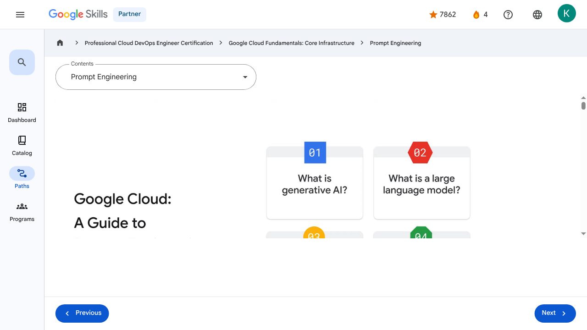

# Prompt Engineering - Prompt Engineering | Google Skills for Partners

---

## Metadata

- **URL:** https://partner.skills.google/paths/20/course_sessions/39706059/video/630103
- **Lesson type:** `video`
- **Path ID:** `20`
- **Container type:** `course_sessions`
- **Container ID:** `39706059`
- **Lesson ID:** `630103`
- **Generated:** 2026-07-10 05:02:50

---

## Open Human-Readable HTML

[Open readable_page.html](readable_page.html)

> README/GitHub Markdown usually blocks playable iframes. Open `readable_page.html` to see the playable YouTube frame and browser-like lesson page.

---

## Screenshot



---

## YouTube Video

**Video ID:** `5zoKVf-cnf4`

[](https://www.youtube.com/watch?v=5zoKVf-cnf4)

[Open YouTube Video](https://www.youtube.com/watch?v=5zoKVf-cnf4)

---

## Transcript

### 00:00

Generative AI and large language models are proving to be powerful tools, but to leverage their capabilities, it's important to understand their architecture.

### 00:09

It's also important to consider recommended practices when implementing these technologies.

### 00:13

The goal of this module, titled Google Cloud: Prompt Engineer Guide, is to help with these important steps.

### 00:20

In this guide to prompt engineering, you’ll get answers to the questions: What is generative AI?

### 00:26

What is a large language model?

### 00:28

What is prompt engineering?

### 00:29

You’ll also explore prompt engineering best practices.

### 00:34

Before we delve into this lesson, let's define the interchangeably used terms such as 'generative AI' and 'Large Language Model' (LLM).

### 00:42

While both terms describe AI models capable of generating human-like responses based on input prompts in many references, it's important to note they're not identical.

### 00:53

Generative AI encompasses a broader range of models capable of generating various types of content beyond

### 00:57

just text, while LLM specifically refers to a subset of generative AI models focusing on language tasks.

### 01:07

We'll thoroughly explore each term in this lesson.

### 01:10

So let's begin with an important question: What is generative AI?

### 01:16

Generative artificial intelligence, which is commonly referred to as gen AI, is a subset of artificial intelligence

### 01:21

that is capable of creating text, images, or other data using generative models, often in response to prompts.

### 01:30

It has grown in popularity hugely since 2021 but artificial intelligence has been around since the mid 1950s.

### 01:37

By the way, a prompt is a specific instruction, question, or cue given to a computer

### 01:41

program or user to initiate a specific action or response, but we examine this more later.

### 01:48

In its current format, gen AI models are like conversational programs that can generate content based on the inputs supplied.

### 01:56

Gen AI models learn the patterns and structure from input training data and then create new data with similar characteristics.

### 02:04

Generative AI has uses across a wide range of industries, including software development, healthcare, finance, entertainment, customer service, and sales.

### 02:13

However, rather than exploring all generative AI applications, this training will specifically focus on articulating prompts to harness the power of gen AI effectively.

### 02:24

Let me introduce a scenario that we’ll make reference to throughout this section of the training.

### 02:29

We’ve included it to help put some of this theory into practice.

### 02:32

Meet Sasha, a cloud architect, who needs to create a prototype design of Google Cloud VPC network architecture for Cymbal Bank.

### 02:41

Sasha wants to save time by combining her existing knowledge of cloud architecture and generative AI tools to create a usable prototype design.

### 02:49

Sasha was excited to learn about Gemini, since having the tool inside the Google Cloud Console means that she can access it without any additional installs.

### 02:59

We’ll check back in with Sasha later.

### 03:02

Let’s spend some time exploring large language models, which are a highly sophisticated computer programs trained on gigantic amounts of data that can be text or images.

### 03:12

But how are they trained?

### 03:14

And why do they need training at all?

### 03:17

Large language models refer to large, general-purpose language models that can be pre-trained and then fine-tuned for specific purposes.

### 03:26

In this context, large refers to: The size of the training dataset, which can sometimes be at the petabyte scale.

### 03:33

And the number of parameters.

### 03:35

Parameters are the memories and knowledge that the machine has learned during model training.

### 03:40

They determine the ability of a model to solve a problem, such as predicting text, and can reach billions or even trillions in size.

### 03:48

General-purpose means that the models can sufficiently solve common problems.

### 03:52

This is thanks to the commonality of a human language, regardless of the specific tasks.

### 03:58

Saying LLMs are pre-trained and fine-tuned, means… …that they have been pre-trained for a general

### 04:02

purpose with a large dataset… ...and then fine-tuned for specific goals with a much smaller dataset.

### 04:11

But how are LLMs trained?

### 04:14

When you submit a prompt to an LLM, it calculates the probability of the correct answer from its pre-trained model.

### 04:21

The probability is determined through a task called pre-training.

### 04:25

Pre-training an LLM involves feeding a massive dataset of text, images, and code to the model so that it can learn the underlying structure and patterns of the language.

### 04:35

This process helps the model to understand and generate human language more effectively.

### 04:40

In this way, the LLM works like a fancy autocomplete, suggesting the most common correct response to the prompt.

### 04:47

But sometimes the LLM gives a completely wrong answer.

### 04:51

This is called a hallucination.

### 04:53

Hallucinations are words or phrases that are generated by the model that are often nonsensical or grammatically incorrect.

### 05:01

This happens because LLMs can only understand the information they were trained on.

### 05:06

This means that they might not be aware of your business's proprietary or domain-specific data.

### 05:11

Also, they do not have access to real-time information.

### 05:14

To make matters worse, LLMs only understand the information that is explicitly given to them in the prompt.

### 05:22

In other words, they often assume that the prompt is true.

### 05:25

They also do not have the ability to ask for more context information.

### 05:27

Ultimately, an LLM does not know anything outside of what it was trained on, and it cannot truly know if that information is accurate.

### 05:33

But what causes a hallucination.

### 05:37

Hallucinations can be caused by a number of factors, including: The model is not trained on enough data.

### 05:43

The model is trained on noisy or dirty data.

### 05:47

The model is not given enough context.

### 05:50

The model is not given enough constraints.

### 05:53

Hallucinations can be a problem for LLMs because they can make the output text difficult to understand.

### 05:59

They can also make the model more likely to generate incorrect or misleading information.

### 06:04

But we will see in the Prompt Engineering section that there are things we can do to minimize this problem.

### 06:11

OK, but knowing where the sun is will not help Sasha with her current task.

### 06:17

Lucky for Sasha, Google Cloud offers a generative AI model called Gemini, [[Pause here for 5 seconds]] which can act as an always-on collaborator.

### 06:28

This gen AI-powered assistant can help a wide range of Google Cloud users, including developers, data scientists, and operators.

### 06:36

To provide an integrated assistance experience, Gemini is embedded in many Google Cloud products.

### 06:42

Gemini has access to a massive range of data, including Google Cloud documentation, tutorials, and samples.

### 06:50

With the right prompts, it can produce detailed suggestions and guides on what resources will best suit Sasha’s current challenge and their configuration.

### 06:57

Gemini can even create detailed gcloud commands and insert them into Cloud Shell for her.

### 07:03

She just needs to articulate her needs in a way that gets the best response from Gemini.

### 07:08

For example, if she uses the prompt “How can I create a network that uses

### 07:12

IPv4 and IPv6 addresses?”, she will get a response that details how to do just that.

### 07:20

You’ve learned that a large language model is a huge object model containing a massive dataset of text.

### 07:27

But how can you extract the information you need from this dataset?

### 07:31

This is where prompt engineering comes in.

### 07:35

A prompt is the text that you feed to the model, and prompt engineering is a way of articulating your prompts to get the best response from the model.

### 07:43

The better structured a prompt is, the better the output from the model will be.

### 07:44

Let’s explore what this means.

### 07:45

Prompts can be in the form of a question, and are categorized into four categories: zero-shot, one-shot, few-shot, and role prompts.

### 07:55

Zero-shot prompts do not contain any context or examples to assist the model.

### 08:00

For example, the prompt “What’s the capital of France?” does not provide any examples of what a capital is.

### 08:08

Clearly, that is not too important for this example.

### 08:12

But for more specific and technical prompts, an example would help refine the scope of the response from Gemini.

### 08:19

One-shot prompts, however, provide one example to the model for context.

### 08:22

Here, we ask for the capital of France again, but we provide Italy and Rome as an example.

### 08:29

And few-shot prompts provide at least two examples to the model for context.

### 08:33

Here, our prompt is updated to also include Japan and Tokyo in our examples.

### 08:40

And then, there are role prompts which require a frame of reference for the model to work from as it answers the questions.

### 08:47

In our example, we state “I want you to act as a business professor. I’ll give you a term, and you will correctly explain its

### 08:53

meaning. Make sure your answers are always right. What is ROI? “ For Sasha’s needs, using role prompts might be the best solution. She can define

### 09:03

what is required and in what context. This means that the LLM will have a clear point of reference when supplying an answer. Now that you’ve

### 09:11

seen the types of prompts you can create, let’s explore the two elements of a prompt: the preamble and the input. The preamble refers to the

### 09:21

introductory text you provide to give the model context and instructions before your main question or request. Think of it as setting the stage for the

### 09:29

LLM to better understand what you want. It can include the context for the task, the task itself, and some examples to guide the model. The

### 09:37

input is the central request you're making to the LLM. It’s what the instruction or task will act upon, for example “Comment: I don’t know what

### 09:47

to think about the video. The review is:” Based on the preamble, Gemini reviews the input and suggests if the review is positive, neutral, or negative.

### 10:01

It is worth noting that not all the components are required for a prompt, and the format can change depending on the task at hand.

### 10:10

The element order can also change.

### 10:13

Let's amend Sasha’s original prompt “How can I create a network that uses IPv4 and IPv6 addresses?” and add a role context to the input fed into Gemini.

### 10:24

She also adds the detail of needing a dual stack subnet.

### 10:29

The new prompt is “I want you to act as a cloud architect in Google

### 10:33

Cloud. How can I use gcloud to create a network that uses IPv4 and IPv6 subnets?”

### 10:40

But since Gemini maintains its own interaction context, she could have just asked “I want you to act as a cloud architect

### 10:46

in Google Cloud. How can I adjust the gcloud command provided to create a subnet to ensure the subnet is dual stack?”

### 10:54

Now that you’ve had a chance to explore what Gen AI is, what large language models are

### 11:00

and how they’re trained, and what prompt engineering is, it’s time to explore some prompt engineering best practices.

### 11:07

The first best practice is to write detailed and explicit instructions.

### 11:12

The more vague the prompt, the more chance that the model will produce a result that is not usable.

### 11:18

Be clear and concise in the prompts that you feed into the model.

### 11:22

Next, be sure to define boundaries for the prompt.

### 11:26

It’s better to instruct the model on what to do rather than what not to do.

### 11:31

If the model gets stuck, give it a few 'fallback' outputs that work in various situations.

### 11:36

For example, something like "I'm still learning about that" to use when unsure.

### 11:41

Another best practice is to adopt a persona for your input.

### 11:46

Adding a persona for the model can provide meaningful context to help it focus on related questions, which can help improve accuracy.

### 11:54

This prompt would help Sasha, the cloud architect, get started with prototyping a network architecture for Cymbal Bank.

### 12:01

And finally, it’s a recommended practice to keep each sentence concise.

### 12:05

Longer sentences can sometimes produce suboptimal results.

### 12:09

It’s best to break long sentences in a prompt into a series of shorter sentences and simpler tasks.

### 12:15

So, let’s return to Sasha, and use what we have learned so far.

### 12:21

Sasha updates her prompt to: “You're a cloud architect. You want to build a Google Cloud VPC network that can be centrally managed. You also connect to other

### 12:30

VPC networks in your company's other regions. You don't want to have many different sets of firewall policies to maintain. What sort of network architecture would you recommend?”

### 12:42

With this new prompt, Gemini proposes a hub-and-spoke network architecture, which fits Sasha’s needs exactly.

### 12:50

By refining and amending her prompts, Sasha has articulated her requirements in a way that Gemini can respond with the correct focus and level of detail.

### 00:00

Generative AI and large language models are proving to be powerful tools, but to leverage their capabilities, it's important to understand their architecture. 00:09 It's also important to consider recommended practices when implementing these technologies. 00:13 The goal of this module, titled Google Cloud: Prompt Engineer Guide, is to help with these important steps. 00:20 In this guide to prompt engineering, you’ll get answers to the questions: What is generative AI? 00:26 What is a large language model? 00:28 What is prompt engineering? 00:29 You’ll also explore prompt engineering best practices. 00:34 Before we delve into this lesson, let's define the interchangeably used terms such as 'generative AI' and 'Large Language Model' (LLM). 00:42 While both terms describe AI models capable of generating human-like responses based on input prompts in many references, it's important to note they're not identical. 00:53 Generative AI encompasses a broader range of models capable of generating various types of content beyond 00:57 just text, while LLM specifically refers to a subset of generative AI models focusing on language tasks. 01:07 We'll thoroughly explore each term in this lesson. 01:10 So let's begin with an important question: What is generative AI? 01:16 Generative artificial intelligence, which is commonly referred to as gen AI, is a subset of artificial intelligence 01:21 that is capable of creating text, images, or other data using generative models, often in response to prompts. 01:30 It has grown in popularity hugely since 2021 but artificial intelligence has been around since the mid 1950s. 01:37 By the way, a prompt is a specific instruction, question, or cue given to a computer 01:41 program or user to initiate a specific action or response, but we examine this more later. 01:48 In its current format, gen AI models are like conversational programs that can generate content based on the inputs supplied. 01:56 Gen AI models learn the patterns and structure from input training data and then create new data with similar characteristics. 02:04 Generative AI has uses across a wide range of industries, including software development, healthcare, finance, entertainment, customer service, and sales. 02:13 However, rather than exploring all generative AI applications, this training will specifically focus on articulating prompts to harness the power of gen AI effectively. 02:24 Let me introduce a scenario that we’ll make reference to throughout this section of the training. 02:29 We’ve included it to help put some of this theory into practice. 02:32 Meet Sasha, a cloud architect, who needs to create a prototype design of Google Cloud VPC network architecture for Cymbal Bank. 02:41 Sasha wants to save time by combining her existing knowledge of cloud architecture and generative AI tools to create a usable prototype design. 02:49 Sasha was excited to learn about Gemini, since having the tool inside the Google Cloud Console means that she can access it without any additional installs. 02:59 We’ll check back in with Sasha later. 03:02 Let’s spend some time exploring large language models, which are a highly sophisticated computer programs trained on gigantic amounts of data that can be text or images. 03:12 But how are they trained? 03:14 And why do they need training at all? 03:17 Large language models refer to large, general-purpose language models that can be pre-trained and then fine-tuned for specific purposes. 03:26 In this context, large refers to: The size of the training dataset, which can sometimes be at the petabyte scale. 03:33 And the number of parameters. 03:35 Parameters are the memories and knowledge that the machine has learned during model training. 03:40 They determine the ability of a model to solve a problem, such as predicting text, and can reach billions or even trillions in size. 03:48 General-purpose means that the models can sufficiently solve common problems. 03:52 This is thanks to the commonality of a human language, regardless of the specific tasks. 03:58 Saying LLMs are pre-trained and fine-tuned, means… …that they have been pre-trained for a general 04:02 purpose with a large dataset… ...and then fine-tuned for specific goals with a much smaller dataset. 04:11 But how are LLMs trained? 04:14 When you submit a prompt to an LLM, it calculates the probability of the correct answer from its pre-trained model. 04:21 The probability is determined through a task called pre-training. 04:25 Pre-training an LLM involves feeding a massive dataset of text, images, and code to the model so that it can learn the underlying structure and patterns of the language. 04:35 This process helps the model to understand and generate human language more effectively. 04:40 In this way, the LLM works like a fancy autocomplete, suggesting the most common correct response to the prompt. 04:47 But sometimes the LLM gives a completely wrong answer. 04:51 This is called a hallucination. 04:53 Hallucinations are words or phrases that are generated by the model that are often nonsensical or grammatically incorrect. 05:01 This happens because LLMs can only understand the information they were trained on. 05:06 This means that they might not be aware of your business's proprietary or domain-specific data. 05:11 Also, they do not have access to real-time information. 05:14 To make matters worse, LLMs only understand the information that is explicitly given to them in the prompt. 05:22 In other words, they often assume that the prompt is true. 05:25 They also do not have the ability to ask for more context information. 05:27 Ultimately, an LLM does not know anything outside of what it was trained on, and it cannot truly know if that information is accurate. 05:33 But what causes a hallucination. 05:37 Hallucinations can be caused by a number of factors, including: The model is not trained on enough data. 05:43 The model is trained on noisy or dirty data. 05:47 The model is not given enough context. 05:50 The model is not given enough constraints. 05:53 Hallucinations can be a problem for LLMs because they can make the output text difficult to understand. 05:59 They can also make the model more likely to generate incorrect or misleading information. 06:04 But we will see in the Prompt Engineering section that there are things we can do to minimize this problem. 06:11 OK, but knowing where the sun is will not help Sasha with her current task. 06:17 Lucky for Sasha, Google Cloud offers a generative AI model called Gemini, [[Pause here for 5 seconds]] which can act as an always-on collaborator. 06:28 This gen AI-powered assistant can help a wide range of Google Cloud users, including developers, data scientists, and operators. 06:36 To provide an integrated assistance experience, Gemini is embedded in many Google Cloud products. 06:42 Gemini has access to a massive range of data, including Google Cloud documentation, tutorials, and samples. 06:50 With the right prompts, it can produce detailed suggestions and guides on what resources will best suit Sasha’s current challenge and their configuration. 06:57 Gemini can even create detailed gcloud commands and insert them into Cloud Shell for her. 07:03 She just needs to articulate her needs in a way that gets the best response from Gemini. 07:08 For example, if she uses the prompt “How can I create a network that uses 07:12 IPv4 and IPv6 addresses?”, she will get a response that details how to do just that. 07:20 You’ve learned that a large language model is a huge object model containing a massive dataset of text. 07:27 But how can you extract the information you need from this dataset? 07:31 This is where prompt engineering comes in. 07:35 A prompt is the text that you feed to the model, and prompt engineering is a way of articulating your prompts to get the best response from the model. 07:43 The better structured a prompt is, the better the output from the model will be. 07:44 Let’s explore what this means. 07:45 Prompts can be in the form of a question, and are categorized into four categories: zero-shot, one-shot, few-shot, and role prompts. 07:55 Zero-shot prompts do not contain any context or examples to assist the model. 08:00 For example, the prompt “What’s the capital of France?” does not provide any examples of what a capital is. 08:08 Clearly, that is not too important for this example. 08:12 But for more specific and technical prompts, an example would help refine the scope of the response from Gemini. 08:19 One-shot prompts, however, provide one example to the model for context. 08:22 Here, we ask for the capital of France again, but we provide Italy and Rome as an example. 08:29 And few-shot prompts provide at least two examples to the model for context. 08:33 Here, our prompt is updated to also include Japan and Tokyo in our examples. 08:40 And then, there are role prompts which require a frame of reference for the model to work from as it answers the questions. 08:47 In our example, we state “I want you to act as a business professor. I’ll give you a term, and you will correctly explain its 08:53 meaning. Make sure your answers are always right. What is ROI? “ For Sasha’s needs, using role prompts might be the best solution. She can define 09:03 what is required and in what context. This means that the LLM will have a clear point of reference when supplying an answer. Now that you’ve 09:11 seen the types of prompts you can create, let’s explore the two elements of a prompt: the preamble and the input. The preamble refers to the 09:21 introductory text you provide to give the model context and instructions before your main question or request. Think of it as setting the stage for the 09:29 LLM to better understand what you want. It can include the context for the task, the task itself, and some examples to guide the model. The 09:37 input is the central request you're making to the LLM. It’s what the instruction or task will act upon, for example “Comment: I don’t know what 09:47 to think about the video. The review is:” Based on the preamble, Gemini reviews the input and suggests if the review is positive, neutral, or negative. 10:01 It is worth noting that not all the components are required for a prompt, and the format can change depending on the task at hand. 10:10 The element order can also change. 10:13 Let's amend Sasha’s original prompt “How can I create a network that uses IPv4 and IPv6 addresses?” and add a role context to the input fed into Gemini. 10:24 She also adds the detail of needing a dual stack subnet. 10:29 The new prompt is “I want you to act as a cloud architect in Google 10:33 Cloud. How can I use gcloud to create a network that uses IPv4 and IPv6 subnets?” 10:40 But since Gemini maintains its own interaction context, she could have just asked “I want you to act as a cloud architect 10:46 in Google Cloud. How can I adjust the gcloud command provided to create a subnet to ensure the subnet is dual stack?” 10:54 Now that you’ve had a chance to explore what Gen AI is, what large language models are 11:00 and how they’re trained, and what prompt engineering is, it’s time to explore some prompt engineering best practices. 11:07 The first best practice is to write detailed and explicit instructions. 11:12 The more vague the prompt, the more chance that the model will produce a result that is not usable. 11:18 Be clear and concise in the prompts that you feed into the model. 11:22 Next, be sure to define boundaries for the prompt. 11:26 It’s better to instruct the model on what to do rather than what not to do. 11:31 If the model gets stuck, give it a few 'fallback' outputs that work in various situations. 11:36 For example, something like "I'm still learning about that" to use when unsure. 11:41 Another best practice is to adopt a persona for your input. 11:46 Adding a persona for the model can provide meaningful context to help it focus on related questions, which can help improve accuracy. 11:54 This prompt would help Sasha, the cloud architect, get started with prototyping a network architecture for Cymbal Bank. 12:01 And finally, it’s a recommended practice to keep each sentence concise. 12:05 Longer sentences can sometimes produce suboptimal results. 12:09 It’s best to break long sentences in a prompt into a series of shorter sentences and simpler tasks. 12:15 So, let’s return to Sasha, and use what we have learned so far. 12:21 Sasha updates her prompt to: “You're a cloud architect. You want to build a Google Cloud VPC network that can be centrally managed. You also connect to other 12:30 VPC networks in your company's other regions. You don't want to have many different sets of firewall policies to maintain. What sort of network architecture would you recommend?” 12:42 With this new prompt, Gemini proposes a hub-and-spoke network architecture, which fits Sasha’s needs exactly. 12:50 By refining and amending her prompts, Sasha has articulated her requirements in a way that Gemini can respond with the correct focus and level of detail.

---

## Page Text

Partner
4
navigate_next
Professional Cloud DevOps Engineer Certification
navigate_next
Google Cloud Fundamentals: Core Infrastructure
navigate_next
Prompt Engineering
Previous
Next
Recertify in 3 simple steps:
Link your Google Skills and certification account profiles using the same email to get started.
Instantly see which certifications are eligible for renewal.
Complete courses and skill badges to renew your certifications automatically.

By clicking "Accept", I consent to share my name, email, and course completion data with Google Skills' certification partner, CM Connect, to receive continuing education credit for certification renewal.

---

## Images

### Image 1


### Image 2


---

## Main Resources

### youtube

- [Youtube](https://www.youtube.com/@googlecloud)

### videos

- [Course Introduction](https://partner.skills.google/paths/20/course_sessions/39706059/video/630060)
- [Cloud computing overview](https://partner.skills.google/paths/20/course_sessions/39706059/video/630061)
- [IaaS and PaaS](https://partner.skills.google/paths/20/course_sessions/39706059/video/630062)
- [The Google Cloud network](https://partner.skills.google/paths/20/course_sessions/39706059/video/630063)
- [Environmental impact](https://partner.skills.google/paths/20/course_sessions/39706059/video/630064)
- [Security](https://partner.skills.google/paths/20/course_sessions/39706059/video/630065)
- [Open source ecosystems](https://partner.skills.google/paths/20/course_sessions/39706059/video/630066)
- [Pricing and billing](https://partner.skills.google/paths/20/course_sessions/39706059/video/630067)
- [Google Cloud resource hierarchy](https://partner.skills.google/paths/20/course_sessions/39706059/video/630069)
- [Identity and Access Management (IAM)](https://partner.skills.google/paths/20/course_sessions/39706059/video/630070)
- [Service accounts](https://partner.skills.google/paths/20/course_sessions/39706059/video/630071)
- [Cloud Identity](https://partner.skills.google/paths/20/course_sessions/39706059/video/630072)
- [Interacting with Google Cloud](https://partner.skills.google/paths/20/course_sessions/39706059/video/630073)
- [Virtual Private Cloud networking](https://partner.skills.google/paths/20/course_sessions/39706059/video/630076)
- [Compute Engine](https://partner.skills.google/paths/20/course_sessions/39706059/video/630077)
- [Scaling virtual machines](https://partner.skills.google/paths/20/course_sessions/39706059/video/630078)
- [Important VPC compatibilities](https://partner.skills.google/paths/20/course_sessions/39706059/video/630079)
- [Cloud Load Balancing](https://partner.skills.google/paths/20/course_sessions/39706059/video/630080)
- [Cloud DNS and Cloud CDN](https://partner.skills.google/paths/20/course_sessions/39706059/video/630081)
- [Connecting networks to Google VPC](https://partner.skills.google/paths/20/course_sessions/39706059/video/630082)
- [Google Cloud storage options](https://partner.skills.google/paths/20/course_sessions/39706059/video/630085)
- [Cloud Storage](https://partner.skills.google/paths/20/course_sessions/39706059/video/630086)
- [Cloud Storage: Storage classes and data transfer](https://partner.skills.google/paths/20/course_sessions/39706059/video/630087)
- [Cloud SQL](https://partner.skills.google/paths/20/course_sessions/39706059/video/630088)
- [Spanner](https://partner.skills.google/paths/20/course_sessions/39706059/video/630089)
- [Firestore](https://partner.skills.google/paths/20/course_sessions/39706059/video/630090)
- [Bigtable](https://partner.skills.google/paths/20/course_sessions/39706059/video/630091)
- [Comparing storage options](https://partner.skills.google/paths/20/course_sessions/39706059/video/630092)
- [Introduction to containers](https://partner.skills.google/paths/20/course_sessions/39706059/video/630095)
- [Kubernetes](https://partner.skills.google/paths/20/course_sessions/39706059/video/630096)
- [Google Kubernetes Engine](https://partner.skills.google/paths/20/course_sessions/39706059/video/630097)
- [Cloud Run](https://partner.skills.google/paths/20/course_sessions/39706059/video/630099)
- [Development in the cloud](https://partner.skills.google/paths/20/course_sessions/39706059/video/630100)
- [Prompt Engineering](https://partner.skills.google/paths/20/course_sessions/39706059/video/630103)
- [Course summary](https://partner.skills.google/paths/20/course_sessions/39706059/video/630105)

### labs

- [Resource](https://support.google.com/qwiklabs/contact/Google_Skills_Partner)
- [Google Cloud Fundamentals: Getting Started with Cloud Marketplace](https://partner.skills.google/paths/20/course_sessions/39706059/labs/630074)
- [Get Started with Virtual Private Cloud Networking and Compute Engine](https://partner.skills.google/paths/20/course_sessions/39706059/labs/630083)
- [Google Cloud Fundamentals: Getting Started with Cloud Storage and Cloud SQL](https://partner.skills.google/paths/20/course_sessions/39706059/labs/630093)
- [Hello Cloud Run](https://partner.skills.google/paths/20/course_sessions/39706059/labs/630101)

### external_links

- [Resource](https://partner.skills.google/)
- [Professional Cloud DevOps Engineer Certification](https://partner.skills.google/paths/20)
- [Google Cloud Fundamentals: Core Infrastructure](https://partner.skills.google/paths/20/course_templates/60)
- [Dashboard](https://partner.skills.google/)
- [Catalog](https://partner.skills.google/catalog)
- [Paths](https://partner.skills.google/paths)
- [Subscriptions](https://partner.skills.google/subscriptions)
- [Activities](https://partner.skills.google/profile/stay_on_track)
- [Achievements](https://partner.skills.google/profile/badges)
- [Resource](https://partner.skills.google/profile/activity)
- [Resource](https://partner.skills.google/my_account/profile)
- [Programs](https://partner.skills.google/my_account/programs)
- [Overview](https://partner.skills.google/paths/20/course_templates/60)
- [Quiz](https://partner.skills.google/paths/20/course_sessions/39706059/quizzes/630068)
- [Quiz](https://partner.skills.google/paths/20/course_sessions/39706059/quizzes/630075)
- [Quiz](https://partner.skills.google/paths/20/course_sessions/39706059/quizzes/630084)
- [Quiz](https://partner.skills.google/paths/20/course_sessions/39706059/quizzes/630094)
- [Quiz](https://partner.skills.google/paths/20/course_sessions/39706059/quizzes/630098)
- [Quiz](https://partner.skills.google/paths/20/course_sessions/39706059/quizzes/630102)
- [Quiz](https://partner.skills.google/paths/20/course_sessions/39706059/quizzes/630104)
- [Course resources](https://partner.skills.google/paths/20/course_sessions/39706059/documents/630106)
- [Claim credential](https://partner.skills.google/paths/20/course_templates/60/badge)
- [Course Survey
      Recommended](https://partner.skills.google/paths/20/course_templates/60/course_surveys/0)
- [Resource](https://partner.skills.google/paths/20/course_sessions/39706059/quizzes/630102)
- [Resource](https://partner.skills.google/paths/20/course_sessions/39706059/quizzes/630104)
- [Resource](https://partner.skills.google/paths/20/course_templates/60/preview)

---

## Headings

- **H3**: Transcript
- **H2**: Recertify in 3 simple steps:
- **H1**: A newer version of this course is available. Your progress will carry over if you choose to upgrade. However, your completion percentage may change if the new version has added or removed any learning activities. Click the preview button to see the course changes before upgrading.
---

## Raw Files

- [readable_page.html](readable_page.html)
- [page.html](page.html)
- [page_text.txt](page_text.txt)
- [session.json](session.json)
- [headings.json](headings.json)
- [links.json](links.json)
- [images.json](images.json)
- [resources.json](resources.json)
- [youtube_links.json](youtube_links.json)
- [transcript.json](transcript.json)
- [transcript.txt](transcript.txt)
- [plugin_extra.json](plugin_extra.json)
- [screenshot.png](screenshot.png)

## Plugin Extra Data

```json
{
  "content_kind": "video"
}
```
